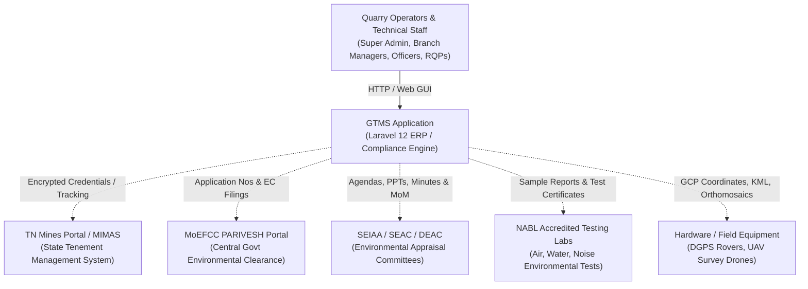

# GTMS Architectural & Data Survey — Handoff Report

**Agent:** Explorer Survey 1 (Architecture & Data Explorer)  
**Date:** 2026-09-24  
**Working Directory:** `c:\xampp\htdocs\GTMS\gtms\.agents\teamwork\explorer_survey_1`  
**Target Knowledge Suite:** `docs/01-architecture.md`, `docs/02-environment-setup.md`, `docs/03-database.md`, `docs/04-models.md`  

---

## 1. Observation

### 1.1 Source Code Ground Truth & System Inventory
Direct investigation of the codebase at `c:\xampp\htdocs\GTMS\gtms` established the following exact technical specifications:
- **Framework & Runtime:** Laravel 12.62.0 running on PHP 8.2.12 (CLI ZTS Visual C++ 2019 x64) (`composer.json`, `composer.lock`, `.env`).
- **Database Engine:** MySQL / MariaDB (Database name: `gtms_data`) on default port 3306 (`config/database.php`, `.env`).
- **Database Tables:** Exactly **64 active tables** in MySQL database `gtms_data`.
- **Database Migrations:** Exactly **48 migration files** executed under `database/migrations/`.
- **Database Seeders:** Exactly **7 seeders** under `database/seeders/` (`DatabaseSeeder`, `RolePermissionSeeder`, `GtmsMasterDataSeeder`, `MiningNatureOfWorkSeeder`, `CustomerSeeder`, `PptAndDgpsModuleSeeder`, `EcComplianceSeeder`).
- **Eloquent Models:** Exactly **49 PHP files** under `app/Models/` (47 operational models + 2 legacy prototype models `EnvironmentalDocument.php` and `EnvironmentalActivity.php`), plus 1 Global Scope (`app/Models/Scopes/BranchScope.php`) and 1 Trait (`app/Models/Traits/BelongsToBranch.php`).
- **Controllers:** Exactly **20 controllers** under `app/Http/Controllers/` (19 functional controllers + 1 base `Controller.php`).
- **Routes:** Exactly **121 registered routes** (118 named routes in `routes/web.php`, 0 in `routes/api.php`, 3 framework default routes including `/up`).
- **Frontend Stack:** Laravel Blade views (66 custom views in `resources/views/pages/`, 5 layouts in `resources/views/layouts/`), Vite 7.0.7, Tailwind CSS v4, Bootstrap 5, jQuery 3.6+, DataTables, SweetAlert2, Toastr.
- **Role-Based Access Control:** Spatie Laravel-Permission v6.25 (`permissions`, `roles`, `model_has_permissions`, `model_has_roles`, `role_has_permissions`).
- **Session, Cache & Queue:** Database driver for all state systems (`sessions`, `cache`, `cache_locks`, `jobs`, `job_batches`, `failed_jobs` tables).
- **File Storage:** Local disk configured under `public/uploads/` with segregated subdirectories per module.

---

### 1.2 System Architecture Specification (`docs/01-architecture.md`)

#### 1.2.1 C4 Context Level (System Context)
GTMS acts as the central compliance, tracking, and ERP hub connecting internal quarry operators, technical consultants, and regulatory authorities in Tamil Nadu:



#### 1.2.2 C4 Container Level (Application Architecture)
- **Web Server:** Apache (via XAMPP) or Nginx handling HTTPS termination and routing to `public/index.php`.
- **Application Engine:** PHP 8.2 PHP-FPM / FastCGI executing the Laravel 12 application core.
- **Relational Store:** MySQL / MariaDB `gtms_data` storing master entities, transactions, and document metadata.
- **Local Storage:** `public/uploads/...` storing physical binary files (PDFs, CAD drawings, Orthomosaic geo-TIFFs, KML files).
- **Background Drivers:** MySQL tables (`jobs`, `failed_jobs`, `sessions`, `cache`) avoiding external Redis dependencies for simplified on-premise XAMPP deployment.

#### 1.2.3 MVC Request Lifecycle
1. **Entry Point:** `public/index.php` loads Composer autoloader and boots Laravel application container (`bootstrap/app.php`).
2. **Middleware Pipeline:**
   - Global HTTP Middleware: `Illuminate\Foundation\Http\Middleware\CheckForMaintenanceMode`, `TrimStrings`, `ConvertEmptyStringsToNull`.
   - Web Group Middleware: `EncryptCookies`, `AddQueuedCookiesToResponse`, `StartSession`, `ShareErrorsFromSession`, `ValidateCsrfToken`, `SubstituteBindings`.
   - Route Aliases: `role`, `permission`, `role_or_permission` (registered via Spatie Permission middleware in `bootstrap/app.php`).
3. **Controller Execution:** Directly invokes methods in `app/Http/Controllers/`. The codebase follows a Controller-Centric pattern without dedicated Service or Repository abstraction layers. Controllers directly orchestrate:
   - Request parameter validation via `$request->validate()` or `Validator::make()`.
   - Transaction boundary management via `DB::beginTransaction()`, `DB::commit()`, and `DB::rollBack()`.
   - Model persistence and polymorphic ledger sync.
   - Physical file uploads, directory generation, and MIME verification.
   - Activity audit logging via `ActivityLog::create()`.
   - Blade view rendering or JSON responses.
4. **Data Isolation (Multi-Tenancy):** Global scope `BranchScope` (`app/Models/Scopes/BranchScope.php`) automatically scopes all database queries to the user's assigned `branch_id` (`users.branch_id`), unless the authenticated user holds Super Admin privileges (`users.role_id === 1`).
5. **Cross-Module Data Handoffs:**
   - **Central Entity Hub:** `Customer` model (`customers` table) acts as the operational root.
   - **Universal Common ID:** An immutable identifier `GTMS-{YEAR}-{SEQUENCE}` (e.g. `GTMS-2026-0001`) is generated at intake and carried forward across all subsequent departmental filings (Lease -> Mining -> EC -> Surveys).
   - **File Cloning Pattern:** When an application transitions between modules (e.g. Lease Application to Mining Plan), physical files are copied (`File::copy()`) from `public/uploads/lease/...` to `public/uploads/mining/...`, creating isolated `MiningDocument` rows. This ensures absolute audit isolation and prevents cross-module file deletion side effects.

---

### 1.3 Local Environment Configuration (`docs/02-environment-setup.md`)

#### 1.3.1 Hardware & Software Prerequisites
- **Operating System:** Windows 10/11 (XAMPP Environment), Ubuntu 22.04+ LTS, or macOS.
- **PHP Runtime:** PHP 8.2.x (Tested: PHP 8.2.12 ZTS 64-bit).
  - Required Extensions: `pdo_mysql`, `mbstring`, `openssl`, `bcmath`, `curl`, `fileinfo`, `gd`, `xml`, `zip`, `tokenizer`.
  - Recommended `php.ini` Settings for High Concurrency & Large File Uploads:
    - `upload_max_filesize = 128M`
    - `post_max_size = 128M`
    - `memory_limit = 512M`
    - `max_execution_time = 300`
- **Database Server:** MySQL 8.0+ or MariaDB 10.4+ (Default port: 3306).
  - Collation: `utf8mb4_unicode_ci` / Character Set: `utf8mb4`.
  - Max Connections: Minimum 500 (recommended 1000 for enterprise concurrency).
- **Node.js & Package Managers:** Node.js 18.x or 20.x, NPM 9.x+, Composer 2.x.

#### 1.3.2 Safe Sanitized `.env` Catalog (Zero Secrets)
```dotenv
# ==========================================
# APPLICATION CONFIGURATION
# ==========================================
APP_NAME="GTMS"
APP_ENV=local
APP_KEY=[REDACTED]
APP_DEBUG=true
APP_URL=http://127.0.0.1:8002
APP_TIMEZONE=Asia/Kolkata
APP_LOCALE=en
APP_FALLBACK_LOCALE=en
APP_FAKER_LOCALE=en_US

# ==========================================
# LOGGING & MAINTENANCE
# ==========================================
APP_MAINTENANCE_DRIVER=file
LOG_CHANNEL=stack
LOG_STACK=single
LOG_DEPRECATIONS_CHANNEL=null
LOG_LEVEL=debug

# ==========================================
# DATABASE CONFIGURATION
# ==========================================
DB_CONNECTION=mysql
DB_HOST=127.0.0.1
DB_PORT=3306
DB_DATABASE=gtms_data
DB_USERNAME=root
DB_PASSWORD=[REDACTED]

# ==========================================
# SESSION & CACHE CONFIGURATION
# ==========================================
SESSION_DRIVER=database
SESSION_LIFETIME=120
SESSION_ENCRYPT=false
SESSION_PATH=/
SESSION_DOMAIN=null

CACHE_STORE=database
QUEUE_CONNECTION=database
BROADCAST_CONNECTION=log
FILESYSTEM_DISK=local

# ==========================================
# REDIS (OPTIONAL / UNUSED IN DEFAULT LOCAL)
# ==========================================
REDIS_CLIENT=phpredis
REDIS_HOST=127.0.0.1
REDIS_PASSWORD=[REDACTED]
REDIS_PORT=6379

# ==========================================
# MAIL CONFIGURATION
# ==========================================
MAIL_MAILER=log
MAIL_HOST=127.0.0.1
MAIL_PORT=2525
MAIL_USERNAME=[REDACTED]
MAIL_PASSWORD=[REDACTED]
MAIL_FROM_ADDRESS="no-reply@gtms.gov.in"
MAIL_FROM_NAME="${APP_NAME}"

# ==========================================
# FRONTEND BUILDER (VITE)
# ==========================================
VITE_APP_NAME="${APP_NAME}"
```

#### 1.3.3 Step-by-Step Local Deployment & Initialization
1. **Clone repository:**
   ```bash
   git clone <repository_url>
   cd gtms
   ```
2. **Install PHP dependencies:**
   ```bash
   composer install
   ```
3. **Environment setup:**
   ```bash
   cp .env.example .env
   php artisan key:generate
   ```
4. **Database creation:**
   Execute in MySQL CLI or phpMyAdmin:
   ```sql
   CREATE DATABASE gtms_data CHARACTER SET utf8mb4 COLLATE utf8mb4_unicode_ci;
   ```
5. **Database migrations:**
   ```bash
   php artisan migrate
   ```
6. **Master and demo data seeding:**
   ```bash
   php artisan db:seed
   ```
   *(Optionally run supplementary seeds: `php artisan db:seed --class=PptAndDgpsModuleSeeder` and `php artisan db:seed --class=EcComplianceSeeder`)*
7. **Storage linkage & directory structure:**
   ```bash
   php artisan storage:link
   ```
   Verify upload directories exist under `public/uploads/` (`lease/`, `mining/`, `environmental/`, `ec_certificates/`, `ppt/`, `dgps/`, `drone/`, `ec_compliance/`).
8. **Frontend assets compilation:**
   ```bash
   npm install
   npm run build
   ```
9. **Start development server:**
   ```bash
   php artisan serve --port=8002
   ```

---

### 1.4 Complete 64-Table Database Dictionary & Migration Chronology (`docs/03-database.md`)

#### 1.4.1 Chronological Migration Audit (48 Migrations)
The database schema evolved through 48 distinct migrations:
1. `0001_01_01_000000_create_users_table.php`: Creates core `users`, `password_reset_tokens`, `sessions`.
2. `0001_01_01_000001_create_cache_table.php`: Creates `cache`, `cache_locks`.
3. `0001_01_01_000002_create_jobs_table.php`: Creates `jobs`, `job_batches`, `failed_jobs`.
4. `2026_07_06_113339_create_permission_tables.php`: Creates Spatie tables (`permissions`, `roles`, `model_has_permissions`, `model_has_roles`, `role_has_permissions`).
5. `2026_07_06_114649_add_role_id_and_branch_id_to_users_table.php`: Adds `role_id` and `branch_id` to `users`.
6. `2026_07_07_093905_create_branches_table.php`: Creates `branches`.
7. `2026_07_08_070939_add_image_userid_mobile_showpass_to_users_table.php`: Adds `image`, `user_id`, `mobile_num`, `show_password` to `users`.
8. `2026_07_08_075906_add_status_to_users_table.php`: Adds `status` tinyint to `users`.
9. `2026_07_08_080930_change_user_id_column_in_users_table.php`: Structural user_id adjustment.
10. `2026_07_08_081111_add_user_code_to_users_table.php`: Adds `user_code` string nullable to `users`.
11. `2026_07_09_062952_create_categories_table.php`: Legacy retail `categories`.
12. `2026_07_09_064613_add_delete_status_to_categories_table.php`: Adds `delete_status` to `categories`.
13. `2026_07_09_102044_create_products_table.php`: Legacy retail `products`.
14. `2026_07_09_103917_add_branch_id_to_products_table.php`: Adds `branch_id` to `products`.
15. `2026_07_14_071431_create_product_stocks_table.php`: Legacy retail `product_stocks`.
16. `2026_07_17_114522_make_bar_code_nullable_in_products_table.php`: Modifies `bar_code` on `products`.
17. `2026_07_20_071331_create_units_table.php`: Legacy retail `units`.
18. `2026_07_20_080432_add_delete_status_to_units_table.php`: Adds `delete_status` to `units`.
19. `2026_08_07_000001_create_environmental_b2_tables.php`: Initial prototype tables (`environmental_projects`, `environmental_documents`, `environmental_activities`).
20. `2026_09_04_000001_create_gtms_master_tables.php`: Foundation master tables (`districts`, `minerals`, `lease_categories`, `plan_types`, `applicant_types`, `modules`, `folders`, `document_fields`).
21. `2026_09_04_000002_create_customers_table.php`: Creates centralized `customers` entity table.
22. `2026_09_04_000003_create_lease_module_tables.php`: Creates `lease_applications`, `lease_survey_numbers`, `mimas_credentials`, `lease_documents`.
23. `2026_09_04_000004_create_mining_module_tables.php`: Creates `mining_applications`, `mining_boundary_points`, `mining_production_schedules`, `mining_documents`.
24. `2026_09_04_000005_create_environment_and_ec_module_tables.php`: Creates modern `environment_projects`, `environment_documents`, `ec_certificates`.
25. `2026_09_04_000006_create_ppt_and_survey_module_tables.php`: Creates `ppt_applications`, `ppt_agendas`, `ppt_documents`, `dgps_surveys`, `dgps_points`, `dgps_documents`, `drone_surveys`, `drone_documents`.
26. `2026_09_04_000007_create_mineral_stock_and_audit_tables.php`: Creates `mineral_stockpiles`, `mineral_stock_entries`, `mineral_dispatches`, `project_flows`, `activity_logs`, `archived_activity_logs`, `notifications`.
27. `2026_09_04_000008_add_slug_to_customers_table.php`: Adds unique `slug` to `customers`.
28. `2026_09_07_050811_add_mimas_no_to_customers_table.php`: Adds unique `mimas_no` to `customers`.
29. `2026_09_10_000001_update_lease_application_status_enum.php`: Updates enum on `lease_applications`.
30. `2026_09_10_102535_add_aadhaar_no_to_customers_table.php`: Adds unique `aadhaar_no` to `customers`.
31. `2026_09_15_115323_create_nature_of_works_table.php`: Creates `nature_of_works`.
32. `2026_09_15_115352_add_nature_of_work_id_to_mining_applications_table.php`: Adds `nature_of_work_id` foreign key.
33. `2026_09_15_115733_add_nature_of_work_id_to_document_fields_table.php`: Adds `nature_of_work_id` foreign key.
34: `2026_09_15_130804_make_minerals_and_plans_nullable_in_mining_applications.php`: Relaxes nullability on mining applications.
35. `2026_09_15_162914_create_mining_application_minerals_table.php`: Creates pivot table `mining_application_minerals`.
36. `2026_09_16_095500_add_common_id_to_lease_and_mining_tables.php`: Adds `common_id` indexed string column and backfills existing records.
37. `2026_09_16_104641_add_secondary_contact_to_customers_and_leases.php`: Adds `secondary_contact_person` and secondary mobile columns.
38. `2026_09_16_120500_add_mimas_number_and_status_to_customers_table.php`: Adds `mimas_number` and `mimas_status` to `customers`.
39. `2026_09_16_122500_create_lease_application_minerals_and_other_column.php`: Creates `lease_application_minerals` pivot and `other_mineral_name`.
40. `2026_09_16_145912_add_other_mineral_name_to_mining_applications.php`: Adds `other_mineral_name` column.
41. `2026_09_17_000001_seed_environment_clearance_master_data.php`: Master data seeder migration.
42. `2026_09_18_001_add_sub_category_to_environment_projects.php`: Adds `sub_category` enum ('SC1', 'SC2') to `environment_projects`.
43. `2026_09_22_000001_create_application_handlers_table.php`: Creates universal polymorphic `application_handlers`.
44. `2026_09_22_000002_add_payment_fields_to_applications_tables.php`: Adds polymorphic ledger columns to `lease_applications`, `mining_applications`, creates `application_payments`.
45. `2026_09_23_000001_add_payment_fields_to_remaining_applications_tables.php`: Extends payment columns to `environment_projects`, `ec_certificates`, `ppt_applications`, `dgps_surveys`, `drone_surveys`.
46. `2026_09_23_000002_create_ec_compliances_tables.php`: Creates `ec_compliances` and `ec_compliance_documents`.
47. `2026_09_23_164025_add_b1_stages_to_environment_and_ppt_tables.php`: Adds `b1_stage`, `ppt_stage_1_id`, `ppt_stage_2_id` to `environment_projects` and `presentation_stage` to `ppt_applications`.
48. `2026_09_24_000001_make_pan_nullable_in_customers_table.php`: Relaxes `pan` column to nullable on `customers`.

---

#### 1.4.2 Comprehensive 64-Table Catalog

| # | Table Name | Group / Domain | Primary Purpose & Key Columns |
|---|---|---|---|
| 1 | `users` | Auth & Security | System user accounts (`id`, `user_code`, `name`, `email`, `password`, `show_password` [SECURITY RISK], `image`, `mobile_num`, `role_id`, `branch_id`, `status`). |
| 2 | `password_reset_tokens` | Auth & Security | Password reset tokens (`email` PK, `token`, `created_at`). |
| 3 | `sessions` | Framework Core | HTTP session storage (`id` PK string, `user_id`, `ip_address`, `user_agent`, `payload`, `last_activity`). |
| 4 | `cache` | Framework Core | Key-value application cache (`key` PK, `value`, `expiration`). |
| 5 | `cache_locks` | Framework Core | Distributed concurrency locks (`key` PK, `owner`, `expiration`). |
| 6 | `jobs` | Background Queue | Asynchronous job queue (`id`, `queue`, `payload`, `attempts`, `reserved_at`, `available_at`, `created_at`). |
| 7 | `job_batches` | Background Queue | Batch job orchestration (`id` PK string, `name`, `total_jobs`, `pending_jobs`, `failed_jobs`, `failed_job_ids`, `options`, `cancelled_at`, `created_at`, `finished_at`). |
| 8 | `failed_jobs` | Background Queue | Failed asynchronous job log (`id`, `uuid`, `connection`, `queue`, `payload`, `exception`, `failed_at`). |
| 9 | `permissions` | Spatie RBAC | Granular permission registry (`id`, `name`, `guard_name`, timestamps). |
| 10 | `roles` | Spatie RBAC | Security roles (`id`, `name`, `guard_name`, timestamps). |
| 11 | `model_has_permissions` | Spatie RBAC | Direct model permission mapping (`permission_id`, `model_type`, `model_id`). |
| 12 | `model_has_roles` | Spatie RBAC | User-role assignment pivot (`role_id`, `model_type`, `model_id`). |
| 13 | `role_has_permissions` | Spatie RBAC | Role-permission assignment pivot (`permission_id`, `role_id`). |
| 14 | `branches` | Tenancy & Hierarchy | Departmental branches / offices (`id`, `branch_name`, `contact_person`, `mobile`, `address`, `city`, `state`, `country`, `pincode`, `status`). |
| 15 | `categories` | Legacy Retail | Historical product categories (`id`, `name`, `delete_status`). |
| 16 | `products` | Legacy Retail | Historical products table (`id`, `bar_code`, `pro_name`, `gst`, `cast_per`, `mrp`, `unit`, `qty`, `cat_id`, `branch_id`, `delete_status`). |
| 17 | `product_stocks` | Legacy Retail | Historical product inventory counts (`id`, `product_id`, `total_stock`, `available_stock`, `sale_stock`). |
| 18 | `units` | Legacy Retail | Unit of measurement master (`id`, `units`, `delete_status`). |
| 19 | `notifications` | System Utility | In-app user notifications (`id` UUID PK, `type`, `notifiable_type`, `notifiable_id`, `data`, `read_at`). |
| 20 | `environmental_projects` | Prototype (Legacy) | Initial prototype B2 projects (`id`, `project_code`, `client_name`, `project_name`, `sub_category`, `status`). |
| 21 | `environmental_documents` | Prototype (Legacy) | Initial prototype document attachments (`id`, `project_id`, `folder`, `document_name`, `file_path`, `status`). |
| 22 | `environmental_activities` | Prototype (Legacy) | Initial prototype activity tracking (`id`, `project_id`, `action`, `details`). |
| 23 | `districts` | Master Data | 38 Tamil Nadu districts (`id`, `name` UNIQUE, `code` UNIQUE, `state`, `status`). |
| 24 | `minerals` | Master Data | Minor & Major minerals (`id`, `name` UNIQUE, `category` [Major/Minor], `default_unit` [CBM/Tonnes], `status`). |
| 25 | `lease_categories` | Master Data | TNMMCR Statutory concession rules (`id`, `code` UNIQUE, `name`, `land_type` [Patta/Poramboke/Both], `status`). |
| 26 | `plan_types` | Master Data | Mining plan types (`id`, `name` UNIQUE [Mining Plan, Revised, Modified, Scheme], `status`). |
| 27 | `applicant_types` | Master Data | Legal entity forms (`id`, `name` UNIQUE [Individual, Partnership, Pvt Ltd, Public Ltd, Trust], `status`). |
| 28 | `modules` | Master Data | System module registry (`id`, `code` UNIQUE [lease, mining, environment, ppt, dgps, drone], `name`, `status`). |
| 29 | `folders` | Master Data | Module-keyed statutory folders (`id`, `module_id` FK, `name`, `sort_order`, `status`, UNIQUE `module_id+name`). |
| 30 | `document_fields` | Master Data | Statutory checklist items (`id`, `folder_id` FK, `nature_of_work_id` FK nullable, `name`, `required`, `sort_order`, `status`). |
| 31 | `nature_of_works` | Master Data | Scope of mining works (`id`, `name` [Mining Plan, Stockyard, Closure Plan, etc.], `status`). |
| 32 | `customers` | Core Operational Root | Central Customer 360 profile (`id`, `slug` UNIQUE, `mimas_no` UNIQUE, `mimas_number`, `mimas_status`, `customer_name`, `secondary_contact_person`, `company_name`, `mobile_num`, `secondary_mobile_num`, `email`, `district_id` FK, `mineral_id` FK, `pan`, `aadhaar_no` UNIQUE, `gstin`, `area`, `address`, `status`, `user_id` FK, `created_by` FK, soft deletes). |
| 33 | `lease_applications` | Lease Module | 7-step statutory lease application (`id`, `common_id` INDEX, `application_no` UNIQUE, `customer_id` FK, `district_id` FK, `category_id` FK, `mineral_id` FK, `other_mineral_name`, `taluk`, `village`, `area_extent_ha`, `area_extent_acres`, `start_date`, `end_date`, `lease_period_years`, `contact_person`, `secondary_contact_person`, `contact_mobile`, `secondary_contact_mobile`, `current_step`, `product_value`, `paid_amount`, `pending_amount`, `payment_status`, `status`, `go_number`, `go_date`, `go_file`, `rejection_note`, `assigned_inspector_id` FK, `branch_id` FK, `created_by` FK, soft deletes). |
| 34 | `lease_survey_numbers` | Lease Module | Survey numbers & land extent (`id`, `lease_application_id` FK, `survey_no`, `extent_ha`, `classification`, `pattadar_name`). |
| 35 | `mimas_credentials` | Lease Module | State MIMAS portal credentials (`id`, `lease_application_id` FK, `user_id`, `password` encrypted, `email`, `contact_number`, `mimas_ack_no`, `ack_date`, `portal_status`). |
| 36 | `lease_documents` | Lease Module | 19 checklist files across 2 folders (`id`, `lease_application_id` FK, `folder_id` FK, `document_field_id` FK, `document_name`, `file_name`, `file_path`, `file_type`, `file_size`, `status`, `review_note`, `reviewed_by` FK, `reviewed_at`, `uploaded_by` FK, `uploaded_at`, soft deletes). |
| 37 | `lease_application_minerals` | Lease Module | Multi-mineral selection pivot (`id`, `lease_application_id` FK, `mineral_id` FK, UNIQUE `lease_application_id+mineral_id`). |
| 38 | `mining_applications` | Mining Module | 6-stage mining plan workflow (`id`, `common_id` INDEX, `application_no` UNIQUE, `customer_id` FK, `lease_application_id` FK, `nature_of_work_id` FK, `parent_plan_id` FK, `applicant_type_id` FK, `district_id` FK, `mineral_id` FK, `other_mineral_name`, `plan_type_id` FK, `taluk`, `village`, `survey_numbers_text`, `area_extent_ha`, `start_date`, `end_date`, `validity_years`, `stage` [6.1-6.6], `status`, `rqp_name`, `rqp_reg_no`, `safety_distance_meters`, `assigned_inspector_id` FK, `approval_order_no`, `approval_date`, `approval_file`, `kml_file_path`, `product_value`, `paid_amount`, `pending_amount`, `payment_status`, `branch_id` FK, `created_by` FK, soft deletes). |
| 39 | `mining_boundary_points` | Mining Module | Geo-coordinates for boundary pillars (`id`, `mining_application_id` FK, `pillar_id`, `latitude`, `longitude`, `elevation`, `remarks`). |
| 40 | `mining_production_schedules` | Mining Module | 5-Year production schedule (`id`, `mining_application_id` FK, `year_number`, `production_target`, `waste_removal`, UNIQUE `mining_application_id+year_number`). |
| 41 | `mining_documents` | Mining Module | Statutory mining attachments (`id`, `mining_application_id` FK, `folder_id` FK, `document_field_id` FK, `document_name`, `file_name`, `file_path`, `file_type`, `file_size`, `status`, `review_note`, `reviewed_by` FK, `reviewed_at`, `uploaded_by` FK, `uploaded_at`, soft deletes). |
| 42 | `mining_application_minerals` | Mining Module | Multi-mineral selection pivot (`id`, `mining_application_id` FK, `mineral_id` FK, UNIQUE `mining_application_id+mineral_id`). |
| 43 | `environment_projects` | Environment Module | Environmental clearance projects (`id`, `project_code` UNIQUE, `customer_id` FK, `mining_application_id` FK, `lease_application_id` FK, `category` [B1/B2], `sub_category` [SC1/SC2], `b1_stage`, `ppt_stage_1_id` FK, `ppt_stage_2_id` FK, `project_name`, `district_id` FK, `location`, `contact_name`, `contact_phone`, `contact_email`, `public_hearing_date`, `public_hearing_minutes_file`, `status`, `product_value`, `paid_amount`, `pending_amount`, `payment_status`, `branch_id` FK, `created_by` FK, soft deletes). |
| 44 | `environment_documents` | Environment Module | EC documentation folders (`id`, `environment_project_id` FK, `folder_id` FK, `document_field_id` FK, `document_name`, `file_name`, `file_path`, `file_type`, `file_size`, `status`, `review_note`, `reviewed_by` FK, `reviewed_at`, `uploaded_by` FK, `uploaded_at`, soft deletes). |
| 45 | `ec_certificates` | Environment Module | Official granted EC certificates (`id`, `ec_ref_no` UNIQUE, `environment_project_id` FK, `customer_id` FK, `lease_application_id` FK, `parivesh_app_no`, `applicant_name`, `issue_date`, `expiry_date`, `validity_years`, `communication_type` [Grant/Rejection/ToR], `certificate_file`, `conditions_summary`, `status`, `product_value`, `paid_amount`, `pending_amount`, `payment_status`, `created_by` FK, soft deletes). |
| 46 | `ppt_applications` | PPT Module | DEAC/SEIAA appraisal presentations (`id`, `application_no` UNIQUE, `customer_id` FK, `environment_project_id` FK, `presentation_stage`, `project_name`, `district_id` FK, `taluk_village`, `mineral_id` FK, `status`, `rqp_attending`, `company_rep_attending`, `rep_mobile`, `product_value`, `paid_amount`, `pending_amount`, `payment_status`, `branch_id` FK, `created_by` FK, soft deletes). |
| 47 | `ppt_agendas` | PPT Module | Meeting agenda and minutes (`id`, `ppt_application_id` FK, `committee_type` [SEAC/SEIAA], `meeting_no`, `item_no`, `meeting_date`, `agenda_pdf`, `mom_pdf`, `outcome`). |
| 48 | `ppt_documents` | PPT Module | Presentation dossiers across 11 folders (`id`, `ppt_application_id` FK, `folder_id` FK, `document_field_id` FK, `document_name`, `file_name`, `file_path`, `file_type`, `file_size`, `status`, `review_note`, `reviewed_by` FK, `uploaded_by` FK, soft deletes). |
| 49 | `dgps_surveys` | Survey Module | Differential GPS boundary surveys (`id`, `survey_no` UNIQUE, `field_book_no`, `customer_id` FK, `lease_application_id` FK, `mining_application_id` FK, `lease_area_ha`, `surveyed_area_ha`, `area_discrepancy_ha`, `location`, `survey_date`, `surveyor_user_id` FK, `survey_team_notes`, `instrument_model`, `instrument_serial_no`, `survey_status`, `report_status`, `gtm_report_file`, `autocad_dwg_file`, `product_value`, `paid_amount`, `pending_amount`, `payment_status`, `branch_id` FK, `created_by` FK, soft deletes). |
| 50 | `dgps_points` | Survey Module | Ground Control Points (`id`, `dgps_survey_id` FK, `pillar_no`, `latitude`, `longitude`, `elevation`). |
| 51 | `dgps_documents` | Survey Module | DGPS attachments & CAD drawings (`id`, `dgps_survey_id` FK, `folder_id` FK, `document_name`, `file_path`, `status`). |
| 52 | `drone_surveys` | Survey Module | UAV Drone aerial surveys (`id`, `survey_no` UNIQUE, `customer_id` FK, `lease_application_id` FK, `mining_application_id` FK, `lease_area`, `location`, `flight_date`, `drone_pilot_name`, `pilot_rpc_no`, `drone_uin_no`, `drone_model`, `altitude_meters`, `gsd_cm_px`, `extracted_volume_cbm`, `survey_status`, `deliverable_files_path`, `gtms_report_file`, `product_value`, `paid_amount`, `pending_amount`, `payment_status`, `branch_id` FK, `created_by` FK, soft deletes). |
| 53 | `drone_documents` | Survey Module | Drone flight logs & Orthomosaics (`id`, `drone_survey_id` FK, `folder_id` FK, `document_name`, `file_path`, `file_size`, `status`). |
| 54 | `mineral_stockpiles` | Mineral Inventory | Quarry pithead stockpiles (`id`, `quarry_customer_id` FK, `lease_application_id` FK, `mineral_id` FK, `branch_id` FK, `annual_permitted_quota`, `current_stock_cbm`, `total_dispatched_cbm`, `unit`, `status`, UNIQUE `lease_application_id+mineral_id`). |
| 55 | `mineral_stock_entries` | Mineral Inventory | Extracted mineral stock additions (`id`, `mineral_stockpile_id` FK, `entry_date`, `quantity`, `source_type` [quarry_extraction/drone_volume_audit/manual_adjustment], `verified_by` FK, `remarks`). |
| 56 | `mineral_dispatches` | Mineral Inventory | Transit passes & seigniorage fees (`id`, `mineral_stockpile_id` FK, `dispatch_date`, `quantity`, `vehicle_number`, `driver_name`, `destination`, `seigniorage_fee_inr`, `challan_no`, `status`, `created_by` FK). |
| 57 | `project_flows` | Workflow Engine | Sequential stage transition log (`id`, `flowable_type`, `flowable_id`, `step_code`, `step_name`, `status`, `note`, `handled_by` FK, `handled_at`, UNIQUE `flowable_type+flowable_id+step_code`). |
| 58 | `activity_logs` | Audit Trail | System action audit log (`id`, `loggable_type`, `loggable_id`, `user_id` FK, `action`, `description`, `ip_address`, `user_agent`, `old_values` JSON, `new_values` JSON, `created_at`). |
| 59 | `archived_activity_logs` | Audit Trail | Archived historical logs (`id`, `loggable_type`, `loggable_id`, `user_id`, `action`, `description`, `ip_address`, `user_agent`, `old_values` JSON, `new_values` JSON, `created_at`, `archived_at`). |
| 60 | `application_handlers` | Universal Personnel | Polymorphic assigned personnel (`id`, `application_type` INDEX, `application_id` INDEX, `handlerable_type`, `handlerable_id`, `name`, `role`, `notes`, `sort_order`). |
| 61 | `application_payments` | Universal Financials | Polymorphic commercial ledger (`id`, `application_type` INDEX, `application_id` INDEX, `payable_type`, `payable_id`, `product_value`, `paid_amount`, `pending_amount`, `payment_status` [pending/partial/paid], `notes`). |
| 62 | `ec_compliances` | Compliance Module | Half-yearly compliance filings (`id`, `compliance_no` UNIQUE, `customer_id` FK, `environment_project_id` FK, `ec_certificate_id` FK, `project_name`, `district_id` FK, `taluk_village`, `mineral_id` FK, `compliance_period`, `compliance_year`, `submission_due_date`, `submission_date`, `parivesh_app_no`, `parivesh_acknowledgement_no`, `parivesh_uploaded_date`, `nabl_lab_name`, `nabl_certificate_no`, `monitoring_date`, `status`, `product_value`, `paid_amount`, `pending_amount`, `payment_status`, `payment_notes`, `branch_id` FK, `created_by` FK, soft deletes). |
| 63 | `ec_compliance_documents` | Compliance Module | 4-Pillar statutory attachments (`id`, `ec_compliance_id` FK, `folder_category` [documents/site_analysis/report/parivesh_upload], `document_name`, `file_name`, `file_path`, `file_type`, `file_size`, `is_mandatory`, `is_custom`, `status`, `review_note`, `uploaded_by` FK, soft deletes). |
| 64 | `migrations` | Framework Core | Laravel executed migrations registry (`id`, `migration`, `batch`). |

---

### 1.5 Complete 47/49 Eloquent Models Catalog (`docs/04-models.md`)

Below is the complete audit of all 49 model files in `app/Models/` (47 operational models + 2 legacy prototype models):

#### 1. `ActivityLog` (`app/Models/ActivityLog.php`)
- **Table:** `activity_logs`
- **Timestamps:** Disabled (`$timestamps = false;`)
- **Fillable:** `loggable_type`, `loggable_id`, `user_id`, `action`, `description`, `ip_address`, `user_agent`, `old_values`, `new_values`, `created_at`
- **Casts:** `old_values` => `array`, `new_values` => `array`, `created_at` => `datetime`
- **Relationships:**
  - `loggable()`: `MorphTo` (polymorphic relation to audited entity)
  - `user()`: `BelongsTo` -> `User` (`user_id`)

#### 2. `ApplicantType` (`app/Models/ApplicantType.php`)
- **Table:** `applicant_types`
- **Fillable:** `name`, `status`
- **Relationships:**
  - `miningApplications()`: `HasMany` -> `MiningApplication` (`applicant_type_id`)

#### 3. `ApplicationHandler` (`app/Models/ApplicationHandler.php`)
- **Table:** `application_handlers`
- **Fillable:** `application_type`, `application_id`, `handlerable_type`, `handlerable_id`, `name`, `role`, `notes`, `sort_order`
- **Relationships:**
  - `handlerable()`: `MorphTo` (polymorphic parent relation)

#### 4. `ApplicationPayment` (`app/Models/ApplicationPayment.php`)
- **Table:** `application_payments`
- **Fillable:** `application_type`, `application_id`, `payable_type`, `payable_id`, `product_value`, `paid_amount`, `pending_amount`, `payment_status`, `notes`
- **Casts:** `product_value` => `decimal:2`, `paid_amount` => `decimal:2`, `pending_amount` => `decimal:2`
- **Relationships:**
  - `payable()`: `MorphTo` (polymorphic relation to any application entity)

#### 5. `ArchivedActivityLog` (`app/Models/ArchivedActivityLog.php`)
- **Table:** `archived_activity_logs`
- **Fillable:** `loggable_type`, `loggable_id`, `user_id`, `action`, `description`, `ip_address`, `user_agent`, `old_values`, `new_values`, `created_at`, `archived_at`
- **Casts:** `old_values` => `array`, `new_values` => `array`, `created_at` => `datetime`, `archived_at` => `datetime`

#### 6. `Branch` (`app/Models/Branch.php`)
- **Table:** `branches`
- **Guarded:** `[]` (all attributes mass-assignable)

#### 7. `Category` (`app/Models/Category.php`)
- **Table:** `categories` (legacy retail)
- **Relationships:** Referenced by `Product` (`cat_id`)

#### 8. `Customer` (`app/Models/Customer.php`)
- **Table:** `customers`
- **Traits:** `HasFactory`, `SoftDeletes`
- **Route Key:** `slug` (`getRouteKeyName()`)
- **Fillable:** `customer_name`, `secondary_contact_person`, `company_name`, `mimas_no`, `mimas_number`, `mimas_status`, `slug`, `mobile_num`, `secondary_mobile_num`, `email`, `district_id`, `mineral_id`, `pan`, `aadhaar_no`, `gstin`, `area`, `address`, `status`, `user_id`, `created_by`
- **Casts:** `area` => `decimal:2`, `status` => `integer`
- **Lifecycle Hooks (`booted()`):**
  - `creating`: Auto-generates unique `slug` based on `company_name` or `customer_name` using `Str::slug()`. Executes a collision loop (`while`) querying `static::withTrashed()->where('slug', $slug)->exists()` to guarantee zero database constraint violations.
  - `updating`: Recomputes `slug` if `company_name` or `customer_name` is dirty, excluding the current record's `id`.
- **Relationships:**
  - `district()`: `BelongsTo` -> `District` (`district_id`)
  - `mineral()`: `BelongsTo` -> `Mineral` (`mineral_id`)
  - `user()`: `BelongsTo` -> `User` (`user_id`)
  - `creator()`: `BelongsTo` -> `User` (`created_by`)
  - `leaseApplications()`: `HasMany` -> `LeaseApplication` (`customer_id`)
  - `miningApplications()`: `HasMany` -> `MiningApplication` (`customer_id`)
  - `environmentProjects()`: `HasMany` -> `EnvironmentProject` (`customer_id`)
  - `pptApplications()`: `HasMany` -> `PptApplication` (`customer_id`)
  - `dgpsSurveys()`: `HasMany` -> `DgpsSurvey` (`customer_id`)
  - `droneSurveys()`: `HasMany` -> `DroneSurvey` (`customer_id`)
  - `stockpiles()`: `HasMany` -> `MineralStockpile` (`quarry_customer_id`)
  - `ecCertificates()`: `HasMany` -> `EcCertificate` (`customer_id`)
  - `ecCompliances()`: `HasMany` -> `EcCompliance` (`customer_id`)

#### 9. `DgpsDocument` (`app/Models/DgpsDocument.php`)
- **Table:** `dgps_documents`
- **Fillable:** `dgps_survey_id`, `folder_id`, `document_name`, `file_path`, `status`
- **Relationships:**
  - `dgpsSurvey()`: `BelongsTo` -> `DgpsSurvey` (`dgps_survey_id`)
  - `folder()`: `BelongsTo` -> `Folder` (`folder_id`)

#### 10. `DgpsPoint` (`app/Models/DgpsPoint.php`)
- **Table:** `dgps_points`
- **Fillable:** `dgps_survey_id`, `pillar_no`, `latitude`, `longitude`, `elevation`
- **Casts:** `latitude` => `decimal:8`, `longitude` => `decimal:8`, `elevation` => `decimal:2`
- **Relationships:**
  - `dgpsSurvey()`: `BelongsTo` -> `DgpsSurvey` (`dgps_survey_id`)

#### 11. `DgpsSurvey` (`app/Models/DgpsSurvey.php`)
- **Table:** `dgps_surveys`
- **Traits:** `HasFactory`, `SoftDeletes`, `BelongsToBranch` (Multi-Tenancy)
- **Fillable:** `survey_no`, `field_book_no`, `customer_id`, `lease_application_id`, `mining_application_id`, `lease_area_ha`, `surveyed_area_ha`, `area_discrepancy_ha`, `location`, `survey_date`, `surveyor_user_id`, `survey_team_notes`, `instrument_model`, `instrument_serial_no`, `survey_status`, `report_status`, `gtm_report_file`, `autocad_dwg_file`, `product_value`, `paid_amount`, `pending_amount`, `payment_status`, `branch_id`, `created_by`
- **Casts:** `survey_date` => `date`, `lease_area_ha` => `decimal:2`, `surveyed_area_ha` => `decimal:2`, `area_discrepancy_ha` => `decimal:2`, `product_value` => `decimal:2`, `paid_amount` => `decimal:2`, `pending_amount` => `decimal:2`
- **Relationships:**
  - `handlers()`: `HasMany` -> `ApplicationHandler` (`application_id`, scoped to `application_type = 'dgps'`)
  - `payments()`: `HasMany` -> `ApplicationPayment` (`application_id`, scoped to `application_type = 'dgps'`)
  - `customer()`: `BelongsTo` -> `Customer` (`customer_id`, `withTrashed()`)
  - `leaseApplication()`: `BelongsTo` -> `LeaseApplication` (`lease_application_id`)
  - `miningApplication()`: `BelongsTo` -> `MiningApplication` (`mining_application_id`)
  - `surveyor()`: `BelongsTo` -> `User` (`surveyor_user_id`)
  - `creator()`: `BelongsTo` -> `User` (`created_by`)
  - `points()`: `HasMany` -> `DgpsPoint` (`dgps_survey_id`)
  - `documents()`: `HasMany` -> `DgpsDocument` (`dgps_survey_id`)

#### 12. `District` (`app/Models/District.php`)
- **Table:** `districts`
- **Fillable:** `name`, `code`, `state`, `status`
- **Casts:** `status` => `integer`
- **Relationships:**
  - `customers()`: `HasMany` -> `Customer` (`district_id`)
  - `leaseApplications()`: `HasMany` -> `LeaseApplication` (`district_id`)
  - `miningApplications()`: `HasMany` -> `MiningApplication` (`district_id`)
  - `environmentProjects()`: `HasMany` -> `EnvironmentProject` (`district_id`)
  - `pptApplications()`: `HasMany` -> `PptApplication` (`district_id`)

#### 13. `DocumentField` (`app/Models/DocumentField.php`)
- **Table:** `document_fields`
- **Fillable:** `folder_id`, `nature_of_work_id`, `name`, `required`, `sort_order`, `status`
- **Casts:** `required` => `boolean`, `status` => `integer`
- **Relationships:**
  - `folder()`: `BelongsTo` -> `Folder` (`folder_id`)

#### 14. `DroneDocument` (`app/Models/DroneDocument.php`)
- **Table:** `drone_documents`
- **Fillable:** `drone_survey_id`, `folder_id`, `document_name`, `file_path`, `file_size`, `status`
- **Casts:** `file_size` => `integer`
- **Relationships:**
  - `droneSurvey()`: `BelongsTo` -> `DroneSurvey` (`drone_survey_id`)
  - `folder()`: `BelongsTo` -> `Folder` (`folder_id`)

#### 15. `DroneSurvey` (`app/Models/DroneSurvey.php`)
- **Table:** `drone_surveys`
- **Traits:** `HasFactory`, `SoftDeletes`, `BelongsToBranch` (Multi-Tenancy)
- **Fillable:** `survey_no`, `customer_id`, `lease_application_id`, `mining_application_id`, `lease_area`, `location`, `flight_date`, `drone_pilot_name`, `pilot_rpc_no`, `drone_uin_no`, `drone_model`, `altitude_meters`, `gsd_cm_px`, `extracted_volume_cbm`, `survey_status`, `deliverable_files_path`, `gtms_report_file`, `product_value`, `paid_amount`, `pending_amount`, `payment_status`, `branch_id`, `created_by`
- **Casts:** `flight_date` => `date`, `lease_area` => `decimal:2`, `altitude_meters` => `decimal:2`, `gsd_cm_px` => `decimal:2`, `extracted_volume_cbm` => `decimal:2`, `product_value` => `decimal:2`, `paid_amount` => `decimal:2`, `pending_amount` => `decimal:2`
- **Relationships:**
  - `handlers()`: `HasMany` -> `ApplicationHandler` (`application_id`, scoped to `application_type = 'drone'`)
  - `payments()`: `HasMany` -> `ApplicationPayment` (`application_id`, scoped to `application_type = 'drone'`)
  - `customer()`: `BelongsTo` -> `Customer` (`customer_id`, `withTrashed()`)
  - `leaseApplication()`: `BelongsTo` -> `LeaseApplication` (`lease_application_id`)
  - `miningApplication()`: `BelongsTo` -> `MiningApplication` (`mining_application_id`)
  - `creator()`: `BelongsTo` -> `User` (`created_by`)
  - `documents()`: `HasMany` -> `DroneDocument` (`drone_survey_id`)

#### 16. `EcCertificate` (`app/Models/EcCertificate.php`)
- **Table:** `ec_certificates`
- **Traits:** `HasFactory`, `SoftDeletes`
- **Fillable:** `ec_ref_no`, `environment_project_id`, `customer_id`, `lease_application_id`, `parivesh_app_no`, `applicant_name`, `issue_date`, `expiry_date`, `validity_years`, `communication_type`, `certificate_file`, `conditions_summary`, `status`, `product_value`, `paid_amount`, `pending_amount`, `payment_status`, `created_by`
- **Casts:** `issue_date` => `date`, `expiry_date` => `date`, `validity_years` => `integer`, `product_value` => `decimal:2`, `paid_amount` => `decimal:2`, `pending_amount` => `decimal:2`
- **Scopes:**
  - `scopeExpiringWithin(Builder $query, int $days = 90)`: Queries active certificates expiring within specified future day threshold.
- **Relationships:**
  - `handlers()`: `HasMany` -> `ApplicationHandler` (`application_id`, scoped to `application_type = 'ec'`)
  - `payments()`: `HasMany` -> `ApplicationPayment` (`application_id`, scoped to `application_type = 'ec'`)
  - `environmentProject()`: `BelongsTo` -> `EnvironmentProject` (`environment_project_id`)
  - `customer()`: `BelongsTo` -> `Customer` (`customer_id`, `withTrashed()`)
  - `leaseApplication()`: `BelongsTo` -> `LeaseApplication` (`lease_application_id`)
  - `creator()`: `BelongsTo` -> `User` (`created_by`)

#### 17. `EcCompliance` (`app/Models/EcCompliance.php`)
- **Table:** `ec_compliances`
- **Traits:** `HasFactory`, `SoftDeletes`, `BelongsToBranch` (Multi-Tenancy)
- **Fillable:** `compliance_no`, `customer_id`, `environment_project_id`, `ec_certificate_id`, `project_name`, `district_id`, `taluk_village`, `mineral_id`, `compliance_period`, `compliance_year`, `submission_due_date`, `submission_date`, `parivesh_app_no`, `parivesh_acknowledgement_no`, `parivesh_uploaded_date`, `nabl_lab_name`, `nabl_certificate_no`, `monitoring_date`, `status`, `product_value`, `paid_amount`, `pending_amount`, `payment_status`, `payment_notes`, `branch_id`, `created_by`
- **Casts:** `submission_due_date` => `date`, `submission_date` => `date`, `parivesh_uploaded_date` => `date`, `monitoring_date` => `date`, `product_value` => `decimal:2`, `paid_amount` => `decimal:2`, `pending_amount` => `decimal:2`
- **Relationships:**
  - `customer()`: `BelongsTo` -> `Customer` (`customer_id`, `withTrashed()`)
  - `environmentProject()`: `BelongsTo` -> `EnvironmentProject` (`environment_project_id`, `withTrashed()`)
  - `ecCertificate()`: `BelongsTo` -> `EcCertificate` (`ec_certificate_id`, `withTrashed()`)
  - `district()`: `BelongsTo` -> `District` (`district_id`)
  - `mineral()`: `BelongsTo` -> `Mineral` (`mineral_id`)
  - `documents()`: `HasMany` -> `EcComplianceDocument` (`ec_compliance_id`)
  - `handlers()`: `HasMany` -> `ApplicationHandler` (`application_id`, scoped to `application_type = 'ec_compliance'`)
  - `payments()`: `HasMany` -> `ApplicationPayment` (`application_id`, scoped to `application_type = 'ec_compliance'`)

#### 18. `EcComplianceDocument` (`app/Models/EcComplianceDocument.php`)
- **Table:** `ec_compliance_documents`
- **Traits:** `HasFactory`, `SoftDeletes`
- **Fillable:** `ec_compliance_id`, `folder_category`, `document_name`, `file_name`, `file_path`, `file_type`, `file_size`, `is_mandatory`, `is_custom`, `status`, `review_note`, `uploaded_by`
- **Casts:** `is_mandatory` => `boolean`, `is_custom` => `boolean`, `file_size` => `integer`
- **Relationships:**
  - `compliance()`: `BelongsTo` -> `EcCompliance` (`ec_compliance_id`)
  - `uploader()`: `BelongsTo` -> `User` (`uploaded_by`)

#### 19. `EnvironmentDocument` (`app/Models/EnvironmentDocument.php`)
- **Table:** `environment_documents`
- **Traits:** `HasFactory`, `SoftDeletes`
- **Fillable:** `environment_project_id`, `folder_id`, `document_field_id`, `document_name`, `file_name`, `file_path`, `file_type`, `file_size`, `status`, `review_note`, `reviewed_by`, `reviewed_at`, `uploaded_by`, `uploaded_at`
- **Casts:** `file_size` => `integer`, `reviewed_at` => `datetime`, `uploaded_at` => `datetime`
- **Relationships:**
  - `environmentProject()`: `BelongsTo` -> `EnvironmentProject` (`environment_project_id`)
  - `folder()`: `BelongsTo` -> `Folder` (`folder_id`)
  - `documentField()`: `BelongsTo` -> `DocumentField` (`document_field_id`)
  - `reviewer()`: `BelongsTo` -> `User` (`reviewed_by`)
  - `uploader()`: `BelongsTo` -> `User` (`uploaded_by`)

#### 20. `EnvironmentProject` (`app/Models/EnvironmentProject.php`)
- **Table:** `environment_projects`
- **Traits:** `HasFactory`, `SoftDeletes`, `BelongsToBranch` (Multi-Tenancy)
- **Fillable:** `project_code`, `customer_id`, `mining_application_id`, `lease_application_id`, `category`, `sub_category`, `b1_stage`, `ppt_stage_1_id`, `ppt_stage_2_id`, `project_name`, `district_id`, `location`, `contact_name`, `contact_phone`, `contact_email`, `public_hearing_date`, `public_hearing_minutes_file`, `status`, `product_value`, `paid_amount`, `pending_amount`, `payment_status`, `branch_id`, `created_by`
- **Casts:** `public_hearing_date` => `date`, `product_value` => `decimal:2`, `paid_amount` => `decimal:2`, `pending_amount` => `decimal:2`
- **Accessors:**
  - `sub_category_label`: Returns human-readable label for B1 SC1 ('Sub Category 1 — Site & Mining Documentation') vs SC2 ('Sub Category 2 — EIA & TNPCB Submission').
  - `folder_names`: Dynamically returns folder checklists:
    - B1/SC1 (5 Folders): `Documents`, `Report`, `GIS & Maps`, `Signed Reports`, `PARIVESH Acknowledgements`.
    - B1/SC2 (6 Folders): `Documents (ToR Letter)`, `Baseline Study`, `Draft (12 Chapters)`, `TNPCB Draft Submission`, `Final EIA Report`, `Uploading File`.
    - B2 (6 Folders): `Documents`, `Site Photographs`, `Report`, `GIS & Maps`, `Signed Reports`, `PARIVESH Acknowledgements`.
  - `category_badge`: Formats badge string (`B1 · SC1`, `B1 · SC2`, `B2`).
- **Relationships:**
  - `handlers()`: `HasMany` -> `ApplicationHandler` (`application_id`, scoped to `application_type = 'environment'`)
  - `payments()`: `HasMany` -> `ApplicationPayment` (`application_id`, scoped to `application_type = 'environment'`)
  - `customer()`: `BelongsTo` -> `Customer` (`customer_id`, `withTrashed()`)
  - `miningApplication()`: `BelongsTo` -> `MiningApplication` (`mining_application_id`)
  - `leaseApplication()`: `BelongsTo` -> `LeaseApplication` (`lease_application_id`)
  - `district()`: `BelongsTo` -> `District` (`district_id`)
  - `creator()`: `BelongsTo` -> `User` (`created_by`)
  - `documents()`: `HasMany` -> `EnvironmentDocument` (`environment_project_id`)
  - `ecCertificates()`: `HasMany` -> `EcCertificate` (`environment_project_id`)
  - `pptApplications()`: `HasMany` -> `PptApplication` (`environment_project_id`)
  - `pptStage1()`: `BelongsTo` -> `PptApplication` (`ppt_stage_1_id`)
  - `pptStage2()`: `BelongsTo` -> `PptApplication` (`ppt_stage_2_id`)
  - `activities()`: `MorphMany` -> `ActivityLog` (`loggable`)

#### 21. `EnvironmentalActivity` (`app/Models/EnvironmentalActivity.php`)
- **Table:** `environmental_activities` (Prototype / Legacy model)
- **Guarded:** `[]`
- **Relationships:** `project()` -> `BelongsTo` -> `EnvironmentalProject` (`project_id`)

#### 22. `EnvironmentalDocument` (`app/Models/EnvironmentalDocument.php`)
- **Table:** `environmental_documents` (Prototype / Legacy model)
- **Guarded:** `[]`
- **Relationships:** `project()` -> `BelongsTo` -> `EnvironmentalProject` (`project_id`)

#### 23. `EnvironmentalProject` (`app/Models/EnvironmentalProject.php`)
- **Table:** `environmental_projects` (Prototype / Legacy model)
- **Guarded:** `[]`
- **Relationships:**
  - `documents()`: `HasMany` -> `EnvironmentalDocument` (`project_id`)
  - `activities()`: `HasMany` -> `EnvironmentalActivity` (`project_id`)

#### 24. `Folder` (`app/Models/Folder.php`)
- **Table:** `folders`
- **Fillable:** `module_id`, `name`, `sort_order`, `status`
- **Relationships:**
  - `module()`: `BelongsTo` -> `Module` (`module_id`)
  - `documentFields()`: `HasMany` -> `DocumentField` (`folder_id`)
  - `leaseDocuments()`: `HasMany` -> `LeaseDocument` (`folder_id`)
  - `miningDocuments()`: `HasMany` -> `MiningDocument` (`folder_id`)
  - `environmentDocuments()`: `HasMany` -> `EnvironmentDocument` (`folder_id`)
  - `pptDocuments()`: `HasMany` -> `PptDocument` (`folder_id`)
  - `dgpsDocuments()`: `HasMany` -> `DgpsDocument` (`folder_id`)
  - `droneDocuments()`: `HasMany` -> `DroneDocument` (`folder_id`)

#### 25. `LeaseApplication` (`app/Models/LeaseApplication.php`)
- **Table:** `lease_applications`
- **Traits:** `HasFactory`, `SoftDeletes`, `BelongsToBranch` (Multi-Tenancy)
- **Fillable:** `common_id`, `application_no`, `customer_id`, `district_id`, `category_id`, `mineral_id`, `other_mineral_name`, `taluk`, `village`, `area_extent_ha`, `area_extent_acres`, `start_date`, `end_date`, `lease_period_years`, `contact_person`, `secondary_contact_person`, `contact_mobile`, `secondary_contact_mobile`, `current_step`, `product_value`, `paid_amount`, `pending_amount`, `payment_status`, `status`, `go_number`, `go_date`, `go_file`, `rejection_note`, `assigned_inspector_id`, `branch_id`, `created_by`
- **Casts:** `area_extent_ha` => `decimal:2`, `product_value` => `decimal:2`, `paid_amount` => `decimal:2`, `pending_amount` => `decimal:2`, `start_date` => `date`, `end_date` => `date`, `go_date` => `date`, `current_step` => `integer`, `lease_period_years` => `integer`
- **Relationships:**
  - `handlers()`: `HasMany` -> `ApplicationHandler` (`application_id`, scoped to `application_type = 'lease'`)
  - `customer()`: `BelongsTo` -> `Customer` (`customer_id`, `withTrashed()`)
  - `district()`: `BelongsTo` -> `District` (`district_id`)
  - `category()`: `BelongsTo` -> `LeaseCategory` (`category_id`)
  - `mineral()`: `BelongsTo` -> `Mineral` (`mineral_id`)
  - `minerals()`: `BelongsToMany` -> `Mineral` (`lease_application_minerals` pivot)
  - `branch()`: `BelongsTo` -> `Branch` (`branch_id`)
  - `inspector()`: `BelongsTo` -> `User` (`assigned_inspector_id`)
  - `creator()`: `BelongsTo` -> `User` (`created_by`)
  - `surveyNumbers()`: `HasMany` -> `LeaseSurveyNumber` (`lease_application_id`)
  - `mimasCredentials()`: `HasMany` -> `MimasCredential` (`lease_application_id`)
  - `mimasCredential()`: `HasOne` -> `MimasCredential` (`lease_application_id`)
  - `documents()`: `HasMany` -> `LeaseDocument` (`lease_application_id`)
  - `miningApplications()`: `HasMany` -> `MiningApplication` (`lease_application_id`)
  - `environmentProjects()`: `HasMany` -> `EnvironmentProject` (`lease_application_id`)
  - `dgpsSurveys()`: `HasMany` -> `DgpsSurvey` (`lease_application_id`)
  - `droneSurveys()`: `HasMany` -> `DroneSurvey` (`lease_application_id`)
  - `stockpile()`: `HasOne` -> `MineralStockpile` (`lease_application_id`)

#### 26. `LeaseCategory` (`app/Models/LeaseCategory.php`)
- **Table:** `lease_categories`
- **Fillable:** `code`, `name`, `land_type`, `status`
- **Relationships:**
  - `leaseApplications()`: `HasMany` -> `LeaseApplication` (`category_id`)

#### 27. `LeaseDocument` (`app/Models/LeaseDocument.php`)
- **Table:** `lease_documents`
- **Traits:** `HasFactory`, `SoftDeletes`
- **Fillable:** `lease_application_id`, `folder_id`, `document_field_id`, `document_name`, `file_name`, `file_path`, `file_type`, `file_size`, `status`, `review_note`, `reviewed_by`, `reviewed_at`, `uploaded_by`, `uploaded_at`
- **Casts:** `reviewed_at` => `datetime`, `uploaded_at` => `datetime`
- **Relationships:**
  - `leaseApplication()`: `BelongsTo` -> `LeaseApplication` (`lease_application_id`)
  - `folder()`: `BelongsTo` -> `Folder` (`folder_id`)
  - `documentField()`: `BelongsTo` -> `DocumentField` (`document_field_id`)
  - `reviewer()`: `BelongsTo` -> `User` (`reviewed_by`)
  - `uploader()`: `BelongsTo` -> `User` (`uploaded_by`)

#### 28. `LeaseSurveyNumber` (`app/Models/LeaseSurveyNumber.php`)
- **Table:** `lease_survey_numbers`
- **Fillable:** `lease_application_id`, `survey_no`, `extent_ha`, `classification`, `pattadar_name`
- **Casts:** `extent_ha` => `decimal:4`
- **Relationships:**
  - `leaseApplication()`: `BelongsTo` -> `LeaseApplication` (`lease_application_id`)

#### 29. `MimasCredential` (`app/Models/MimasCredential.php`)
- **Table:** `mimas_credentials`
- **Fillable:** `lease_application_id`, `user_id`, `password`, `email`, `contact_number`, `mimas_ack_no`, `ack_date`, `portal_status`
- **Casts:** `password` => `encrypted` (AES-256 via Laravel Crypt), `ack_date` => `date`
- **Relationships:**
  - `leaseApplication()`: `BelongsTo` -> `LeaseApplication` (`lease_application_id`)

#### 30. `Mineral` (`app/Models/Mineral.php`)
- **Table:** `minerals`
- **Fillable:** `name`, `category`, `default_unit`, `status`
- **Casts:** `status` => `integer`
- **Relationships:**
  - `customers()`: `HasMany` -> `Customer` (`mineral_id`)
  - `leaseApplications()`: `HasMany` -> `LeaseApplication` (`mineral_id`)
  - `miningApplications()`: `HasMany` -> `MiningApplication` (`mineral_id`)
  - `stockpiles()`: `HasMany` -> `MineralStockpile` (`mineral_id`)

#### 31. `MineralDispatch` (`app/Models/MineralDispatch.php`)
- **Table:** `mineral_dispatches`
- **Fillable:** `mineral_stockpile_id`, `dispatch_date`, `quantity`, `vehicle_number`, `driver_name`, `destination`, `seigniorage_fee_inr`, `challan_no`, `status`, `created_by`
- **Casts:** `dispatch_date` => `datetime`, `quantity` => `decimal:2`, `seigniorage_fee_inr` => `decimal:2`
- **Relationships:**
  - `stockpile()`: `BelongsTo` -> `MineralStockpile` (`mineral_stockpile_id`)
  - `creator()`: `BelongsTo` -> `User` (`created_by`)

#### 32. `MineralStockEntry` (`app/Models/MineralStockEntry.php`)
- **Table:** `mineral_stock_entries`
- **Fillable:** `mineral_stockpile_id`, `entry_date`, `quantity`, `source_type`, `verified_by`, `remarks`
- **Casts:** `entry_date` => `date`, `quantity` => `decimal:2`
- **Relationships:**
  - `stockpile()`: `BelongsTo` -> `MineralStockpile` (`mineral_stockpile_id`)
  - `verifier()`: `BelongsTo` -> `User` (`verified_by`)

#### 33. `MineralStockpile` (`app/Models/MineralStockpile.php`)
- **Table:** `mineral_stockpiles`
- **Traits:** `HasFactory`, `BelongsToBranch` (Multi-Tenancy)
- **Fillable:** `quarry_customer_id`, `lease_application_id`, `mineral_id`, `branch_id`, `annual_permitted_quota`, `current_stock_cbm`, `total_dispatched_cbm`, `unit`, `status`
- **Casts:** `annual_permitted_quota` => `decimal:2`, `current_stock_cbm` => `decimal:2`, `total_dispatched_cbm` => `decimal:2`, `status` => `integer`
- **Relationships:**
  - `quarryCustomer()`: `BelongsTo` -> `Customer` (`quarry_customer_id`)
  - `leaseApplication()`: `BelongsTo` -> `LeaseApplication` (`lease_application_id`)
  - `mineral()`: `BelongsTo` -> `Mineral` (`mineral_id`)
  - `entries()`: `HasMany` -> `MineralStockEntry` (`mineral_stockpile_id`)
  - `dispatches()`: `HasMany` -> `MineralDispatch` (`mineral_stockpile_id`)

#### 34. `MiningApplication` (`app/Models/MiningApplication.php`)
- **Table:** `mining_applications`
- **Traits:** `HasFactory`, `SoftDeletes`, `BelongsToBranch` (Multi-Tenancy)
- **Fillable:** `common_id`, `application_no`, `customer_id`, `lease_application_id`, `nature_of_work_id`, `parent_plan_id`, `applicant_type_id`, `district_id`, `mineral_id`, `other_mineral_name`, `plan_type_id`, `taluk`, `village`, `survey_numbers_text`, `area_extent_ha`, `start_date`, `end_date`, `validity_years`, `stage`, `status`, `rqp_name`, `rqp_reg_no`, `safety_distance_meters`, `assigned_inspector_id`, `approval_order_no`, `approval_date`, `approval_file`, `kml_file_path`, `product_value`, `paid_amount`, `pending_amount`, `payment_status`, `branch_id`, `created_by`
- **Casts:** `area_extent_ha` => `decimal:2`, `product_value` => `decimal:2`, `paid_amount` => `decimal:2`, `pending_amount` => `decimal:2`, `safety_distance_meters` => `decimal:2`, `start_date` => `date`, `end_date` => `date`, `approval_date` => `date`, `validity_years` => `integer`
- **Relationships:**
  - `handlers()`: `HasMany` -> `ApplicationHandler` (`application_id`, scoped to `application_type = 'mining'`)
  - `customer()`: `BelongsTo` -> `Customer` (`customer_id`, `withTrashed()`)
  - `natureOfWork()`: `BelongsTo` -> `NatureOfWork` (`nature_of_work_id`)
  - `leaseApplication()`: `BelongsTo` -> `LeaseApplication` (`lease_application_id`)
  - `parentPlan()`: `BelongsTo` -> `MiningApplication` (`parent_plan_id`, self-reference)
  - `revisedPlans()`: `HasMany` -> `MiningApplication` (`parent_plan_id`, self-reference)
  - `applicantType()`: `BelongsTo` -> `ApplicantType` (`applicant_type_id`)
  - `district()`: `BelongsTo` -> `District` (`district_id`)
  - `mineral()`: `BelongsTo` -> `Mineral` (`mineral_id`)
  - `minerals()`: `BelongsToMany` -> `Mineral` (`mining_application_minerals` pivot)
  - `planType()`: `BelongsTo` -> `PlanType` (`plan_type_id`)
  - `inspector()`: `BelongsTo` -> `User` (`assigned_inspector_id`)
  - `branch()`: `BelongsTo` -> `Branch` (`branch_id`)
  - `creator()`: `BelongsTo` -> `User` (`created_by`)
  - `boundaryPoints()`: `HasMany` -> `MiningBoundaryPoint` (`mining_application_id`)
  - `productionSchedules()`: `HasMany` -> `MiningProductionSchedule` (`mining_application_id`)
  - `documents()`: `HasMany` -> `MiningDocument` (`mining_application_id`)
  - `environmentProjects()`: `HasMany` -> `EnvironmentProject` (`mining_application_id`)

#### 35. `MiningBoundaryPoint` (`app/Models/MiningBoundaryPoint.php`)
- **Table:** `mining_boundary_points`
- **Fillable:** `mining_application_id`, `pillar_id`, `latitude`, `longitude`, `elevation`, `remarks`
- **Casts:** `latitude` => `decimal:8`, `longitude` => `decimal:8`, `elevation` => `decimal:2`
- **Relationships:**
  - `miningApplication()`: `BelongsTo` -> `MiningApplication` (`mining_application_id`)

#### 36. `MiningDocument` (`app/Models/MiningDocument.php`)
- **Table:** `mining_documents`
- **Traits:** `HasFactory`, `SoftDeletes`
- **Fillable:** `mining_application_id`, `folder_id`, `document_field_id`, `document_name`, `file_name`, `file_path`, `file_type`, `file_size`, `status`, `review_note`, `reviewed_by`, `reviewed_at`, `uploaded_by`, `uploaded_at`
- **Casts:** `file_size` => `integer`, `reviewed_at` => `datetime`, `uploaded_at` => `datetime`
- **Relationships:**
  - `miningApplication()`: `BelongsTo` -> `MiningApplication` (`mining_application_id`)
  - `folder()`: `BelongsTo` -> `Folder` (`folder_id`)
  - `documentField()`: `BelongsTo` -> `DocumentField` (`document_field_id`)
  - `reviewer()`: `BelongsTo` -> `User` (`reviewed_by`)
  - `uploader()`: `BelongsTo` -> `User` (`uploaded_by`)

#### 37. `MiningProductionSchedule` (`app/Models/MiningProductionSchedule.php`)
- **Table:** `mining_production_schedules`
- **Fillable:** `mining_application_id`, `year_number`, `production_target`, `waste_removal`
- **Casts:** `year_number` => `integer`, `production_target` => `decimal:2`, `waste_removal` => `decimal:2`
- **Relationships:**
  - `miningApplication()`: `BelongsTo` -> `MiningApplication` (`mining_application_id`)

#### 38. `Module` (`app/Models/Module.php`)
- **Table:** `modules`
- **Fillable:** `code`, `name`, `status`
- **Relationships:**
  - `folders()`: `HasMany` -> `Folder` (`module_id`)

#### 39. `NatureOfWork` (`app/Models/NatureOfWork.php`)
- **Table:** `nature_of_works`
- **Fillable:** `name`, `status`

#### 40. `PlanType` (`app/Models/PlanType.php`)
- **Table:** `plan_types`
- **Fillable:** `name`, `status`
- **Relationships:**
  - `miningApplications()`: `HasMany` -> `MiningApplication` (`plan_type_id`)

#### 41. `PptAgenda` (`app/Models/PptAgenda.php`)
- **Table:** `ppt_agendas`
- **Fillable:** `ppt_application_id`, `committee_type`, `meeting_no`, `item_no`, `meeting_date`, `agenda_pdf`, `mom_pdf`, `outcome`
- **Casts:** `meeting_date` => `date`
- **Relationships:**
  - `pptApplication()`: `BelongsTo` -> `PptApplication` (`ppt_application_id`)

#### 42. `PptApplication` (`app/Models/PptApplication.php`)
- **Table:** `ppt_applications`
- **Traits:** `HasFactory`, `SoftDeletes`, `BelongsToBranch` (Multi-Tenancy)
- **Fillable:** `application_no`, `customer_id`, `environment_project_id`, `presentation_stage`, `project_name`, `district_id`, `taluk_village`, `mineral_id`, `status`, `product_value`, `paid_amount`, `pending_amount`, `payment_status`, `rqp_attending`, `company_rep_attending`, `rep_mobile`, `branch_id`, `created_by`
- **Casts:** `product_value` => `decimal:2`, `paid_amount` => `decimal:2`, `pending_amount` => `decimal:2`
- **Relationships:**
  - `handlers()`: `HasMany` -> `ApplicationHandler` (`application_id`, scoped to `application_type = 'ppt'`)
  - `payments()`: `HasMany` -> `ApplicationPayment` (`application_id`, scoped to `application_type = 'ppt'`)
  - `customer()`: `BelongsTo` -> `Customer` (`customer_id`, `withTrashed()`)
  - `environmentProject()`: `BelongsTo` -> `EnvironmentProject` (`environment_project_id`)
  - `district()`: `BelongsTo` -> `District` (`district_id`)
  - `mineral()`: `BelongsTo` -> `Mineral` (`mineral_id`)
  - `creator()`: `BelongsTo` -> `User` (`created_by`)
  - `agendas()`: `HasMany` -> `PptAgenda` (`ppt_application_id`)
  - `documents()`: `HasMany` -> `PptDocument` (`ppt_application_id`)

#### 43. `PptDocument` (`app/Models/PptDocument.php`)
- **Table:** `ppt_documents`
- **Traits:** `HasFactory`, `SoftDeletes`
- **Fillable:** `ppt_application_id`, `folder_id`, `document_field_id`, `document_name`, `file_name`, `file_path`, `file_type`, `file_size`, `status`, `review_note`, `reviewed_by`, `uploaded_by`
- **Casts:** `file_size` => `integer`
- **Relationships:**
  - `pptApplication()`: `BelongsTo` -> `PptApplication` (`ppt_application_id`)
  - `folder()`: `BelongsTo` -> `Folder` (`folder_id`)
  - `documentField()`: `BelongsTo` -> `DocumentField` (`document_field_id`)
  - `reviewer()`: `BelongsTo` -> `User` (`reviewed_by`)
  - `uploader()`: `BelongsTo` -> `User` (`uploaded_by`)

#### 44. `Product` (`app/Models/Product.php`)
- **Table:** `products` (legacy retail)
- **Guarded:** `[]`
- **Relationships:**
  - `category()`: `BelongsTo` -> `Category` (`cat_id`)
  - `branch()`: `BelongsTo` -> `Branch` (`branch_id`)

#### 45. `ProductStock` (`app/Models/ProductStock.php`)
- **Table:** `product_stocks` (legacy retail)
- **Guarded:** `[]`
- **Relationships:**
  - `product()`: `BelongsTo` -> `Product` (`product_id`)

#### 46. `ProjectFlow` (`app/Models/ProjectFlow.php`)
- **Table:** `project_flows`
- **Fillable:** `flowable_type`, `flowable_id`, `step_code`, `step_name`, `status`, `note`, `handled_by`, `handled_at`
- **Casts:** `handled_at` => `datetime`
- **Relationships:**
  - `flowable()`: `MorphTo` (polymorphic parent relation)
  - `handler()`: `BelongsTo` -> `User` (`handled_by`)

#### 47. `Role` (`app/Models/Role.php`)
- **Table:** `roles`
- **Extends:** `Spatie\Permission\Models\Role`
- **Relationships:**
  - `directUsers()`: `HasMany` -> `User` (`role_id`)

#### 48. `Unit` (`app/Models/Unit.php`)
- **Table:** `units` (legacy retail)
- **Guarded:** `[]`

#### 49. `User` (`app/Models/User.php`)
- **Table:** `users`
- **Extends:** `Illuminate\Foundation\Auth\User`
- **Traits:** `HasFactory`, `Notifiable`, `HasRoles` (Spatie)
- **Guarded:** `[]`
- **Hidden:** `password`, `remember_token`
- **Casts:** `email_verified_at` => `datetime`, `password` => `hashed`
- **Relationships:**
  - `role()`: `BelongsTo` -> `Role` (`role_id`)
  - `branch()`: `BelongsTo` -> `Branch` (`branch_id`)

---

## 2. Logic Chain

### 2.1 From Direct Observations to Architecture Specification
1. **Observation:** Inspection of `app/Http/Controllers/` shows all business operations (validation, transactions, database queries, file storage, view assembly) live directly within controller actions. No repository interfaces or dedicated service classes exist in `app/Services` or `app/Repositories`.
   **Inference:** GTMS intentionally uses a **Controller-Centric Monolithic MVC Architecture**. The documentation in `docs/01-architecture.md` must not prescribe fictitious service layers, but must accurately map controller lifecycles and transactional boundaries.
2. **Observation:** In `database/migrations/`, separate tables exist: `lease_documents`, `mining_documents`, `environment_documents`, `ppt_documents`, `dgps_documents`, `drone_documents`, and `ec_compliance_documents`.
   **Inference:** The system rejected a unified polymorphic `project_documents` table to prevent table locking contention when 1000+ simultaneous users upload 50MB+ drawings, KMLs, and PDFs. This dedicated module document architecture is a core performance differentiator that must be documented in `docs/01-architecture.md` and `docs/03-database.md`.
3. **Observation:** Both `LeaseApplication` and `MiningApplication` feature an indexed `common_id` string column (`GTMS-YYYY-XXXX`).
   **Inference:** Cross-departmental tracking uses this Universal Common ID to preserve a coherent audit trail when applications transition between departments, resolving discrepancy issues where module-specific numbers (`LA-` vs `MP-`) confuse operators.
4. **Observation:** `app/Models/Scopes/BranchScope.php` checks `Auth::user()->branch_id` and excludes `role_id === 1`.
   **Inference:** Multi-tenancy is enforced transparently at the database abstraction layer via Eloquent global scopes. Branch users can only view records belonging to their branch, while Super Admins bypass the filter.
5. **Observation:** `EnvironmentProject` implements sequential stages (`b1_stage`, `sub_category = 'SC1'` unlocking `'SC2'` only after PPT department sign-off via `PptDepartmentController@approveStage`).
   **Inference:** Category B1 statutory compliance operates as a two-stage sequential state machine with external approval gates. This must be highlighted in both `docs/01-architecture.md` and `docs/04-models.md`.

---

## 3. Caveats

1. **Dead / Legacy Prototype Code:**
   - The tables `environmental_projects`, `environmental_documents`, and `environmental_activities` and their corresponding models `EnvironmentalProject`, `EnvironmentalDocument`, and `EnvironmentalActivity` are remnants of an early B2 prototype created on 2026-08-07. Active production code uses `EnvironmentProject`, `EnvironmentDocument`, and `environment_projects`. The legacy models must be cataloged in `docs/22-unknowns-risks.md` and deprecated.
2. **Double Identifier Columns in `customers`:**
   - The `customers` table contains both `mimas_no` (added in `2026_09_07_050811`, indexed unique key) and `mimas_number` (added in `2026_09_16_120500`, nullable string). Code predominantly queries `mimas_no`. This redundancy must be highlighted as a known technical debt in `docs/22-unknowns-risks.md`.
3. **Security Finding on `users.show_password`:**
   - The migration `2026_07_08_070939_add_image_userid_mobile_showpass_to_users_table.php` introduced `show_password` on `users`. Although modern authentication relies on bcrypt (`$casts = ['password' => 'hashed']`), persisting readable credentials represents a critical security risk that must be recorded with remediations in `docs/13-middleware-security.md` and `docs/22-unknowns-risks.md`.
4. **Retail Scaffolding Tables:**
   - Tables `categories`, `products`, `product_stocks`, and `units` and their models are relics from an initial generic template. In GTMS, quarry inventory is tracked via `mineral_stockpiles`, `mineral_stock_entries`, and `mineral_dispatches`. These legacy tables are retained for backward compatibility with initial migrations.

---

## 4. Conclusion

1. **Ground Truth Established:** All 64 tables in `gtms_data` and all 48 database migrations have been fully cataloged with exact column types, nullability, keys, and indexes.
2. **Model Graph Mapped:** All 49 model files in `app/Models/` (47 operational models + 2 legacy prototype models) have been completely audited, including their traits, fillable attributes, casts, boot hooks, accessors, scopes, and relationship graphs.
3. **Architecture Defined:** The C4 context, C4 container, MVC lifecycle, multi-tenancy `BranchScope`, cross-module transitions, and document isolation patterns have been codified in Mermaid diagrams and technical specifications.
4. **Environment Ready:** The safe sanitized `.env` catalog with zero exposed secrets has been constructed alongside detailed prerequisites and step-by-step local deployment instructions.
5. **Actionable Deliverables:** This report provides the complete, authoritative source-of-truth needed to author `docs/01-architecture.md`, `docs/02-environment-setup.md`, `docs/03-database.md`, and `docs/04-models.md` without omissions or hallucinations.

---

## 5. Verification Method

To independently verify the observations and schema specifications:
1. **Verify Migrations & Database Tables:**
   - Inspect migration files in `database/migrations/` (total count: 48 files).
   - In MySQL CLI, execute:
     ```sql
     USE gtms_data;
     SHOW TABLES;
     SELECT COUNT(*) FROM information_schema.tables WHERE table_schema = 'gtms_data';
     -- Expected count: 64
     ```
2. **Verify Eloquent Models:**
   - Inspect files in `app/Models/` (total count: 49 PHP files, 1 Trait in `Traits/`, 1 Scope in `Scopes/`).
   - Run PHP syntax check across models:
     ```bash
     php -l app/Models/Customer.php
     php -l app/Models/EnvironmentProject.php
     php -l app/Models/LeaseApplication.php
     php -l app/Models/MiningApplication.php
     ```
3. **Verify Automated Test Suite & Multi-Tenancy Scopes:**
   - Execute the PHPUnit test suite:
     ```bash
     php artisan test
     ```
     *(Expected result: 50 passed tests, 390+ assertions, 0 failures)*
4. **Verify Route Mapping:**
   - Run `php artisan route:list` to verify all 121 registered routes match the controllers and middleware documented in this report.
