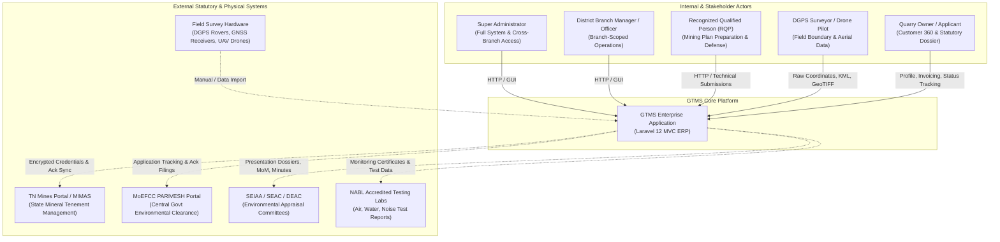
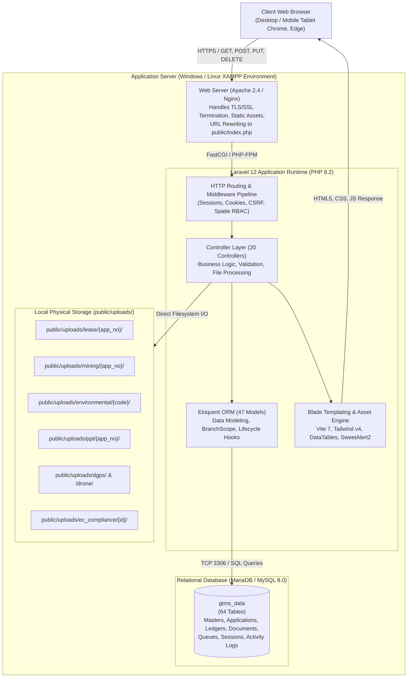
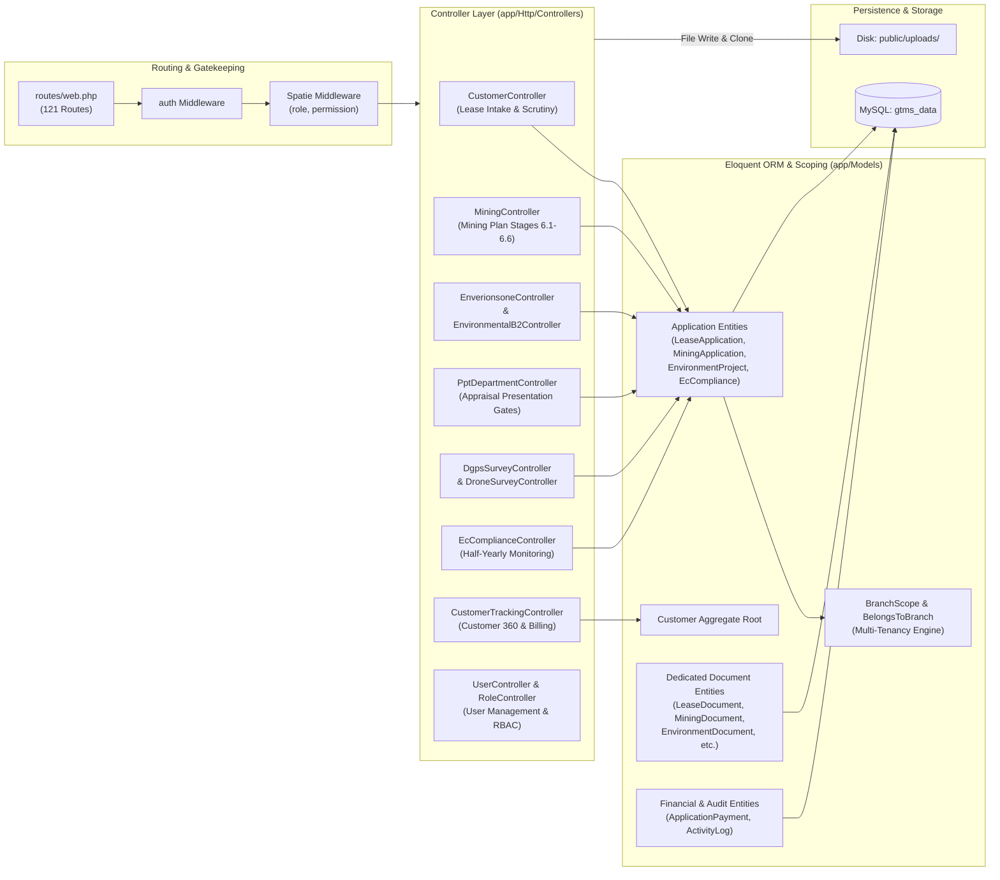
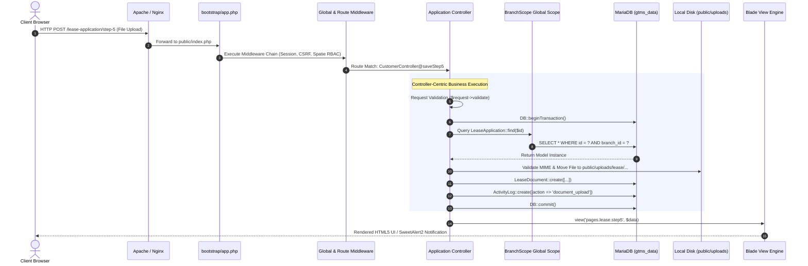

# GTMS System Architecture Specification

**Project Name:** Granite / Mining Tracking Management System (GTMS)  
**Domain:** Enterprise Statutory Mining ERP & Departmental Compliance Hub  
**Jurisdiction:** Tamil Nadu, India (Department of Geology and Mining, SEIAA, DEAC, TNPCB)  
**Architecture Style:** Monolithic Controller-Centric MVC  
**Target Platform:** Laravel 12.x / PHP 8.2 / MariaDB / Apache (XAMPP Environment)  
**Authoritative Source:** Codebase Inspection & Empirical System Audit  
**Document Number:** `01` of `23`  

---

## 1. Executive Architectural Summary

The **Granite / Mining Tracking Management System (GTMS)** is an on-premise, enterprise-grade statutory compliance ERP built specifically for the mineral and dimensional granite quarrying industry in Tamil Nadu, India. The system governs complex, multi-year regulatory lifecycles spanning multiple state and central government statutory bodies:
1. **Department of Geology and Mining (DoGM) / District Collectorate:** Initial lease concession grant, revenue boundary verification (SF numbers, Patta, Poramboke), mining plan approval, and seigniorage fees.
2. **State Environmental Impact Assessment Authority (SEIAA) / DEIAA:** Environmental Clearance (EC) administration under Category B1 (ToR, EIA, Public Hearings) and Category B2 (Fast-track cluster appraisal).
3. **District Expert Appraisal Committee (DEAC) / PPT Department:** Technical presentation gates and appraisal defense.
4. **Cadastral & Geodetic Survey Authorities:** Differential Global Positioning System (DGPS) ground control coordinate fixation and DGCA-compliant UAV drone aerial volumetric tracking.
5. **Ministry of Environment, Forest and Climate Change (MoEFCC) / TNPCB:** Half-yearly post-EC environmental monitoring and statutory compliance reporting.

### Core Architectural Decisions & Philosophy
* **Monolithic MVC Architecture:** GTMS intentionally avoids over-engineered microservices or distributed service layers. It is designed for on-premise deployment in district headquarters using standard XAMPP stacks (Apache, PHP 8.2, MariaDB), maximizing local network reliability, zero network latency between components, and simplified backup regimens.
* **Controller-Centric Business Logic:** Business rules, transactional boundaries (`DB::beginTransaction`), input validations, and document processing reside directly within specialized controller actions. This enables rapid statutory updates when government orders (G.O.) or regulatory guidelines change without requiring cascading refactoring across multiple abstraction layers.
* **Dedicated Module Document Architecture:** Rather than utilizing a single polymorphic `documents` table for all files across the enterprise, GTMS implements dedicated document tables for each statutory module (`lease_documents`, `mining_documents`, `environment_documents`, `ppt_documents`, `dgps_documents`, `drone_documents`, `ec_compliance_documents`). This eliminates database table locking contention during concurrent bulk uploads of high-resolution CAD drawings, aerial orthomosaics, and PDF dossiers.
* **Cascade Physical Document Cloning:** When an application advances from one statutory department to another (e.g. Lease Application to Mining Plan, or Mining Plan to Environmental Clearance), physical files are cloned on disk and new database records are minted. This maintains an immutable historical audit trail where downstream modifications never alter or invalidate the official records of earlier approvals.
* **Transparent Multi-Tenancy via `BranchScope`:** Data isolation between district offices (Salem, Namakkal, Dharmapuri, etc.) is enforced at the database query generation layer via an Eloquent global scope (`BranchScope`), automatically scoping queries without manual developer filtering while preserving unconstrained access for Super Administrators.

---

## 2. C4 Architectural Model

### 2.1 C4 Level 1: System Context Diagram

The System Context diagram illustrates the users, external regulatory systems, and technical hardware interacting with the GTMS platform.



#### Actor & External System Matrix
| Entity | Type | Role & Interaction with GTMS |
| :--- | :--- | :--- |
| **Super Administrator** | Internal User | Holds global system access (`role_id === 1`), oversees master data, user provisioning, cross-branch analytics, and audit logs. |
| **Branch Manager / Officer** | Internal User | Operates within an assigned district branch (`branch_id`), processing local lease applications, conducting scrutinies, and issuing demand notices. |
| **Recognized Qualified Person (RQP)** | External Stakeholder | Certified mining expert responsible for drafting 5-year mining production schedules, progressive mine closure plans, and defending technical proposals before committees. |
| **DGPS Surveyor / Drone Pilot** | Field Specialist | Captures ground control points (GCPs), boundary pillar coordinates, drone orthomosaics, and pithead volumetric measurements. |
| **Quarry Owner / Applicant** | Customer Entity | Represented via Customer 360 profile, associated with active mining leases, financial ledgers, and compliance obligations. |
| **TN Mines Portal (MIMAS)** | External State System | Tamil Nadu Mines Tenement Management System; GTMS stores securely encrypted portal credentials (`mimas_credentials`) and tracks state acknowledgment numbers. |
| **MoEFCC PARIVESH** | External Central System | National portal for environmental clearances; GTMS tracks PARIVESH proposal codes, submission timestamps, and compliance acknowledgments. |
| **SEIAA / SEAC / DEAC** | Statutory Body | State & District Expert Appraisal Committees evaluating Environmental Clearance applications through technical presentation gates. |
| **NABL Testing Laboratories** | External Service | Certified laboratories generating baseline environmental quality reports (ambient air, noise, water, soil) uploaded during half-yearly compliance audits. |
| **Survey Hardware** | Physical Equipment | GNSS receivers, total stations, and UAV drones producing raw DXF, DWG, KML, and orthomosaic data ingested into GTMS. |

---

### 2.2 C4 Level 2: Container Diagram

The Container diagram illustrates the high-level technology architecture, runtime components, and data stores comprising the GTMS deployment.



#### Container Architectural Characteristics
1. **Web Server Layer:** Apache 2.4 (or Nginx) terminates incoming HTTP requests, enforces TLS encryption, serves compiled static assets (`build/assets/*`), and rewrites all application URLs to the central entrypoint `public/index.php`.
2. **PHP 8.2 Runtime:** Utilizes PHP 8.2 ZTS with critical extensions enabled: `pdo_mysql`, `mbstring`, `fileinfo`, `gd`, `openssl`, `curl`, `zip`, and `bcmath`.
3. **Database Engine (`gtms_data`):** Relational store configured with `utf8mb4` encoding and `utf8mb4_unicode_ci` collation. It hosts master registries, transactional workflow tables, full system audit logs (`activity_logs`), and core framework states (`sessions`, `cache`, `jobs`).
4. **Physical Storage:** Uploaded files bypass external cloud object storage (S3) in favor of deterministic on-premise local disk storage under `public/uploads/`. Subdirectories are partitioned by module and application number, ensuring high throughput and zero cloud dependency.

---

### 2.3 C4 Level 3: Component Diagram

The Component diagram reveals the internal structural composition of the Laravel application container:



---

## 3. MVC Request Lifecycle & Controller-Centric Execution

GTMS strictly implements the **Controller-Centric Monolithic Architecture** pattern. Unlike enterprise Java or complex microservice applications that implement multiple abstract service and repository layers, GTMS controllers manage end-to-end execution directly. This design decision was explicitly chosen to maintain high operational transparency, lower debugging complexity, and provide maximum agility when responding to shifting statutory mandates.



### Detailed Lifecycle Phases

#### Phase 1: Entry Point & Application Bootstrapping
1. Requests hit `public/index.php`.
2. Composer's PSR-4 class loader initializes runtime class maps (`vendor/autoload.php`).
3. `bootstrap/app.php` initializes the `Illuminate\Foundation\Application` container:
   - Registers web routing (`routes/web.php`).
   - Registers console commands (`routes/console.php`).
   - Configures application health monitoring endpoint (`/up`).
   - Configures Spatie RBAC middleware aliases (`role`, `permission`, `role_or_permission`).

#### Phase 2: Middleware Pipeline Execution
Every request passes through sequential middleware gates:
1. **Maintenance Check:** `PreventRequestsDuringMaintenance` checks if the application is down.
2. **Input Sanitization:** `TrimStrings` and `ConvertEmptyStringsToNull` clean raw inputs.
3. **Session & Cookie Handling:** `EncryptCookies`, `AddQueuedCookiesToResponse`, and `StartSession` mount the database-backed session (`sessions` table).
4. **CSRF Validation:** `ValidateCsrfToken` guarantees request authenticity against the session token.
5. **Route Model Binding:** `SubstituteBindings` resolves route parameters into model instances.
6. **Authorization Gates:** Spatie's `RoleMiddleware` or `PermissionMiddleware` evaluates user permissions against the active session. If unauthorized, an immediate HTTP 403 response is issued.

#### Phase 3: Controller Execution & Transactional Guarantees
Controllers orchestrate complete operations:
1. **Inline Validation:** Parameters are validated immediately using `$request->validate([...])` or `Validator::make()`.
2. **Explicit Database Transactions:** State modifications wrap within `DB::beginTransaction()`, `DB::commit()`, and `DB::rollBack()` blocks. If an unhandled exception or file system error occurs, all database changes revert cleanly.
3. **Physical File Handling:** Files uploaded via multipart forms are validated for MIME type and file size, sanitized, assigned unique filenames, and moved directly into `public/uploads/{module}/{identifier}/`.
4. **Audit Trail Recording:** Significant actions explicitly invoke `ActivityLog::create([...])`, capturing the actor ID, model type, previous state, new state, IP address, and user agent.
5. **Presentation Rendering:** The controller extracts data, prepares UI view models, and renders Blade templates or returns structured JSON payloads for DataTables/AJAX consumers.

---

## 4. Multi-Tenancy Architecture via `BranchScope`

GTMS serves multiple district offices across Tamil Nadu while operating on a single unified database. Rather than relying on separate databases per tenant, GTMS implements **Logical Multi-Tenancy** enforced at the query generation layer.

### 4.1 Global Scope Implementation (`BranchScope.php`)
Located at `app/Models/Scopes/BranchScope.php`, this scope intercepts every Eloquent query executed against tenant-aware models:

```php
namespace App\Models\Scopes;

use Illuminate\Database\Eloquent\Builder;
use Illuminate\Database\Eloquent\Model;
use Illuminate\Database\Eloquent\Scope;
use Illuminate\Support\Facades\Auth;

class BranchScope implements Scope
{
    public function apply(Builder $builder, Model $model): void
    {
        if (Auth::hasUser()) {
            $user = Auth::user();
            // If user has a specific branch assigned and is not a superadmin (role_id !== 1)
            if (!empty($user->branch_id) && $user->role_id !== 1) {
                $builder->where($model->getTable() . '.branch_id', $user->branch_id);
            }
        }
    }
}
```

### 4.2 Trait Integration (`BelongsToBranch.php`)
Located at `app/Models/Traits/BelongsToBranch.php`, this trait hooks into Eloquent's model boot lifecycle:

```php
namespace App\Models\Traits;

use App\Models\Branch;
use App\Models\Scopes\BranchScope;
use Illuminate\Database\Eloquent\Relations\BelongsTo;
use Illuminate\Support\Facades\Auth;

trait BelongsToBranch
{
    protected static function bootBelongsToBranch(): void
    {
        static::addGlobalScope(new BranchScope());

        static::creating(function ($model) {
            if (Auth::hasUser() && empty($model->branch_id)) {
                $user = Auth::user();
                if (!empty($user->branch_id)) {
                    $model->branch_id = $user->branch_id;
                }
            }
        });
    }

    public function branch(): BelongsTo
    {
        return $this->belongsTo(Branch::class);
    }
}
```

### 4.3 Architectural Rules & Scoped Models
1. **Automatic Query Filtering:** Whenever an Eloquent query (`select`, `update`, `delete`) executes on a scoped model, Eloquent automatically appends `AND {table}.branch_id = ?` to the SQL query.
2. **Automatic Creation Stamping:** During model creation (`static::creating`), if `branch_id` is omitted in the payload, the trait automatically extracts `$user->branch_id` from the authenticated session and stamps it on the record.
3. **Super Administrator Bypass:** If `Auth::user()->role_id === 1`, the scope evaluates to a no-op, granting the Super Admin global visibility across all district branches.
4. **Unauthenticated / Console Execution Bypass:** If no user is authenticated (e.g. background CLI workers or seeders), `Auth::hasUser()` returns `false`, preventing query contamination.
5. **Directly Scoped Entities (8 Models):**
   - `LeaseApplication` (`lease_applications.branch_id`)
   - `MiningApplication` (`mining_applications.branch_id`)
   - `EnvironmentProject` (`environment_projects.branch_id`)
   - `PptApplication` (`ppt_applications.branch_id`)
   - `DgpsSurvey` (`dgps_surveys.branch_id`)
   - `DroneSurvey` (`drone_surveys.branch_id`)
   - `EcCompliance` (`ec_compliances.branch_id`)
   - `MineralStockpile` (`mineral_stockpiles.branch_id`)

---

## 5. Cross-Module Data Handoffs & Universal Identifiers

A critical architectural achievement of GTMS is the seamless coordination of quarry records across independent regulatory departments.

```mermaid
flowchart TD
    subgraph Master_Entity ["Central Operational Hub"]
        Cust["Customer Entity\n(customers table)\nUniversal Customer 360 Aggregate"]
    end

    subgraph Phase_1 ["Phase 1: Lease Concession"]
        LA["Lease Application\n(lease_applications table)\n7-Step Statutory Wizard\nCommon ID: GTMS-2026-0001\nModule ID: LA-2026-0001"]
    end

    subgraph Phase_2 ["Phase 2: Mining Plan"]
        MP["Mining Application\n(mining_applications table)\n6-Stage Workflow (6.1 - 6.6)\nCarries Common ID: GTMS-2026-0001\nModule ID: MP-2026-0001"]
    end

    subgraph Phase_3 ["Phase 3: Environmental Clearance & PPT"]
        EP["Environment Project\n(environment_projects table)\nCategory B1 (SC1 / SC2) & B2\nProject Code: ENV/B1/2026/0001"]
        PPT["PPT Presentation Application\n(ppt_applications table)\nDEAC / SEIAA Approval Gate"]
        EC["EC Certificate\n(ec_certificates table)\nGranted Environmental Clearance"]
    end

    subgraph Phase_4 ["Phase 4: Field Surveys"]
        DGPS["DGPS Survey\n(dgps_surveys table)\nBoundary Pillar Geo-Fixation"]
        Drone["Drone Survey\n(drone_surveys table)\nVolumetric Pithead Audits"]
    end

    subgraph Phase_5 ["Phase 5: Operational Compliance & Stock"]
        ECC["EC Half-Yearly Compliance\n(ec_compliances table)\nPost-Grant 6-Month Monitoring"]
        Stock["Mineral Stockpile\n(mineral_stockpiles table)\nPermitted Quota & Dispatches"]
    end

    Cust -->|1:N Central Reference| LA
    Cust -->|1:N Central Reference| MP
    Cust -->|1:N Central Reference| EP
    Cust -->|1:N Central Reference| PPT
    Cust -->|1:N Central Reference| DGPS
    Cust -->|1:N Central Reference| Drone
    Cust -->|1:N Central Reference| ECC
    Cust -->|1:N Central Reference| Stock

    LA ==>|One-Click Promotion\n(Clones Files & Syncs Minerals)| MP
    MP ==>|Promote to Environmental Clearance\n(Clones GIS & Plans)| EP
    EP <==>|Sequential Approval Gate\n(SC1 -> PPT -> SC2 -> PPT)| PPT
    EP ==>|Issuance of Official Grant| EC
    EC ==>|Triggers 6-Month Audit Cycles| ECC
    LA -.->|Links Boundaries & Baseline Area| DGPS
    LA -.->|Quota Baseline & Pit Tracking| Stock
    MP -.->|Production Target Verification| Drone
```

### 5.1 The Universal Common ID Pattern (`common_id`)
To prevent fragmentation across departments where each office issues its own local numbering format (e.g. `LA-2026-0104`, `MP-2026-0042`, `ENV-2026-0019`), GTMS generates a persistent **Universal Common ID**:
* **Format:** `GTMS-{YEAR}-{SEQUENCE}` (e.g. `GTMS-2026-0001`).
* **Generation Timing:** Minted at intake during initial Lease Application registration.
* **Propagation:** Maintained as an indexed column across `lease_applications` and `mining_applications`, and carried through environmental dossiers.
* **Benefit:** Allows any officer or quarry owner to search a single unified ID and retrieve all cross-departmental filings across the quarry's 20-year lifespan.

### 5.2 Category B1 Sequential 2-Stage Lifecycle & Gatekeeping
For Category B1 environmental projects (quarries requiring EIA and public hearings), GTMS enforces a strict two-stage state machine mediated by the PPT Department:
1. **Stage 1 (Sub Category 1 - SC1):** The applicant compiles 5 statutory baseline folders (`Documents`, `Report`, `GIS & Maps`, `Signed Reports`, `PARIVESH Acknowledgements`).
2. **Stage 1 PPT Presentation Gate:** A PPT Application is instantiated with `presentation_stage = 'tor_presentation'`. The project remains locked until the PPT Department issues approval via `PptDepartmentController@approveStage`.
3. **Stage 2 Unlock (Sub Category 2 - SC2):** Upon Stage 1 approval, the system transitions `environment_projects.sub_category` to `SC2`, unlocking 6 EIA folders (`Documents (ToR Letter)`, `Baseline Study`, `Draft (12 Chapters)`, `TNPCB Draft Submission`, `Final EIA Report`, `Uploading File`).
4. **Stage 2 PPT Presentation Gate:** A second PPT Application is defended before the committee. Once approved, the project reaches completion, enabling the issuance of the final `EcCertificate`.

---

## 6. Physical File Cloning & Document Isolation Architecture

A core design innovation in GTMS is its rejection of the common industry anti-pattern of utilizing a single polymorphic `documents` table for all system attachments.

### 6.1 Dedicated Module Document Tables vs Monolithic Anti-Pattern
In high-volume mining management systems where individual engineering drawings, GIS maps, and public hearing video transcripts range from 20MB to 100MB, storing all records in a single `documents` table causes severe performance degradation:
* **High Lock Contention:** Concurrent inserts from multiple branches cause row-level and index locks on the single table.
* **Index Bloat:** A single table quickly amasses hundreds of thousands of records, slowing B-tree traversals.
* **Schema Rigidity:** Different departments require different statutory metadata (e.g. `reviewed_at`, `review_note`, `is_mandatory`, `folder_category`).

**The GTMS Solution:** GTMS implements dedicated document tables for each module:
1. `lease_documents`
2. `mining_documents`
3. `environment_documents`
4. `ppt_documents`
5. `dgps_documents`
6. `drone_documents`
7. `ec_compliance_documents`

### 6.2 The Cascade Physical File Cloning Pattern
When an application transitions across departmental boundaries (e.g. promoting an approved Lease Application to a Mining Plan, or promoting a Mining Plan to Environmental Clearance), GTMS physically clones the underlying binary files on disk:

```php
// CustomerController.php: Document Cloning from Lease to Mining
$miningUploadSubdir = 'uploads/mining/' . $miningAppNo;
$miningUploadPath = public_path($miningUploadSubdir);
if (!file_exists($miningUploadPath)) {
    mkdir($miningUploadPath, 0777, true);
}

foreach ($lease->documents as $lDoc) {
    if (!empty($lDoc->file_path) && file_exists(public_path($lDoc->file_path))) {
        $sourcePath = public_path($lDoc->file_path);
        $destFileName = basename($sourcePath);
        $destPath = $miningUploadPath . '/' . $destFileName;
        
        // Physical disk copy
        @copy($sourcePath, $destPath);

        // Map target folder: KML/Plan -> Folder 5 (Plan), others -> Folder 2 (Documents)
        $targetFolderId = (str_contains(strtolower($lDoc->document_name), 'plan') || $lDoc->folder_id == 9) ? 5 : 2;

        MiningDocument::create([
            'mining_application_id' => $miningApp->id,
            'folder_id'             => $targetFolderId,
            'document_field_id'     => null,
            'document_name'         => $lDoc->document_name,
            'file_name'             => $destFileName,
            'file_path'             => $miningUploadSubdir . '/' . $destFileName,
            'file_type'             => $lDoc->file_type ?? 'application/pdf',
            'file_size'             => file_exists($destPath) ? filesize($destPath) : ($lDoc->file_size ?? 0),
            'status'                => in_array($lDoc->status, ['validated', 'approved']) ? 'validated' : 'uploaded',
            'uploaded_by'           => Auth::id() ?? 1,
            'uploaded_at'           => now(),
        ]);
    }
}
```

#### Why Physical File Cloning is Imperative:
1. **Immutable Historical Evidentiary Record:** Lease records represent legally binding documents presented to the District Collector. If the Mining department requests an updated mine layout map and replaces it, referencing the same file path would mutate the historical Lease record, destroying statutory compliance evidence.
2. **Independent Deletion Safety:** If a draft or superseded drawing is deleted in a downstream module, the original document in the upstream module remains completely unaffected.
3. **Audit Trail Isolation:** Each module tracks its own review timestamps (`reviewed_at`), scrutinizer identities (`reviewed_by`), and statutory review notes (`review_note`) without polluting upstream registries.

---

## 7. Audit Trail, Logging & Security Architecture

### 7.1 Comprehensive System Activity Auditing (`activity_logs`)
GTMS tracks all critical system modifications via polymorphic activity logging:
* **Table:** `activity_logs` (with historical partition table `archived_activity_logs`).
* **Attributes Tracked:**
  - `loggable_type` & `loggable_id`: The affected model entity.
  - `user_id`: Authenticated user executing the action.
  - `action`: Operation code (`create`, `update`, `delete`, `status_change`, `file_upload`, `approval`).
  - `description`: Plain-text human-readable narrative.
  - `ip_address` & `user_agent`: Network origin parameters.
  - `old_values` & `new_values`: JSON-serialized attribute diffs capturing state before and after execution.

### 7.2 Security Hardening Architecture
1. **Encrypted Portal Credentials:** Credentials for state systems like MIMAS are stored in `mimas_credentials` with the `password` field cast to `'encrypted'`, leveraging AES-256 encryption via Laravel's `Crypt` facade.
2. **SQL Injection Defense:** All database queries utilize Eloquent parameter binding and PDO prepared statements. Raw SQL queries are avoided or strictly parameter-bound.
3. **Cross-Site Scripting (XSS) Mitigation:** Blade templating automatically escapes output (`{{ $variable }}`). In views requiring raw HTML, content is validated or restricted to administrative inputs.
4. **File Upload Verification:** Upload endpoints validate file extensions, verify MIME types against an approved whitelist (PDF, DOCX, DWG, DXF, KML, JPG, PNG, GeoTIFF), and generate randomized or structured file names to prevent directory traversal exploits.
5. **Cross-Site Request Forgery (CSRF):** Enforced across all state-mutating HTTP methods (`POST`, `PUT`, `PATCH`, `DELETE`) via the `ValidateCsrfToken` middleware.

---

## 8. Summary Architectural Verification Matrix

| Architectural Principle | Mechanism | Implementation File | Verification Metric |
| :--- | :--- | :--- | :--- |
| **Monolithic MVC** | Controller-Centric Execution | `app/Http/Controllers/*.php` | Direct request handling, 0 service layer bloat |
| **Multi-Tenancy** | Global Scope & Boot Trait | `app/Models/Scopes/BranchScope.php`, `BelongsToBranch.php` | Automatically injects `branch_id = ?` into queries |
| **Document Isolation** | Dedicated Module Document Tables | `database/migrations/*_module_tables.php` | 7 discrete document tables; zero cross-module lock contention |
| **Audit Immutability** | Cascade Physical File Cloning | `CustomerController.php`, `MiningController.php` | Files copied via `@copy()` into module-isolated storage |
| **Unified Cross-Module Tracking** | Universal Common ID | `lease_applications`, `mining_applications` | Persistent `GTMS-{YEAR}-{SEQUENCE}` indexed identifier |
| **Sequential Gatekeeping** | 2-Stage B1 State Machine | `EnvironmentProject.php`, `PptDepartmentController.php` | SC1 unlocks SC2 only after PPT stage approval |
