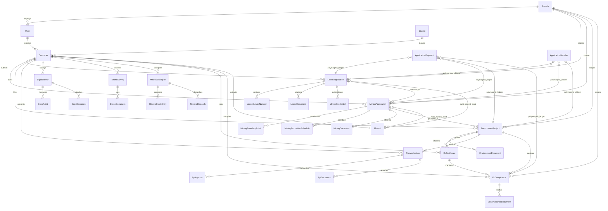

# GTMS Eloquent Models & Relationship Graph

**Project Name:** Granite / Mining Tracking Management System (GTMS)  
**ORM Architecture:** Laravel 12.x Eloquent ORM (Active Record Pattern)  
**Total Model Files:** 49 Files in `app/Models/` (47 Operational Models + 2 Legacy Prototype Models)  
**Global Scopes & Traits:** `app/Models/Scopes/BranchScope.php`, `app/Models/Traits/BelongsToBranch.php`  
**Authoritative Source:** Codebase Source Code Inspection & Structural Audit  
**Document Number:** `04` of `23`  

---

## 1. Eloquent ORM Architecture & Design Conventions

GTMS leverages Laravel's Eloquent ORM to provide an expressive, strongly-typed domain model layer. The models encapsulate data validation attributes, lifecycle hooks, automatic query filtering (multi-tenancy), dynamic accessors, and complex relational graphs.

### Core Architectural Patterns Across Models
1. **Multi-Tenancy via Global Scoping:** 8 primary application models incorporate the `BelongsToBranch` trait (`app/Models/Traits/BelongsToBranch.php`), which automatically attaches the `BranchScope` (`app/Models/Scopes/BranchScope.php`). This scopes all queries to `users.branch_id` unless the authenticated user holds the Super Administrator role (`role_id === 1`).
2. **Regulatory Audit Preservation via Soft Deletes:** Critical business aggregates (`Customer`, `LeaseApplication`, `MiningApplication`, `EnvironmentProject`, `EcCertificate`, `PptApplication`, `DgpsSurvey`, `DroneSurvey`, `EcCompliance`, and all document tables) utilize `Illuminate\Database\Eloquent\SoftDeletes`. This prevents accidental physical deletion from purging legal evidentiary records.
3. **Dedicated Module Document Architecture:** Rather than sharing a single polymorphic table, each statutory module maintains its own dedicated document model (`LeaseDocument`, `MiningDocument`, `EnvironmentDocument`, `PptDocument`, `DgpsDocument`, `DroneDocument`, `EcComplianceDocument`).
4. **Universal Polymorphic Ledgers:** Cross-cutting concerns—specifically assigned officers (`ApplicationHandler` on `application_handlers`) and financial payments (`ApplicationPayment` on `application_payments`)—leverage Eloquent polymorphic morphs (`MorphTo` / `HasMany`) to bind seamlessly across all application types.
5. **Deterministic Collision-Free Slugs:** The `Customer` model automatically generates unique, URL-safe slugs within its `booted()` lifecycle hook (`creating` and `updating` events) through iterative collision-checking loops against both active and soft-deleted rows.

---

## 2. Multi-Tenancy Engine: Scopes & Traits

### 2.1 `BranchScope` (`app/Models/Scopes/BranchScope.php`)
* **Role:** Intercepts query generation to enforce district branch data isolation.
* **Mechanism:** 
  - Inspects `Auth::user()`.
  - If a user is authenticated, has a non-empty `branch_id`, and `role_id !== 1`, it injects a SQL condition:  
    `WHERE {table}.branch_id = {user.branch_id}`.
  - If `role_id === 1` (Super Admin), query execution proceeds without branch restrictions.

### 2.2 `BelongsToBranch` (`app/Models/Traits/BelongsToBranch.php`)
* **Role:** Hooks `BranchScope` and branch auto-assignment into model lifecycles.
* **Boot Hook:**
  - Registers `static::addGlobalScope(new BranchScope())`.
  - Attaches a `creating` event listener: if `empty($model->branch_id)` and an authenticated user exists, it automatically stamps `$model->branch_id = Auth::user()->branch_id`.
* **Defined Relationships:**
  - `branch()`: `BelongsTo` -> `Branch` (`branch_id`).
* **Models Consuming this Trait (8 Models):**
  `DgpsSurvey`, `DroneSurvey`, `EcCompliance`, `EnvironmentProject`, `LeaseApplication`, `MineralStockpile`, `MiningApplication`, `PptApplication`.

---

## 3. Exhaustive Audit of All 49 Eloquent Models

Below is the complete, file-by-file audit of all 49 model files located under `app/Models/`:

---

### 1. `ActivityLog`
* **File Path:** `app/Models/ActivityLog.php`
* **Database Table:** `activity_logs`
* **Timestamps:** Disabled (`public $timestamps = false;`)
* **Fillable Attributes:** `loggable_type`, `loggable_id`, `user_id`, `action`, `description`, `ip_address`, `user_agent`, `old_values`, `new_values`, `created_at`.
* **Type Casts:**
  - `old_values` => `array` (JSON)
  - `new_values` => `array` (JSON)
  - `created_at` => `datetime`
* **Relationships:**
  - `loggable()`: `MorphTo` (polymorphic parent model being audited).
  - `user()`: `BelongsTo` -> `User` (`user_id`).

---

### 2. `ApplicantType`
* **File Path:** `app/Models/ApplicantType.php`
* **Database Table:** `applicant_types`
* **Fillable Attributes:** `name`, `status`.
* **Relationships:**
  - `miningApplications()`: `HasMany` -> `MiningApplication` (`applicant_type_id`).

---

### 3. `ApplicationHandler`
* **File Path:** `app/Models/ApplicationHandler.php`
* **Database Table:** `application_handlers`
* **Fillable Attributes:** `application_type`, `application_id`, `handlerable_type`, `handlerable_id`, `name`, `role`, `notes`, `sort_order`.
* **Relationships:**
  - `handlerable()`: `MorphTo` (polymorphic relationship to assigned entity, nullable).

---

### 4. `ApplicationPayment`
* **File Path:** `app/Models/ApplicationPayment.php`
* **Database Table:** `application_payments`
* **Fillable Attributes:** `application_type`, `application_id`, `payable_type`, `payable_id`, `product_value`, `paid_amount`, `pending_amount`, `payment_status`, `notes`.
* **Type Casts:**
  - `product_value` => `decimal:2`
  - `paid_amount` => `decimal:2`
  - `pending_amount` => `decimal:2`
* **Relationships:**
  - `payable()`: `MorphTo` (polymorphic relationship to any application aggregate).

---

### 5. `ArchivedActivityLog`
* **File Path:** `app/Models/ArchivedActivityLog.php`
* **Database Table:** `archived_activity_logs`
* **Fillable Attributes:** `loggable_type`, `loggable_id`, `user_id`, `action`, `description`, `ip_address`, `user_agent`, `old_values`, `new_values`, `created_at`, `archived_at`.
* **Type Casts:**
  - `old_values` => `array`
  - `new_values` => `array`
  - `created_at` => `datetime`
  - `archived_at` => `datetime`

---

### 6. `Branch`
* **File Path:** `app/Models/Branch.php`
* **Database Table:** `branches`
* **Guarded Attributes:** `protected $guarded = [];` (mass-assignable).
* **Relationships:**
  - Directly referenced by `User`, `LeaseApplication`, `MiningApplication`, `EnvironmentProject`, `DgpsSurvey`, `DroneSurvey`, `EcCompliance`, `MineralStockpile`, and `Product`.

---

### 7. `Category`
* **File Path:** `app/Models/Category.php`
* **Database Table:** `categories` *(Legacy Retail Scaffolding)*.
* **Guarded Attributes:** `protected $guarded = [];`
* **Relationships:**
  - Referenced by `Product` (`cat_id`).

---

### 8. `Customer`
* **File Path:** `app/Models/Customer.php`
* **Database Table:** `customers`
* **Traits:** `HasFactory`, `SoftDeletes`.
* **Route Key Name:** `slug` (overrides default `id` via `getRouteKeyName()`).
* **Fillable Attributes:** `customer_name`, `secondary_contact_person`, `company_name`, `mimas_no`, `mimas_number`, `mimas_status`, `slug`, `mobile_num`, `secondary_mobile_num`, `email`, `district_id`, `mineral_id`, `pan`, `aadhaar_no`, `gstin`, `area`, `address`, `status`, `user_id`, `created_by`.
* **Type Casts:**
  - `area` => `decimal:2`
  - `status` => `integer`
* **Lifecycle Hooks (`booted()`):**
  - `creating`: Evaluates `company_name` or `customer_name` using `Str::slug()`. Checks `static::withTrashed()->where('slug', $slug)->exists()` in a loop to generate a collision-free slug (e.g. `sri-bala-traders-2`).
  - `updating`: If `company_name` or `customer_name` is dirty, recomputes the slug while excluding the current record's `id`.
* **Relationships:**
  - `district()`: `BelongsTo` -> `District` (`district_id`).
  - `mineral()`: `BelongsTo` -> `Mineral` (`mineral_id`).
  - `user()`: `BelongsTo` -> `User` (`user_id`).
  - `creator()`: `BelongsTo` -> `User` (`created_by`).
  - `leaseApplications()`: `HasMany` -> `LeaseApplication` (`customer_id`).
  - `miningApplications()`: `HasMany` -> `MiningApplication` (`customer_id`).
  - `environmentProjects()`: `HasMany` -> `EnvironmentProject` (`customer_id`).
  - `pptApplications()`: `HasMany` -> `PptApplication` (`customer_id`).
  - `dgpsSurveys()`: `HasMany` -> `DgpsSurvey` (`customer_id`).
  - `droneSurveys()`: `HasMany` -> `DroneSurvey` (`customer_id`).
  - `stockpiles()`: `HasMany` -> `MineralStockpile` (`quarry_customer_id`).
  - `ecCertificates()`: `HasMany` -> `EcCertificate` (`customer_id`).
  - `ecCompliances()`: `HasMany` -> `EcCompliance` (`customer_id`).

---

### 9. `DgpsDocument`
* **File Path:** `app/Models/DgpsDocument.php`
* **Database Table:** `dgps_documents`
* **Fillable Attributes:** `dgps_survey_id`, `folder_id`, `document_name`, `file_path`, `status`.
* **Relationships:**
  - `dgpsSurvey()`: `BelongsTo` -> `DgpsSurvey` (`dgps_survey_id`).
  - `folder()`: `BelongsTo` -> `Folder` (`folder_id`).

---

### 10. `DgpsPoint`
* **File Path:** `app/Models/DgpsPoint.php`
* **Database Table:** `dgps_points`
* **Fillable Attributes:** `dgps_survey_id`, `pillar_no`, `latitude`, `longitude`, `elevation`.
* **Type Casts:**
  - `latitude` => `decimal:8`
  - `longitude` => `decimal:8`
  - `elevation` => `decimal:2`
* **Relationships:**
  - `dgpsSurvey()`: `BelongsTo` -> `DgpsSurvey` (`dgps_survey_id`).

---

### 11. `DgpsSurvey`
* **File Path:** `app/Models/DgpsSurvey.php`
* **Database Table:** `dgps_surveys`
* **Traits:** `HasFactory`, `SoftDeletes`, `BelongsToBranch`.
* **Fillable Attributes:** `survey_no`, `field_book_no`, `customer_id`, `lease_application_id`, `mining_application_id`, `lease_area_ha`, `surveyed_area_ha`, `area_discrepancy_ha`, `location`, `survey_date`, `surveyor_user_id`, `survey_team_notes`, `instrument_model`, `instrument_serial_no`, `survey_status`, `report_status`, `gtm_report_file`, `autocad_dwg_file`, `product_value`, `paid_amount`, `pending_amount`, `payment_status`, `branch_id`, `created_by`.
* **Type Casts:**
  - `survey_date` => `date`
  - `lease_area_ha` => `decimal:2`
  - `surveyed_area_ha` => `decimal:2`
  - `area_discrepancy_ha` => `decimal:2`
  - `product_value` => `decimal:2`
  - `paid_amount` => `decimal:2`
  - `pending_amount` => `decimal:2`
* **Relationships:**
  - `handlers()`: `HasMany` -> `ApplicationHandler` (`application_id`, scoped to `application_type = 'dgps'`).
  - `payments()`: `HasMany` -> `ApplicationPayment` (`application_id`, scoped to `application_type = 'dgps'`).
  - `customer()`: `BelongsTo` -> `Customer` (`customer_id`, `withTrashed()`).
  - `leaseApplication()`: `BelongsTo` -> `LeaseApplication` (`lease_application_id`).
  - `miningApplication()`: `BelongsTo` -> `MiningApplication` (`mining_application_id`).
  - `surveyor()`: `BelongsTo` -> `User` (`surveyor_user_id`).
  - `creator()`: `BelongsTo` -> `User` (`created_by`).
  - `points()`: `HasMany` -> `DgpsPoint` (`dgps_survey_id`).
  - `documents()`: `HasMany` -> `DgpsDocument` (`dgps_survey_id`).

---

### 12. `District`
* **File Path:** `app/Models/District.php`
* **Database Table:** `districts`
* **Fillable Attributes:** `name`, `code`, `state`, `status`.
* **Type Casts:** `status` => `integer`.
* **Relationships:**
  - `customers()`: `HasMany` -> `Customer` (`district_id`).
  - `leaseApplications()`: `HasMany` -> `LeaseApplication` (`district_id`).
  - `miningApplications()`: `HasMany` -> `MiningApplication` (`district_id`).
  - `environmentProjects()`: `HasMany` -> `EnvironmentProject` (`district_id`).
  - `pptApplications()`: `HasMany` -> `PptApplication` (`district_id`).

---

### 13. `DocumentField`
* **File Path:** `app/Models/DocumentField.php`
* **Database Table:** `document_fields`
* **Fillable Attributes:** `folder_id`, `nature_of_work_id`, `name`, `required`, `sort_order`, `status`.
* **Type Casts:**
  - `required` => `boolean`
  - `status` => `integer`
* **Relationships:**
  - `folder()`: `BelongsTo` -> `Folder` (`folder_id`).

---

### 14. `DroneDocument`
* **File Path:** `app/Models/DroneDocument.php`
* **Database Table:** `drone_documents`
* **Fillable Attributes:** `drone_survey_id`, `folder_id`, `document_name`, `file_path`, `file_size`, `status`.
* **Type Casts:** `file_size` => `integer`.
* **Relationships:**
  - `droneSurvey()`: `BelongsTo` -> `DroneSurvey` (`drone_survey_id`).
  - `folder()`: `BelongsTo` -> `Folder` (`folder_id`).

---

### 15. `DroneSurvey`
* **File Path:** `app/Models/DroneSurvey.php`
* **Database Table:** `drone_surveys`
* **Traits:** `HasFactory`, `SoftDeletes`, `BelongsToBranch`.
* **Fillable Attributes:** `survey_no`, `customer_id`, `lease_application_id`, `mining_application_id`, `lease_area`, `location`, `flight_date`, `drone_pilot_name`, `pilot_rpc_no`, `drone_uin_no`, `drone_model`, `altitude_meters`, `gsd_cm_px`, `extracted_volume_cbm`, `survey_status`, `deliverable_files_path`, `gtms_report_file`, `product_value`, `paid_amount`, `pending_amount`, `payment_status`, `branch_id`, `created_by`.
* **Type Casts:**
  - `flight_date` => `date`
  - `lease_area` => `decimal:2`
  - `altitude_meters` => `decimal:2`
  - `gsd_cm_px` => `decimal:2`
  - `extracted_volume_cbm` => `decimal:2`
  - `product_value` => `decimal:2`
  - `paid_amount` => `decimal:2`
  - `pending_amount` => `decimal:2`
* **Relationships:**
  - `handlers()`: `HasMany` -> `ApplicationHandler` (`application_id`, scoped to `application_type = 'drone'`).
  - `payments()`: `HasMany` -> `ApplicationPayment` (`application_id`, scoped to `application_type = 'drone'`).
  - `customer()`: `BelongsTo` -> `Customer` (`customer_id`, `withTrashed()`).
  - `leaseApplication()`: `BelongsTo` -> `LeaseApplication` (`lease_application_id`).
  - `miningApplication()`: `BelongsTo` -> `MiningApplication` (`mining_application_id`).
  - `creator()`: `BelongsTo` -> `User` (`created_by`).
  - `documents()`: `HasMany` -> `DroneDocument` (`drone_survey_id`).

---

### 16. `EcCertificate`
* **File Path:** `app/Models/EcCertificate.php`
* **Database Table:** `ec_certificates`
* **Traits:** `HasFactory`, `SoftDeletes`.
* **Fillable Attributes:** `ec_ref_no`, `environment_project_id`, `customer_id`, `lease_application_id`, `parivesh_app_no`, `applicant_name`, `issue_date`, `expiry_date`, `validity_years`, `communication_type`, `certificate_file`, `conditions_summary`, `status`, `product_value`, `paid_amount`, `pending_amount`, `payment_status`, `created_by`.
* **Type Casts:**
  - `issue_date` => `date`
  - `expiry_date` => `date`
  - `validity_years` => `integer`
  - `product_value` => `decimal:2`
  - `paid_amount` => `decimal:2`
  - `pending_amount` => `decimal:2`
* **Local Query Scopes:**
  - `scopeExpiringWithin(Builder $query, int $days = 90)`: Filters certificates expiring between `now()` and `now()->addDays($days)` where `status = 'active'`.
* **Relationships:**
  - `handlers()`: `HasMany` -> `ApplicationHandler` (`application_id`, scoped to `application_type = 'ec'`).
  - `payments()`: `HasMany` -> `ApplicationPayment` (`application_id`, scoped to `application_type = 'ec'`).
  - `environmentProject()`: `BelongsTo` -> `EnvironmentProject` (`environment_project_id`).
  - `customer()`: `BelongsTo` -> `Customer` (`customer_id`, `withTrashed()`).
  - `leaseApplication()`: `BelongsTo` -> `LeaseApplication` (`lease_application_id`).
  - `creator()`: `BelongsTo` -> `User` (`created_by`).

---

### 17. `EcCompliance`
* **File Path:** `app/Models/EcCompliance.php`
* **Database Table:** `ec_compliances`
* **Traits:** `HasFactory`, `SoftDeletes`, `BelongsToBranch`.
* **Fillable Attributes:** `compliance_no`, `customer_id`, `environment_project_id`, `ec_certificate_id`, `project_name`, `district_id`, `taluk_village`, `mineral_id`, `compliance_period`, `compliance_year`, `submission_due_date`, `submission_date`, `parivesh_app_no`, `parivesh_acknowledgement_no`, `parivesh_uploaded_date`, `nabl_lab_name`, `nabl_certificate_no`, `monitoring_date`, `status`, `product_value`, `paid_amount`, `pending_amount`, `payment_status`, `payment_notes`, `branch_id`, `created_by`.
* **Type Casts:**
  - `submission_due_date` => `date`
  - `submission_date` => `date`
  - `parivesh_uploaded_date` => `date`
  - `monitoring_date` => `date`
  - `product_value` => `decimal:2`
  - `paid_amount` => `decimal:2`
  - `pending_amount` => `decimal:2`
* **Relationships:**
  - `customer()`: `BelongsTo` -> `Customer` (`customer_id`, `withTrashed()`).
  - `environmentProject()`: `BelongsTo` -> `EnvironmentProject` (`environment_project_id`, `withTrashed()`).
  - `ecCertificate()`: `BelongsTo` -> `EcCertificate` (`ec_certificate_id`, `withTrashed()`).
  - `district()`: `BelongsTo` -> `District` (`district_id`).
  - `mineral()`: `BelongsTo` -> `Mineral` (`mineral_id`).
  - `documents()`: `HasMany` -> `EcComplianceDocument` (`ec_compliance_id`).
  - `handlers()`: `HasMany` -> `ApplicationHandler` (`application_id`, scoped to `application_type = 'ec_compliance'`).
  - `payments()`: `HasMany` -> `ApplicationPayment` (`application_id`, scoped to `application_type = 'ec_compliance'`).

---

### 18. `EcComplianceDocument`
* **File Path:** `app/Models/EcComplianceDocument.php`
* **Database Table:** `ec_compliance_documents`
* **Traits:** `HasFactory`, `SoftDeletes`.
* **Fillable Attributes:** `ec_compliance_id`, `folder_category`, `document_name`, `file_name`, `file_path`, `file_type`, `file_size`, `is_mandatory`, `is_custom`, `status`, `review_note`, `uploaded_by`.
* **Type Casts:**
  - `is_mandatory` => `boolean`
  - `is_custom` => `boolean`
  - `file_size` => `integer`
* **Relationships:**
  - `compliance()`: `BelongsTo` -> `EcCompliance` (`ec_compliance_id`).
  - `uploader()`: `BelongsTo` -> `User` (`uploaded_by`).

---

### 19. `EnvironmentDocument`
* **File Path:** `app/Models/EnvironmentDocument.php`
* **Database Table:** `environment_documents`
* **Traits:** `HasFactory`, `SoftDeletes`.
* **Fillable Attributes:** `environment_project_id`, `folder_id`, `document_field_id`, `document_name`, `file_name`, `file_path`, `file_type`, `file_size`, `status`, `review_note`, `reviewed_by`, `reviewed_at`, `uploaded_by`, `uploaded_at`.
* **Type Casts:**
  - `file_size` => `integer`
  - `reviewed_at` => `datetime`
  - `uploaded_at` => `datetime`
* **Relationships:**
  - `environmentProject()`: `BelongsTo` -> `EnvironmentProject` (`environment_project_id`).
  - `folder()`: `BelongsTo` -> `Folder` (`folder_id`).
  - `documentField()`: `BelongsTo` -> `DocumentField` (`document_field_id`).
  - `reviewer()`: `BelongsTo` -> `User` (`reviewed_by`).
  - `uploader()`: `BelongsTo` -> `User` (`uploaded_by`).

---

### 20. `EnvironmentProject`
* **File Path:** `app/Models/EnvironmentProject.php`
* **Database Table:** `environment_projects`
* **Traits:** `HasFactory`, `SoftDeletes`, `BelongsToBranch`.
* **Fillable Attributes:** `project_code`, `customer_id`, `mining_application_id`, `lease_application_id`, `category`, `sub_category`, `b1_stage`, `ppt_stage_1_id`, `ppt_stage_2_id`, `project_name`, `district_id`, `location`, `contact_name`, `contact_phone`, `contact_email`, `public_hearing_date`, `public_hearing_minutes_file`, `status`, `product_value`, `paid_amount`, `pending_amount`, `payment_status`, `branch_id`, `created_by`.
* **Type Casts:**
  - `public_hearing_date` => `date`
  - `product_value` => `decimal:2`
  - `paid_amount` => `decimal:2`
  - `pending_amount` => `decimal:2`
* **Dynamic Accessors:**
  - `sub_category_label`: Returns `'Sub Category 1 — Site & Mining Documentation'` (SC1) or `'Sub Category 2 — EIA & TNPCB Submission'` (SC2).
  - `folder_names`: Dynamically returns folder checklists:
    - B1/SC1 (5 Folders): `Documents`, `Report`, `GIS & Maps`, `Signed Reports`, `PARIVESH Acknowledgements`.
    - B1/SC2 (6 Folders): `Documents (ToR Letter)`, `Baseline Study`, `Draft (12 Chapters)`, `TNPCB Draft Submission`, `Final EIA Report`, `Uploading File`.
    - B2 (6 Folders): `Documents`, `Site Photographs`, `Report`, `GIS & Maps`, `Signed Reports`, `PARIVESH Acknowledgements`.
  - `category_badge`: Formats badge string (`B1 · SC1`, `B1 · SC2`, `B2`).
* **Relationships:**
  - `handlers()`: `HasMany` -> `ApplicationHandler` (`application_id`, scoped to `application_type = 'environment'`).
  - `payments()`: `HasMany` -> `ApplicationPayment` (`application_id`, scoped to `application_type = 'environment'`).
  - `customer()`: `BelongsTo` -> `Customer` (`customer_id`, `withTrashed()`).
  - `miningApplication()`: `BelongsTo` -> `MiningApplication` (`mining_application_id`).
  - `leaseApplication()`: `BelongsTo` -> `LeaseApplication` (`lease_application_id`).
  - `district()`: `BelongsTo` -> `District` (`district_id`).
  - `creator()`: `BelongsTo` -> `User` (`created_by`).
  - `documents()`: `HasMany` -> `EnvironmentDocument` (`environment_project_id`).
  - `ecCertificates()`: `HasMany` -> `EcCertificate` (`environment_project_id`).
  - `pptApplications()`: `HasMany` -> `PptApplication` (`environment_project_id`).
  - `pptStage1()`: `BelongsTo` -> `PptApplication` (`ppt_stage_1_id`).
  - `pptStage2()`: `BelongsTo` -> `PptApplication` (`ppt_stage_2_id`).
  - `activities()`: `MorphMany` -> `ActivityLog` (`loggable`).

---

### 21. `EnvironmentalActivity` *(Legacy Prototype Model)*
* **File Path:** `app/Models/EnvironmentalActivity.php`
* **Database Table:** `environmental_activities`
* **Guarded Attributes:** `protected $guarded = [];`
* **Relationships:**
  - `project()`: `BelongsTo` -> `EnvironmentalProject` (`project_id`).

---

### 22. `EnvironmentalDocument` *(Legacy Prototype Model)*
* **File Path:** `app/Models/EnvironmentalDocument.php`
* **Database Table:** `environmental_documents`
* **Guarded Attributes:** `protected $guarded = [];`
* **Relationships:**
  - `project()`: `BelongsTo` -> `EnvironmentalProject` (`project_id`).

---

### 23. `EnvironmentalProject` *(Legacy Prototype Model)*
* **File Path:** `app/Models/EnvironmentalProject.php`
* **Database Table:** `environmental_projects`
* **Guarded Attributes:** `protected $guarded = [];`
* **Relationships:**
  - `documents()`: `HasMany` -> `EnvironmentalDocument` (`project_id`).
  - `activities()`: `HasMany` -> `EnvironmentalActivity` (`project_id`).

---

### 24. `Folder`
* **File Path:** `app/Models/Folder.php`
* **Database Table:** `folders`
* **Fillable Attributes:** `module_id`, `name`, `sort_order`, `status`.
* **Relationships:**
  - `module()`: `BelongsTo` -> `Module` (`module_id`).
  - `documentFields()`: `HasMany` -> `DocumentField` (`folder_id`).
  - `leaseDocuments()`: `HasMany` -> `LeaseDocument` (`folder_id`).
  - `miningDocuments()`: `HasMany` -> `MiningDocument` (`folder_id`).
  - `environmentDocuments()`: `HasMany` -> `EnvironmentDocument` (`folder_id`).
  - `pptDocuments()`: `HasMany` -> `PptDocument` (`folder_id`).
  - `dgpsDocuments()`: `HasMany` -> `DgpsDocument` (`folder_id`).
  - `droneDocuments()`: `HasMany` -> `DroneDocument` (`folder_id`).

---

### 25. `LeaseApplication`
* **File Path:** `app/Models/LeaseApplication.php`
* **Database Table:** `lease_applications`
* **Traits:** `HasFactory`, `SoftDeletes`, `BelongsToBranch`.
* **Fillable Attributes:** `common_id`, `application_no`, `customer_id`, `district_id`, `category_id`, `mineral_id`, `other_mineral_name`, `taluk`, `village`, `area_extent_ha`, `area_extent_acres`, `start_date`, `end_date`, `lease_period_years`, `contact_person`, `secondary_contact_person`, `contact_mobile`, `secondary_contact_mobile`, `current_step`, `product_value`, `paid_amount`, `pending_amount`, `payment_status`, `status`, `go_number`, `go_date`, `go_file`, `rejection_note`, `assigned_inspector_id`, `branch_id`, `created_by`.
* **Type Casts:**
  - `area_extent_ha` => `decimal:2`
  - `product_value` => `decimal:2`
  - `paid_amount` => `decimal:2`
  - `pending_amount` => `decimal:2`
  - `start_date` => `date`
  - `end_date` => `date`
  - `go_date` => `date`
  - `current_step` => `integer`
  - `lease_period_years` => `integer`
* **Relationships:**
  - `handlers()`: `HasMany` -> `ApplicationHandler` (`application_id`, scoped to `application_type = 'lease'`).
  - `customer()`: `BelongsTo` -> `Customer` (`customer_id`, `withTrashed()`).
  - `district()`: `BelongsTo` -> `District` (`district_id`).
  - `category()`: `BelongsTo` -> `LeaseCategory` (`category_id`).
  - `mineral()`: `BelongsTo` -> `Mineral` (`mineral_id`).
  - `minerals()`: `BelongsToMany` -> `Mineral` (`lease_application_minerals` pivot).
  - `branch()`: `BelongsTo` -> `Branch` (`branch_id`).
  - `inspector()`: `BelongsTo` -> `User` (`assigned_inspector_id`).
  - `creator()`: `BelongsTo` -> `User` (`created_by`).
  - `surveyNumbers()`: `HasMany` -> `LeaseSurveyNumber` (`lease_application_id`).
  - `mimasCredentials()`: `HasMany` -> `MimasCredential` (`lease_application_id`).
  - `mimasCredential()`: `HasOne` -> `MimasCredential` (`lease_application_id`).
  - `documents()`: `HasMany` -> `LeaseDocument` (`lease_application_id`).
  - `miningApplications()`: `HasMany` -> `MiningApplication` (`lease_application_id`).
  - `environmentProjects()`: `HasMany` -> `EnvironmentProject` (`lease_application_id`).
  - `dgpsSurveys()`: `HasMany` -> `DgpsSurvey` (`lease_application_id`).
  - `droneSurveys()`: `HasMany` -> `DroneSurvey` (`lease_application_id`).
  - `stockpile()`: `HasOne` -> `MineralStockpile` (`lease_application_id`).

---

### 26. `LeaseCategory`
* **File Path:** `app/Models/LeaseCategory.php`
* **Database Table:** `lease_categories`
* **Fillable Attributes:** `code`, `name`, `land_type`, `status`.
* **Relationships:**
  - `leaseApplications()`: `HasMany` -> `LeaseApplication` (`category_id`).

---

### 27. `LeaseDocument`
* **File Path:** `app/Models/LeaseDocument.php`
* **Database Table:** `lease_documents`
* **Traits:** `HasFactory`, `SoftDeletes`.
* **Fillable Attributes:** `lease_application_id`, `folder_id`, `document_field_id`, `document_name`, `file_name`, `file_path`, `file_type`, `file_size`, `status`, `review_note`, `reviewed_by`, `reviewed_at`, `uploaded_by`, `uploaded_at`.
* **Type Casts:**
  - `reviewed_at` => `datetime`
  - `uploaded_at` => `datetime`
* **Relationships:**
  - `leaseApplication()`: `BelongsTo` -> `LeaseApplication` (`lease_application_id`).
  - `folder()`: `BelongsTo` -> `Folder` (`folder_id`).
  - `documentField()`: `BelongsTo` -> `DocumentField` (`document_field_id`).
  - `reviewer()`: `BelongsTo` -> `User` (`reviewed_by`).
  - `uploader()`: `BelongsTo` -> `User` (`uploaded_by`).

---

### 28. `LeaseSurveyNumber`
* **File Path:** `app/Models/LeaseSurveyNumber.php`
* **Database Table:** `lease_survey_numbers`
* **Fillable Attributes:** `lease_application_id`, `survey_no`, `extent_ha`, `classification`, `pattadar_name`.
* **Type Casts:** `extent_ha` => `decimal:4`.
* **Relationships:**
  - `leaseApplication()`: `BelongsTo` -> `LeaseApplication` (`lease_application_id`).

---

### 29. `MimasCredential`
* **File Path:** `app/Models/MimasCredential.php`
* **Database Table:** `mimas_credentials`
* **Fillable Attributes:** `lease_application_id`, `user_id`, `password`, `email`, `contact_number`, `mimas_ack_no`, `ack_date`, `portal_status`.
* **Type Casts:**
  - `password` => `encrypted` (AES-256 encryption via Laravel `Crypt`)
  - `ack_date` => `date`
* **Relationships:**
  - `leaseApplication()`: `BelongsTo` -> `LeaseApplication` (`lease_application_id`).

---

### 30. `Mineral`
* **File Path:** `app/Models/Mineral.php`
* **Database Table:** `minerals`
* **Fillable Attributes:** `name`, `category`, `default_unit`, `status`.
* **Type Casts:** `status` => `integer`.
* **Relationships:**
  - `customers()`: `HasMany` -> `Customer` (`mineral_id`).
  - `leaseApplications()`: `HasMany` -> `LeaseApplication` (`mineral_id`).
  - `miningApplications()`: `HasMany` -> `MiningApplication` (`mineral_id`).
  - `stockpiles()`: `HasMany` -> `MineralStockpile` (`mineral_id`).

---

### 31. `MineralDispatch`
* **File Path:** `app/Models/MineralDispatch.php`
* **Database Table:** `mineral_dispatches`
* **Fillable Attributes:** `mineral_stockpile_id`, `dispatch_date`, `quantity`, `vehicle_number`, `driver_name`, `destination`, `seigniorage_fee_inr`, `challan_no`, `status`, `created_by`.
* **Type Casts:**
  - `dispatch_date` => `datetime`
  - `quantity` => `decimal:2`
  - `seigniorage_fee_inr` => `decimal:2`
* **Relationships:**
  - `stockpile()`: `BelongsTo` -> `MineralStockpile` (`mineral_stockpile_id`).
  - `creator()`: `BelongsTo` -> `User` (`created_by`).

---

### 32. `MineralStockEntry`
* **File Path:** `app/Models/MineralStockEntry.php`
* **Database Table:** `mineral_stock_entries`
* **Fillable Attributes:** `mineral_stockpile_id`, `entry_date`, `quantity`, `source_type`, `verified_by`, `remarks`.
* **Type Casts:**
  - `entry_date` => `date`
  - `quantity` => `decimal:2`
* **Relationships:**
  - `stockpile()`: `BelongsTo` -> `MineralStockpile` (`mineral_stockpile_id`).
  - `verifier()`: `BelongsTo` -> `User` (`verified_by`).

---

### 33. `MineralStockpile`
* **File Path:** `app/Models/MineralStockpile.php`
* **Database Table:** `mineral_stockpiles`
* **Traits:** `HasFactory`, `BelongsToBranch`.
* **Fillable Attributes:** `quarry_customer_id`, `lease_application_id`, `mineral_id`, `branch_id`, `annual_permitted_quota`, `current_stock_cbm`, `total_dispatched_cbm`, `unit`, `status`.
* **Type Casts:**
  - `annual_permitted_quota` => `decimal:2`
  - `current_stock_cbm` => `decimal:2`
  - `total_dispatched_cbm` => `decimal:2`
  - `status` => `integer`
* **Relationships:**
  - `quarryCustomer()`: `BelongsTo` -> `Customer` (`quarry_customer_id`).
  - `leaseApplication()`: `BelongsTo` -> `LeaseApplication` (`lease_application_id`).
  - `mineral()`: `BelongsTo` -> `Mineral` (`mineral_id`).
  - `entries()`: `HasMany` -> `MineralStockEntry` (`mineral_stockpile_id`).
  - `dispatches()`: `HasMany` -> `MineralDispatch` (`mineral_stockpile_id`).

---

### 34. `MiningApplication`
* **File Path:** `app/Models/MiningApplication.php`
* **Database Table:** `mining_applications`
* **Traits:** `HasFactory`, `SoftDeletes`, `BelongsToBranch`.
* **Fillable Attributes:** `common_id`, `application_no`, `customer_id`, `lease_application_id`, `nature_of_work_id`, `parent_plan_id`, `applicant_type_id`, `district_id`, `mineral_id`, `other_mineral_name`, `plan_type_id`, `taluk`, `village`, `survey_numbers_text`, `area_extent_ha`, `start_date`, `end_date`, `validity_years`, `stage`, `status`, `rqp_name`, `rqp_reg_no`, `safety_distance_meters`, `assigned_inspector_id`, `approval_order_no`, `approval_date`, `approval_file`, `kml_file_path`, `product_value`, `paid_amount`, `pending_amount`, `payment_status`, `branch_id`, `created_by`.
* **Type Casts:**
  - `area_extent_ha` => `decimal:2`
  - `product_value` => `decimal:2`
  - `paid_amount` => `decimal:2`
  - `pending_amount` => `decimal:2`
  - `safety_distance_meters` => `decimal:2`
  - `start_date` => `date`
  - `end_date` => `date`
  - `approval_date` => `date`
  - `validity_years` => `integer`
* **Relationships:**
  - `handlers()`: `HasMany` -> `ApplicationHandler` (`application_id`, scoped to `application_type = 'mining'`).
  - `customer()`: `BelongsTo` -> `Customer` (`customer_id`, `withTrashed()`).
  - `natureOfWork()`: `BelongsTo` -> `NatureOfWork` (`nature_of_work_id`).
  - `leaseApplication()`: `BelongsTo` -> `LeaseApplication` (`lease_application_id`).
  - `parentPlan()`: `BelongsTo` -> `MiningApplication` (`parent_plan_id`, self-reference).
  - `revisedPlans()`: `HasMany` -> `MiningApplication` (`parent_plan_id`, self-reference).
  - `applicantType()`: `BelongsTo` -> `ApplicantType` (`applicant_type_id`).
  - `district()`: `BelongsTo` -> `District` (`district_id`).
  - `mineral()`: `BelongsTo` -> `Mineral` (`mineral_id`).
  - `minerals()`: `BelongsToMany` -> `Mineral` (`mining_application_minerals` pivot).
  - `planType()`: `BelongsTo` -> `PlanType` (`plan_type_id`).
  - `inspector()`: `BelongsTo` -> `User` (`assigned_inspector_id`).
  - `branch()`: `BelongsTo` -> `Branch` (`branch_id`).
  - `creator()`: `BelongsTo` -> `User` (`created_by`).
  - `boundaryPoints()`: `HasMany` -> `MiningBoundaryPoint` (`mining_application_id`).
  - `productionSchedules()`: `HasMany` -> `MiningProductionSchedule` (`mining_application_id`).
  - `documents()`: `HasMany` -> `MiningDocument` (`mining_application_id`).
  - `environmentProjects()`: `HasMany` -> `EnvironmentProject` (`mining_application_id`).

---

### 35. `MiningBoundaryPoint`
* **File Path:** `app/Models/MiningBoundaryPoint.php`
* **Database Table:** `mining_boundary_points`
* **Fillable Attributes:** `mining_application_id`, `pillar_id`, `latitude`, `longitude`, `elevation`, `remarks`.
* **Type Casts:**
  - `latitude` => `decimal:8`
  - `longitude` => `decimal:8`
  - `elevation` => `decimal:2`
* **Relationships:**
  - `miningApplication()`: `BelongsTo` -> `MiningApplication` (`mining_application_id`).

---

### 36. `MiningDocument`
* **File Path:** `app/Models/MiningDocument.php`
* **Database Table:** `mining_documents`
* **Traits:** `HasFactory`, `SoftDeletes`.
* **Fillable Attributes:** `mining_application_id`, `folder_id`, `document_field_id`, `document_name`, `file_name`, `file_path`, `file_type`, `file_size`, `status`, `review_note`, `reviewed_by`, `reviewed_at`, `uploaded_by`, `uploaded_at`.
* **Type Casts:**
  - `file_size` => `integer`
  - `reviewed_at` => `datetime`
  - `uploaded_at` => `datetime`
* **Relationships:**
  - `miningApplication()`: `BelongsTo` -> `MiningApplication` (`mining_application_id`).
  - `folder()`: `BelongsTo` -> `Folder` (`folder_id`).
  - `documentField()`: `BelongsTo` -> `DocumentField` (`document_field_id`).
  - `reviewer()`: `BelongsTo` -> `User` (`reviewed_by`).
  - `uploader()`: `BelongsTo` -> `User` (`uploaded_by`).

---

### 37. `MiningProductionSchedule`
* **File Path:** `app/Models/MiningProductionSchedule.php`
* **Database Table:** `mining_production_schedules`
* **Fillable Attributes:** `mining_application_id`, `year_number`, `production_target`, `waste_removal`.
* **Type Casts:**
  - `year_number` => `integer`
  - `production_target` => `decimal:2`
  - `waste_removal` => `decimal:2`
* **Relationships:**
  - `miningApplication()`: `BelongsTo` -> `MiningApplication` (`mining_application_id`).

---

### 38. `Module`
* **File Path:** `app/Models/Module.php`
* **Database Table:** `modules`
* **Fillable Attributes:** `code`, `name`, `status`.
* **Relationships:**
  - `folders()`: `HasMany` -> `Folder` (`module_id`).

---

### 39. `NatureOfWork`
* **File Path:** `app/Models/NatureOfWork.php`
* **Database Table:** `nature_of_works`
* **Fillable Attributes:** `name`, `status`.

---

### 40. `PlanType`
* **File Path:** `app/Models/PlanType.php`
* **Database Table:** `plan_types`
* **Fillable Attributes:** `name`, `status`.
* **Relationships:**
  - `miningApplications()`: `HasMany` -> `MiningApplication` (`plan_type_id`).

---

### 41. `PptAgenda`
* **File Path:** `app/Models/PptAgenda.php`
* **Database Table:** `ppt_agendas`
* **Fillable Attributes:** `ppt_application_id`, `committee_type`, `meeting_no`, `item_no`, `meeting_date`, `agenda_pdf`, `mom_pdf`, `outcome`.
* **Type Casts:** `meeting_date` => `date`.
* **Relationships:**
  - `pptApplication()`: `BelongsTo` -> `PptApplication` (`ppt_application_id`).

---

### 42. `PptApplication`
* **File Path:** `app/Models/PptApplication.php`
* **Database Table:** `ppt_applications`
* **Traits:** `HasFactory`, `SoftDeletes`, `BelongsToBranch`.
* **Fillable Attributes:** `application_no`, `customer_id`, `environment_project_id`, `presentation_stage`, `project_name`, `district_id`, `taluk_village`, `mineral_id`, `status`, `product_value`, `paid_amount`, `pending_amount`, `payment_status`, `rqp_attending`, `company_rep_attending`, `rep_mobile`, `branch_id`, `created_by`.
* **Type Casts:**
  - `product_value` => `decimal:2`
  - `paid_amount` => `decimal:2`
  - `pending_amount` => `decimal:2`
* **Relationships:**
  - `handlers()`: `HasMany` -> `ApplicationHandler` (`application_id`, scoped to `application_type = 'ppt'`).
  - `payments()`: `HasMany` -> `ApplicationPayment` (`application_id`, scoped to `application_type = 'ppt'`).
  - `customer()`: `BelongsTo` -> `Customer` (`customer_id`, `withTrashed()`).
  - `environmentProject()`: `BelongsTo` -> `EnvironmentProject` (`environment_project_id`).
  - `district()`: `BelongsTo` -> `District` (`district_id`).
  - `mineral()`: `BelongsTo` -> `Mineral` (`mineral_id`).
  - `creator()`: `BelongsTo` -> `User` (`created_by`).
  - `agendas()`: `HasMany` -> `PptAgenda` (`ppt_application_id`).
  - `documents()`: `HasMany` -> `PptDocument` (`ppt_application_id`).

---

### 43. `PptDocument`
* **File Path:** `app/Models/PptDocument.php`
* **Database Table:** `ppt_documents`
* **Traits:** `HasFactory`, `SoftDeletes`.
* **Fillable Attributes:** `ppt_application_id`, `folder_id`, `document_field_id`, `document_name`, `file_name`, `file_path`, `file_type`, `file_size`, `status`, `review_note`, `reviewed_by`, `uploaded_by`.
* **Type Casts:** `file_size` => `integer`.
* **Relationships:**
  - `pptApplication()`: `BelongsTo` -> `PptApplication` (`ppt_application_id`).
  - `folder()`: `BelongsTo` -> `Folder` (`folder_id`).
  - `documentField()`: `BelongsTo` -> `DocumentField` (`document_field_id`).
  - `reviewer()`: `BelongsTo` -> `User` (`reviewed_by`).
  - `uploader()`: `BelongsTo` -> `User` (`uploaded_by`).

---

### 44. `Product` *(Legacy Retail Scaffolding)*
* **File Path:** `app/Models/Product.php`
* **Database Table:** `products`
* **Guarded Attributes:** `protected $guarded = [];`
* **Relationships:**
  - `category()`: `BelongsTo` -> `Category` (`cat_id`).
  - `branch()`: `BelongsTo` -> `Branch` (`branch_id`).

---

### 45. `ProductStock` *(Legacy Retail Scaffolding)*
* **File Path:** `app/Models/ProductStock.php`
* **Database Table:** `product_stocks`
* **Guarded Attributes:** `protected $guarded = [];`
* **Relationships:**
  - `product()`: `BelongsTo` -> `Product` (`product_id`).

---

### 46. `ProjectFlow`
* **File Path:** `app/Models/ProjectFlow.php`
* **Database Table:** `project_flows`
* **Fillable Attributes:** `flowable_type`, `flowable_id`, `step_code`, `step_name`, `status`, `note`, `handled_by`, `handled_at`.
* **Type Casts:** `handled_at` => `datetime`.
* **Relationships:**
  - `flowable()`: `MorphTo` (polymorphic parent relation).
  - `handler()`: `BelongsTo` -> `User` (`handled_by`).

---

### 47. `Role`
* **File Path:** `app/Models/Role.php`
* **Database Table:** `roles`
* **Extends:** `Spatie\Permission\Models\Role`
* **Relationships:**
  - `directUsers()`: `HasMany` -> `User` (`role_id`).

---

### 48. `Unit` *(Legacy Retail Scaffolding)*
* **File Path:** `app/Models/Unit.php`
* **Database Table:** `units`
* **Guarded Attributes:** `protected $guarded = [];`

---

### 49. `User`
* **File Path:** `app/Models/User.php`
* **Database Table:** `users`
* **Extends:** `Illuminate\Foundation\Auth\User`
* **Traits:** `HasFactory`, `Notifiable`, `HasRoles` (Spatie).
* **Guarded Attributes:** `protected $guarded = [];`
* **Hidden Attributes:** `password`, `remember_token`.
* **Type Casts:**
  - `email_verified_at` => `datetime`
  - `password` => `hashed`
* **Relationships:**
  - `role()`: `BelongsTo` -> `Role` (`role_id`).
  - `branch()`: `BelongsTo` -> `Branch` (`branch_id`).

---

## 4. System-Wide Entity Relationship & Cardinality Map

The following Mermaid diagram visualizes the complete entity relationships anchoring the GTMS operational suite:

---

## 5. Architectural Warnings & Technical Debt Register

1. **Dead Prototype Models:**
   - `EnvironmentalProject.php`, `EnvironmentalDocument.php`, and `EnvironmentalActivity.php` are historical stubs from an early prototype on 2026-08-07. Active business code uses `EnvironmentProject` (`environment_projects`) and `EnvironmentDocument` (`environment_documents`). The legacy models should be retained only until formal migration cleanup or marked deprecated in `docs/22-unknowns-risks.md`.
2. **Double Column on `Customer` (`mimas_no` vs `mimas_number`):**
   - The `Customer` model has fillables for both `mimas_no` and `mimas_number`. The system standard relies on `mimas_no` (which carries a unique database index). Code should consistently reference `mimas_no`.
3. **Plaintext Password Exposure (`users.show_password`):**
   - The `users` table contains `show_password`. While `User` implements `'password' => 'hashed'`, the legacy column represents a major audit finding and must not be used in new controllers.
