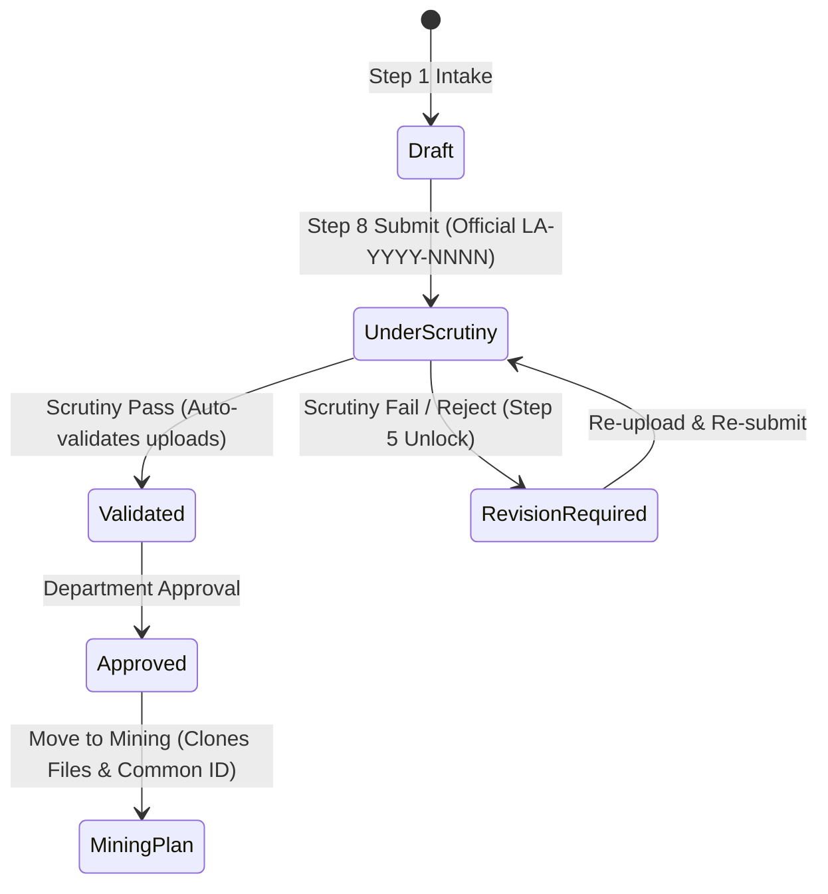
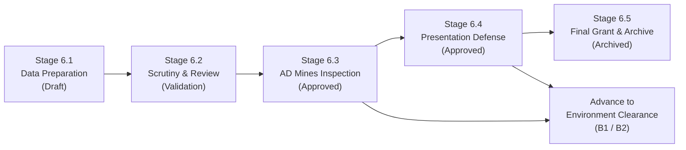
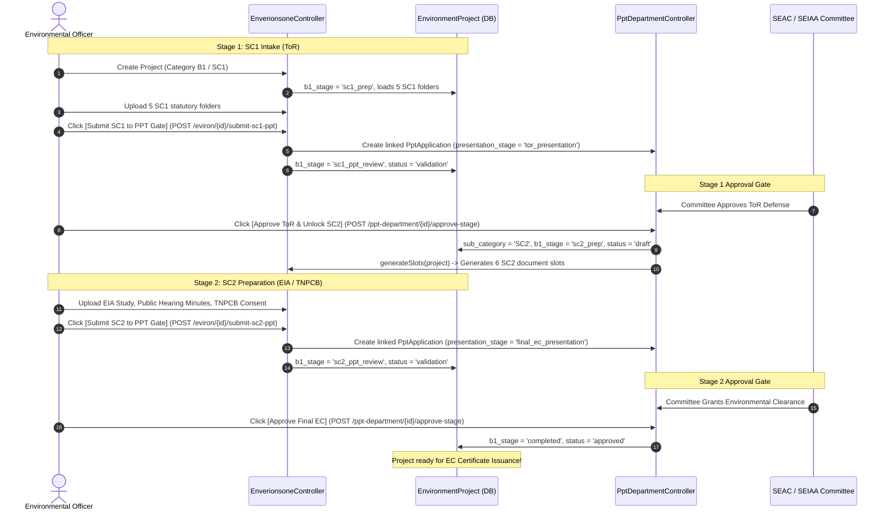

# 08 — Services & Core Business Logic Specification

**Document Version:** 1.0.0  
**Target Codebase:** `c:\xampp\htdocs\GTMS\gtms`  
**Classification:** Core Business Logic, State Machines & Computational Algorithms  
**Author:** Spec Miner Survey 2 (Backend Logic Specialist)  

---

## 1. Business Logic Architecture

GTMS implements domain business logic directly within its HTTP Controllers and Eloquent model lifecycle hooks (`booted()`). There are **zero dedicated service classes under `app/Services`**. 

This document provides the definitive technical specification of the five core domain engines and mathematical algorithms that drive GTMS:
1. **The 8-Step Lease Application State Machine & Milestone Document Saving**
2. **The Mining Plan Process Flow (Stages 6.1 – 6.5) & Stage Advancement Engine**
3. **The Category B1 Sequential 2-Stage Lifecycle & PPT Department Approval Gates**
4. **Universal Common ID (`GTMS-YYYY-XXXX`) Traceability & Cross-Module Physical Document Cloning**
5. **Polymorphic Financial Ledgers, GST Calculation & The Indian Currency Numbering Algorithm**

---

## 2. State Machine 1: Lease Application Lifecycle (Stages 6.1 – 6.5)

The Lease Application workflow tracks a mineral quarry concession from initial applicant intake through scrutiny validation, official approval, and promotion to Mining Plan.



### 2.1 State Definitions & Transition Triggers

| State (`status`) | Step Indicator (`current_step`) | Allowed Actions | Transition Trigger / Handler |
|:---|:---|:---|:---|
| **`draft`** | `1` to `8` | Edit steps, upload files, resume draft | `CustomerController@saveStep1` through `saveStep7`, `resumeDraft` |
| **`under_scrutiny`** | `6` / `8` | Review documents, flag corrections, pass validation, reject | `CustomerController@submit` (generates official `LA-YYYY-NNNN` and `GTMS-YYYY-NNNN`) |
| **`validated`** | `8` | Final executive approval, document status toggle | `CustomerController@validateApplication` (`action = 'pass'`) |
| **`revision_required`** | `5` | Re-upload flagged documents, add remarks | `CustomerController@validateApplication` (`action = 'fail'`) or `rejectApplication` |
| **`approved`** | `9` | Generate summary PDF report, promote to Mining Plan | `CustomerController@approveApplication` |

### 2.2 Milestone Document Saving Pattern
Unlike standard multi-step forms that hold file uploads in volatile memory until final submission, GTMS utilizes **Milestone Document Saving**:
1. At **Step 5**, selecting a file immediately triggers an AJAX POST to `/step5/upload` (`CustomerController@uploadDocument`).
2. The file is moved to `public/uploads/lease_applications/{app_no}/`.
3. An atomic row is inserted or updated in `lease_documents` with `status = 'uploaded'`.
4. If an applicant pauses their intake (e.g. to retrieve offline revenue land records), navigating to `/application/{id}/resume` reads persisted `lease_documents` directly from MySQL, rendering attached documents with green pills (`[ Attached ]`) and separate-page view icons (`target="_blank"`).

### 2.3 Bulk vs Granular Validation
- **Bulk Validation (`validateApplication`):** Passing validation updates the application status to `validated` and automatically executes:
  ```php
  LeaseDocument::where('lease_application_id', $id)
      ->whereNotNull('file_path')
      ->update(['status' => 'validated', 'reviewed_by' => Auth::id(), 'reviewed_at' => now()]);
  ```
- **Granular Scrutiny (`updateDocumentStatus`):** Officers can inspect individual attachments and toggle statuses (`validated`, `revision_required`) with contextual review notes.

---

## 3. State Machine 2: Mining Plan Preparation (Stages 6.1 – 6.5)

Mining Plans govern technical extraction planning, mineral reserve calculation, and safety distance adherence under Rule 41 of the Tamil Nadu Minor Mineral Concession Rules, 1959.



### 3.1 Stage-to-Status Mapping Matrix

| Stage | Process Description | Associated Status | State Transition Rule (`MiningController@advanceStage`) |
|:---|:---|:---|:---|
| **`6.1`** | Data Gathering & Application Intake | `draft` | Intake submission with 6 statutory folders |
| **`6.2`** | Departmental Scrutiny & Validation Loop | `scrutiny` | Scrutiny team reviews 6 statutory folders; requires all documents `validated` |
| **`6.3`** | Assistant Director (AD) Mines Field Inspection | `approved` | Field inspection report submitted; unlocks Environment Promotion |
| **`6.4`** | Technical Presentation & Rule 41 Compliance | `approved` | Presentation defense cleared |
| **`6.5`** | Final Order Grant & Dossier Archive | `archived` | Concession permanently archived |

### 3.2 Six Statutory Folders Architecture
1. **Folder 1: Field Log & Observation Book** (Baseline survey logs, field notes)
2. **Folder 2: Revenue Documents** (Patta, Chitta, Adangal, FMB sketches carried from Lease)
3. **Folder 3: Administrative Clearances** (Forest NOC, PWD water clearance, Village Panchayat resolution)
4. **Folder 4: Geological Reports** (Reserve estimation, bore hole logs, core sample assays)
5. **Folder 5: Mine Plan Drawings** (Surface plan, geological cross-sections, progressive closure plan, KML)
6. **Folder 6: Environmental Management Plan (EMP)** (Dust control, greenbelt design, seigniorage estimate)

---

## 4. State Machine 3: Category B1 Sequential 2-Stage Lifecycle & PPT Department Approval Gates

For major mining projects requiring Environmental Clearance under Category B1, statutory regulations mandate a **strict 2-stage sequential process**:
- **Stage 1:** Terms of Reference (ToR) preparation & presentation defense before the District / State Expert Appraisal Committee (SEAC).
- **Stage 2:** Environmental Impact Assessment (EIA) baseline study, Public Hearing, TNPCB submission, and final presentation defense.



### 4.1 B1 Stage Attributes & Transition Rules

1. **Intake Isolation:** On `/eviron/create`, selecting **Category B1** disables Sub Category 2 (SC2). Applicants can only register in Sub Category 1 (`SC1: ToR & Mining Documents — 5 Folders`).
2. **Stage 1 (SC1 Preparation):** Project initializes with:
   - `category = 'B1'`
   - `sub_category = 'SC1'`
   - `b1_stage = 'sc1_prep'`
   - `status = 'draft'`
   - Auto-generates 5 folders: `Folder 1 (Mining Plan Approval)`, `Folder 2 (Form-1 & PFR)`, `Folder 3 (Baseline Data)`, `Folder 4 (Survey & Revenue)`, `Folder 5 (Affidavits)`.
3. **Stage 1 PPT Gate Handoff (`submitSc1ToPpt`):**
   - Creates a linked `PptApplication` with `presentation_stage = 'tor_presentation'`.
   - Transitions project: `ppt_stage_1_id = $ppt->id`, `b1_stage = 'sc1_ppt_review'`, `status = 'validation'`.
4. **Stage 1 Gate Approval (`PptDepartmentController@approvePresentation`):**
   - PPT Department reviews presentation slides and committee queries.
   - Upon clicking approve, the controller detects `presentation_stage === 'tor_presentation'`:
     ```php
     $project->update([
         'sub_category' => 'SC2',
         'b1_stage'     => 'sc2_prep',
         'status'       => 'draft',
     ]);
     EnverionsoneController::generateSlots($project);
     ```
   - Automatically generates the 6 SC2 document slots!
5. **Stage 2 (SC2 Preparation):** Project now exposes 6 EIA folders: `Folder 1 (Approved ToR Letter)`, `Folder 2 (EIA & EMP Study Report)`, `Folder 3 (Public Hearing Minutes & Video)`, `Folder 4 (TNPCB Consent to Establish)`, `Folder 5 (Air/Water Modeling)`, `Folder 6 (Compliance Undertakings)`.
6. **Stage 2 PPT Gate Handoff (`submitSc2ToPpt`):**
   - Creates a linked `PptApplication` with `presentation_stage = 'final_ec_presentation'`.
   - Transitions project: `ppt_stage_2_id = $ppt->id`, `b1_stage = 'sc2_ppt_review'`, `status = 'validation'`.
7. **Stage 2 Gate Approval (`PptDepartmentController@approvePresentation`):**
   - PPT Department records SEIAA meeting grant.
   - Controller detects `presentation_stage === 'final_ec_presentation'`:
     ```php
     $project->update([
         'b1_stage' => 'completed',
         'status'   => 'approved',
     ]);
     ```
   - Transitions project to `approved`, ready for immediate certificate generation in the EC Certificate module!

---

## 5. State Machine 4: EC Certificate Issuance Wizard Gating

The EC Certificate module (`EcCertificateController.php`) provides an 8-step wizard for generating official government orders.

### 5.1 Symmetric Step Gating Algorithm (`getMaxUnlockedStep`)
To prevent applicants from jumping ahead to uninitialized steps via manual URL manipulation, both GET display and POST save handlers calculate `$maxUnlockedStep`:

```php
protected function getMaxUnlockedStep(array $draft): int
{
    $max = 1;
    if (!empty($draft['step1']['completed'])) {
        $max = 2;
        if (!empty($draft['step2'])) {
            $max = 3;
            if (!empty($draft['step3']['preview_verified'])) {
                $max = 4;
                if (!empty($draft['step4']['storage_confirmed'])) {
                    $max = 5;
                    if (!empty($draft['step5']['recipient_email'])) {
                        $max = 6;
                        if (isset($draft['step6'])) {
                            $max = 7;
                            if (isset($draft['step7'])) {
                                $max = 8;
                            }
                        }
                    }
                }
            }
        }
    }
    return $max;
}
```

### 5.2 Dynamic Reference Number Generators
Eliminating hardcoded or randomized identifiers, reference numbers are generated deterministically:
- **EC Reference Number:** `SEIAA-TN/EC/{YEAR}/{SEQUENCE}` (e.g. `SEIAA-TN/EC/2026/0001`)
- **Parivesh Proposal ID:** `SIA/TN/MIN/{10000 + project_id}/{YEAR}` (e.g. `SIA/TN/MIN/10005/2026`)

---

## 6. Business Logic 5: Common Tracking ID & Cross-Module Document Cloning

When transitioning records across statutory departments (Lease Application -> Mining Plan -> Environment Clearance), GTMS enforces **Referential Traceability** and **Physical Storage Isolation**.

### 6.1 Universal Common ID Specification
- **Format:** `GTMS-{YEAR}-{SEQUENCE}` (e.g. `GTMS-2026-0012`)
- **Immutability:** Once generated during Lease Application submission or direct intake, `common_id` is propagated to child `MiningApplication` and `EnvironmentProject` records.
- **Search Key:** Indexed across all domain tables, allowing users to query `GTMS-2026-0012` and instantly pull up all related departmental records on the Customer 360 Tracking Portal.

### 6.2 Atomic Concurrency-Safe Sequence Algorithm
To avoid duplicate primary keys under concurrent multi-user load, controllers do NOT use `Model::count() + 1`. Instead, they query the true numeric maximum with transaction row locks:

```php
$maxApp = DB::table('mining_applications')
    ->where(function($q) use ($year) {
        $q->where('application_no', 'like', "MP-{$year}-%")
          ->orWhere('application_no', 'like', "MDG-{$year}-%");
    })
    ->whereNull('deleted_at')
    ->orderByRaw("CAST(SUBSTRING_INDEX(application_no, '-', -1) AS UNSIGNED) DESC")
    ->lockForUpdate()
    ->first();

$nextSeq = 1;
if ($maxApp && preg_match('/-(\d+)(?:-[A-Za-z]+)?$/', $maxApp->application_no, $matches)) {
    $nextSeq = (int)$matches[1] + 1;
}
```

### 6.3 Physical Document Auto-Cloning Engine
When `moveToMining` or `moveToEnvironment` is invoked:
1. Target upload directory is created: `public/uploads/mining/{MP-APP-NO}/`.
2. Verified statutory attachments (Patta, FMB, Survey Sketches, KML) are physically copied via `File::copy($source, $dest)`.
3. Corresponding records are created in `mining_documents` (Folder 2 for revenue documents, Folder 5 for boundary plans and KML files).
4. This ensures that subsequent modifications or document replacements in one module never corrupt or overwrite the audit files of another module.

---

## 7. Computational Logic: Commercial Billing, GST & Indian Numbering

While GTMS tracks statutory compliance, all 7 regulatory applications carry polymorphic commercial billing ledgers (`product_value`, `paid_amount`, `pending_amount`, `payment_status`) and synchronize with `application_payments`.

### 7.1 Cross-Module Financial Aggregator (`CustomerTrackingController@buildInvoiceData`)
The billing engine inspects all active statutory applications for a customer and aggregates billable line items with official Government Service Accounting Codes (SAC):

| Regulatory Application | Default Description | SAC Code | Standard Rate (INR) |
|:---|:---|:---|:---|
| **Mining Plan** | Preparation of Mining Plan & PMCP under Rule 41 | `998343` | ₹1,20,000.00 – ₹1,50,000.00 |
| **Lease Application** | Mining Lease Application, Revenue Scrutiny & MMS Filing | `998341` | ₹50,000.00 |
| **Environment Clearance** | EC Formulation, Form-1, Form-2, PFR & Baseline EMP | `998349` | ₹80,000.00 |
| **EC Certificate** | SEIAA EC Certificate Order Verification & Docket | `998349` | ₹25,000.00 |
| **PPT Department** | PPT Presentation Deck & SEAC Committee Appraisal Defense | `998311` | ₹25,000.00 – ₹45,000.00 |
| **DGPS Survey** | DGPS Boundary Survey & Pillar Coordinate Fixation | `998341` | ₹35,000.00 |
| **Drone Survey** | UAV Aerial Photogrammetry & 3D Volumetric Computation | `998342` | ₹50,000.00 |
| **EC Compliance** | Half-Yearly Compliance Monitoring & Parivesh Portal Filing | `998349` | ₹50,000.00 |

### 7.2 GST Tax Computation
GTMS applies standard Indian Goods and Services Tax (GST) rules for technical and consulting services:
```php
$subtotal = collect($items)->sum('amount');
$cgst = round($subtotal * 0.09, 2); // 9% Central GST
$sgst = round($subtotal * 0.09, 2); // 9% State GST
$grandTotal = $subtotal + $cgst + $sgst; // Total: Subtotal + 18% GST
```

### 7.3 Indian Currency Number-to-Words Algorithm
Western numbering formats (millions, billions) violate Indian accounting and tax standards. GTMS implements the exact Indian currency words converter:

```php
protected function numberToWords(float $number): string
{
    $no = (int)floor($number);
    $decimal = (int)round(($number - $no) * 100);
    $words = [
        0 => '', 1 => 'One', 2 => 'Two', 3 => 'Three', 4 => 'Four', 5 => 'Five',
        6 => 'Six', 7 => 'Seven', 8 => 'Eight', 9 => 'Nine', 10 => 'Ten',
        11 => 'Eleven', 12 => 'Twelve', 13 => 'Thirteen', 14 => 'Fourteen', 15 => 'Fifteen',
        16 => 'Sixteen', 17 => 'Seventeen', 18 => 'Eighteen', 19 => 'Nineteen', 20 => 'Twenty',
        30 => 'Thirty', 40 => 'Forty', 50 => 'Fifty', 60 => 'Sixty', 70 => 'Seventy',
        80 => 'Eighty', 90 => 'Ninety'
    ];

    if ($no === 0) return 'Zero Rupees Only';

    // Split integer into Indian denominations
    $crores = (int)floor($no / 10000000);   $no %= 10000000;
    $lakhs = (int)floor($no / 100000);       $no %= 100000;
    $thousands = (int)floor($no / 1000);     $no %= 1000;
    $hundreds = (int)floor($no / 100);       $remainder = $no % 100;

    $parts = [];
    if ($crores > 0)    $parts[] = $this->convertTwoDigits($crores, $words) . ' Crore';
    if ($lakhs > 0)     $parts[] = $this->convertTwoDigits($lakhs, $words) . ' Lakh';
    if ($thousands > 0) $parts[] = $this->convertTwoDigits($thousands, $words) . ' Thousand';
    if ($hundreds > 0)  $parts[] = $words[$hundreds] . ' Hundred';
    if ($remainder > 0) $parts[] = $this->convertTwoDigits($remainder, $words);

    $res = implode(' ', array_filter($parts)) . ' Rupees';
    if ($decimal > 0) {
        $res .= ' and ' . $this->convertTwoDigits($decimal, $words) . ' Paise';
    }
    return trim($res) . ' Only';
}

private function convertTwoDigits(int $n, array $words): string
{
    if ($n < 20) return $words[$n];
    $tens = (int)(floor($n / 10) * 10);
    $units = $n % 10;
    return trim(($words[$tens] ?? '') . ' ' . ($words[$units] ?? ''));
}
```

#### Example Output:
- Input: `₹1,77,000.00` (Subtotal ₹1,50,000 + CGST ₹13,500 + SGST ₹13,500)
- Output: `"One Lakh Seventy Seven Thousand Rupees Only"`
- Input: `₹2,50,050.50`
- Output: `"Two Lakh Fifty Thousand Fifty Rupees and Fifty Paise Only"`

---
*End of Document 08 — Services & Core Business Logic Specification*
