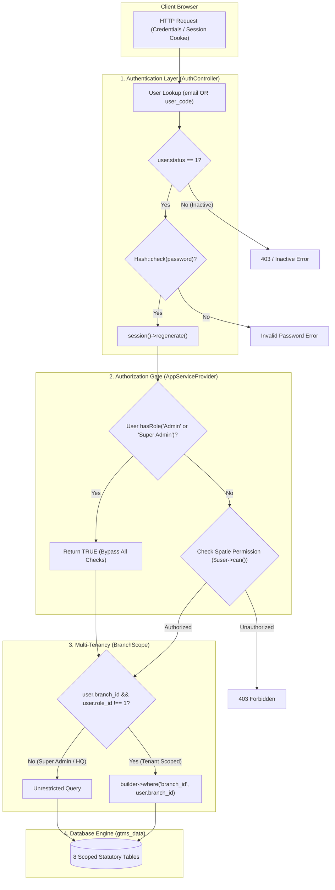

# 09 — Authentication, Authorization & Multi-Tenancy Architecture

**Document Version:** 1.0.0  
**Target Codebase:** `c:\xampp\htdocs\GTMS\gtms`  
**Classification:** Enterprise Security, Access Control & Tenant Isolation  
**Security Standard:** OWASP Top 10 / Statutory Compliance  

---

## 1. Executive Summary & Security Model

The **GTMS (Granite / Mining Tracking Management System)** incorporates a defense-in-depth security model engineered to handle sensitive mineral concessions, revenue documentation, statutory environmental filings, and government liaison records across Tamil Nadu's 38 revenue districts.

The security architecture rests on three core pillars:
1. **Stateful Session Authentication:** Hybrid identifier authentication allowing login via either primary email or official departmental User ID (`user_code`), guarded by account activation checks (`status == 1`) and session regeneration.
2. **Spatie Role-Based Access Control (RBAC):** Implementation of Spatie Laravel-Permission (v6.25) comprising 38 granular permissions organized across 12 functional domains, mapped to 3 operational roles (`Admin`, `Staff`, `Officer`), augmented by an unconditional super-admin bypass via `Gate::before`.
3. **Multi-Tenant Branch Isolation (`BranchScope`):** Architectural data partitioning that enforces automatic branch-level scoping on queries and creations across 8 statutory operational models for non-superadmin users, ensuring strict regional segregation while affording headquarters administrators comprehensive cross-state visibility.



---

## 2. Authentication Architecture & Lifecycle

Authentication in GTMS is managed by `app/Http/Controllers/AuthController.php` utilizing Laravel 12's native session guard (`web`) backed by the `database` session driver.

### 2.1 Login Flow & Dual Identifier Resolution
Unlike conventional systems restricted to email identification, GTMS accommodates field officers and headquarters clerks who frequently reference internal departmental User IDs (e.g., `LUK_001`, `LUK_002`).

```php
// app/Http/Controllers/AuthController.php:20-53
public function login(Request $request)
{
    $credentials = $request->validate([
        'email' => 'required|string',
        'password' => 'required|string',
    ]);

    $remember = $request->boolean('remember');

    // Dual identification lookup: email or user_code
    $user = User::where('email', $credentials['email'])
        ->orWhere('user_code', $credentials['email'])
        ->first();

    if (!$user) {
        return back()->withErrors([
            'email' => 'No account found with this email or User ID.',
        ])->onlyInput('email');
    }

    // Active status verification
    if ($user->status != 1) {
        return back()->withErrors([
            'email' => 'Your account is inactive. Please contact administrator.',
        ])->onlyInput('email');
    }

    if (Auth::attempt(['email' => $user->email, 'password' => $credentials['password']], $remember)) {
        $request->session()->regenerate();
        return redirect()->intended('/dashboard');
    }

    return back()->withErrors([
        'password' => 'Incorrect password entered.',
    ])->onlyInput('email');
}
```

#### Operational Safeguards:
1. **Identifier Resolution:** The controller resolves the canonical `$user->email` from the supplied string prior to calling `Auth::attempt()`, ensuring compatibility with Laravel's standard authentication provider.
2. **Account Status Check:** Inactive accounts (`status != 1`) are terminated immediately prior to password computation, preventing unnecessary cryptographic hashing overhead and brute-force timing attacks against deactivated users.
3. **Session Fixation Defense:** `$request->session()->regenerate()` is executed upon credential validation, invalidating the previous session identifier and assigning a cryptographically secure token.

### 2.2 Logout & Session Invalidation
Session termination executes complete destruction of client-side credentials and server session state:

```php
// app/Http/Controllers/AuthController.php:55-62
public function logout(Request $request)
{
    Auth::logout();
    $request->session()->invalidate();
    $request->session()->regenerateToken();

    return redirect('/')->with('success', 'Logged out successfully.');
}
```

### 2.3 User Model Specifications (`app/Models/User.php`)
The `User` entity combines Spatie RBAC traits, relationship definitions, and mass assignment protections:

```php
namespace App\Models;

use Database\Factories\UserFactory;
use Illuminate\Database\Eloquent\Factories\HasFactory;
use Illuminate\Foundation\Auth\User as Authenticatable;
use Illuminate\Notifications\Notifiable;
use Spatie\Permission\Traits\HasRoles;

class User extends Authenticatable
{
    use HasFactory, Notifiable, HasRoles;

    protected $guarded = [];

    public function role()
    {
        return $this->belongsTo(Role::class, 'role_id');
    }

    public function branch()
    {
        return $this->belongsTo(Branch::class, 'branch_id');
    }

    protected $hidden = [
        'password',
        'remember_token',
    ];

    protected function casts(): array
    {
        return [
            'email_verified_at' => 'datetime',
            'password' => 'hashed',
        ];
    }
}
```

---

## 3. Spatie Role-Based Access Control (RBAC)

GTMS implements the `spatie/laravel-permission` package (v6.25) across standard database tables: `roles`, `permissions`, `model_has_roles`, `model_has_permissions`, and `role_has_permissions`. All entries operate under the default `web` guard.

### 3.1 Exhaustive Catalog of 38 System Permissions
Permissions are seeded via `database/seeders/RolePermissionSeeder.php:25-95` across 12 distinct operational domains:

| # | Domain / Module | Permission Name | Guard | Operational Scope |
| :-: | :--- | :--- | :-: | :--- |
| 1 | **Dashboard** | `dashboard.view` | `web` | Access main analytics KPIs, count badges, and recent filings |
| 2 | **Branch / Dept** | `branch.view` | `web` | View district office branches and contact details |
| 3 | **Branch / Dept** | `branch.create` | `web` | Register new regional branch offices |
| 4 | **Branch / Dept** | `branch.edit` | `web` | Modify branch metadata, contact persons, and operational status |
| 5 | **Branch / Dept** | `branch.delete` | `web` | Remove or deactivate district branches |
| 6 | **Roles Management**| `roles.view` | `web` | Inspect system roles and assigned permission matrices |
| 7 | **Roles Management**| `roles.create` | `web` | Define custom organizational roles |
| 8 | **Roles Management**| `roles.edit` | `web` | Reconfigure permission sets assigned to roles |
| 9 | **Roles Management**| `roles.delete` | `web` | Remove obsolete roles from database |
| 10| **User Management** | `users.view` | `web` | View staff roster, designations, and branch affiliations |
| 11| **User Management** | `users.create` | `web` | Provision new staff accounts, assign initial passwords |
| 12| **User Management** | `users.edit` | `web` | Update staff profile, reset credentials, change branches |
| 13| **Customer Master** | `customer.view` | `web` | Browse Customer Directory and Customer 360 dossiers |
| 14| **Customer Master** | `customer.create` | `web` | Register new quarry owners / applicant corporate profiles |
| 15| **Customer Master** | `customer.edit` | `web` | Update customer GSTIN, PAN, Aadhaar, and contact records |
| 16| **Customer Master** | `customer.delete` | `web` | Soft-delete customer profiles (with dependency validation) |
| 17| **Lease Application**| `application.view` | `web` | View 8-step lease dossiers, summary grids, and checklists |
| 18| **Lease Application**| `application.create` | `web` | Initiate intake wizard (Steps 1-8) and upload attachments |
| 19| **Lease Application**| `application.edit` | `web` | Validate documents, approve/reject lease, trigger `moveToMining` |
| 20| **Lease Application**| `application.delete` | `web` | Remove rejected or draft lease filings |
| 21| **Mining Plan** | `mining.view` | `web` | Access Mining Plan portal, process flow 6.1-6.6, project folders |
| 22| **Mining Plan** | `mining.create` | `web` | Create mining applications, upload plans, bind minerals |
| 23| **Mining Plan** | `mining.edit` | `web` | Advance approval stages (6.1-6.6), transition to EC module |
| 24| **Mining Plan** | `mining.delete` | `web` | Delete aborted mining plan filings |
| 25| **Environment** | `environment.view` | `web` | Access Unified EC dashboard (B1 and B2 project portfolios) |
| 26| **Environment** | `environment.b1.view`| `web` | View Category B1 2-stage (SC1 ToR & SC2 EIA) project files |
| 27| **Environment** | `environment.b2.view`| `web` | View Category B2 6-folder statutory applications |
| 28| **Environment** | `environment.b2.create`| `web` | Initialize B1/B2 project drafts and submit initial dossiers |
| 29| **Environment** | `environment.b2.upload`| `web` | Upload regulatory affidavits, EMP reports, and KML drawings |
| 30| **Environment** | `environment.b2.review`| `web` | Review documents, update project status, submit dossiers to PPT |
| 31| **Environment** | `environment.b2.status`| `web` | Toggle final regulatory clearance stages |
| 32| **EC Certificate** | `ec_certificate.view`| `web` | Access certificate issuance wizard, search, and printable views |
| 33| **PPT Department** | `ppt.view` | `web` | Inspect DEAC presentation agendas, schedules, and reviews |
| 34| **PPT Department** | `ppt.manage` | `web` | Record committee decisions, approve ToR / EC stage gates |
| 35| **DGPS Survey** | `dgps.view` | `web` | Access Differential GPS survey logs and boundary coordinates |
| 36| **DGPS Survey** | `dgps.manage` | `web` | Enter Northing/Easting GCP points, upload CAD/DWG survey plans |
| 37| **Drone Survey** | `drone.view` | `web` | Access orthomosaic photogrammetry runs and flight logs |
| 38| **Drone Survey** | `drone.manage` | `web` | Upload flight permissions, pilot certificates, GIS orthomosaics |

*(Note: Masters permissions for Category, Product, and Unit are managed via `category.*`, `product.*`, `unit.view` within the seed catalog).*

---

### 3.2 Role Permission Assignment Matrix

The application seeds 3 standard roles with carefully graded privileges:

```
================================================================================
ROLE PERMISSION MATRIX:
================================================================================
Permission Name                   Admin       Officer       Staff
--------------------------------------------------------------------------------
dashboard.view                      ✅           ✅            ✅
branch.* (view,create,edit,delete)  ✅           ❌            ❌
roles.* (view,create,edit,delete)   ✅           ❌            ❌
users.view                          ✅           ❌            ✅
users.create, edit                  ✅           ❌            ❌
customer.view                       ✅           ✅            ✅
customer.create, edit               ✅           ✅            ❌
customer.delete                     ✅           ❌            ❌
application.view                    ✅           ✅            ✅
application.create, edit            ✅           ✅            ❌
application.delete                  ✅           ❌            ❌
mining.view                         ✅           ✅            ✅
mining.create, edit                 ✅           ✅            ❌
mining.delete                       ✅           ❌            ❌
environment.view                    ✅           ✅            ✅
environment.b1.view                 ✅           ❌            ❌
environment.b2.view                 ✅           ✅            ✅
environment.b2.create, upload       ✅           ✅            ❌
environment.b2.review               ✅           ✅            ❌
environment.b2.status               ✅           ❌            ❌
ec_certificate.view                 ✅           ❌            ❌
ppt.view                            ✅           ❌            ❌
ppt.manage                          ✅           ❌            ❌
dgps.view, manage                   ✅           ❌            ❌
drone.view, manage                  ✅           ❌            ❌
category.*, product.*, unit.*       ✅           ❌            ❌
--------------------------------------------------------------------------------
TOTAL PERMISSIONS ASSIGNED          38           15            7
================================================================================
```

#### Role Personas:
1. **Admin (`Role::firstOrCreate(['name' => 'Admin'])`):** Assigned 100% of all 38 system permissions via `$adminRole->syncPermissions(Permission::all())`. Possesses complete administrative, auditing, financial, and master configuration capabilities.
2. **Officer (`Role::firstOrCreate(['name' => 'Officer'])`):** Operational field and liaison personnel. Assigned 15 operational permissions allowing customer registration, drafting lease files, creating and progressing mining plans, and uploading/reviewing B2 environmental documentation. Denied administrative privileges, user provisioning, PPT presentation gates, and deletion operations.
3. **Staff (`Role::firstOrCreate(['name' => 'Staff'])`):** Junior clerks and data entry operators. Assigned 7 read-only viewing permissions (`dashboard.view`, `customer.view`, `application.view`, `mining.view`, `environment.view`, `environment.b2.view`, `users.view`). Precluded from making modifications, validating filings, or accessing system settings.

---

## 4. Super-Admin Gate Bypass Architecture

To ensure high-ranking system administrators are never blocked by missing or newly introduced granular permissions during emergency interventions, GTMS implements a global gate interceptor.

### 4.1 Implementation (`app/Providers/AppServiceProvider.php`)

```php
// app/Providers/AppServiceProvider.php:26-28
Gate::before(function ($user, $ability) {
    return $user->hasRole(['Admin', 'Super Admin']) ? true : null;
});
```

### 4.2 Semantic Mechanics of `Gate::before`
1. **Unconditional Pass (`true`):** If the authenticated `$user` possesses either the `Admin` or `Super Admin` role, the gate returns `true` immediately. Spatie's permission lookup tables (`model_has_permissions`, `role_has_permissions`) are bypassed entirely.
2. **Fall-Through Pass (`null`):** For all other users (e.g., `Officer`, `Staff`, or custom regional roles), the callback returns `null`. Under Laravel's authorization contract, returning `null` instructs the Gate to proceed to standard evaluation—namely checking whether the user's assigned role possesses the requested `$ability` in `permissions`.
3. **Prohibition of Explicit `false`:** Notice the callback does **not** return `false`. Returning `false` in `Gate::before` terminates the chain and denies access regardless of permissions. Returning `null` preserves proper fall-through.

---

## 5. Multi-Tenancy & Data Isolation: `BranchScope`

In statutory mining operations, departmental staff in one district (e.g., Salem) must not view, edit, or tamper with lease files, mining plans, or environmental submissions originating in another district (e.g., Tiruchirappalli), unless operating from the central Head Office.

GTMS implements logical multi-tenancy at the ORM layer using an Eloquent Global Scope coupled with a Model Trait.

### 5.1 The `BranchScope` Implementation

```php
// app/Models/Scopes/BranchScope.php:10-25
namespace App\Models\Scopes;

use Illuminate\Database\Eloquent\Builder;
use Illuminate\Database\Eloquent\Model;
use Illuminate\Database\Eloquent\Scope;
use Illuminate\Support\Facades\Auth;

class BranchScope implements Scope
{
    /**
     * Apply the scope to a given Eloquent query builder.
     */
    public function apply(Builder $builder, Model $model): void
    {
        if (Auth::hasUser()) {
            $user = Auth::user();
            // If user has a specific branch assigned and is not a superadmin (role_id !== 1)
            if (!empty($user->branch_id) && $user->role_id !== 1) {
                $builder->where($model->getTable() . '.branch_id', $user->branch_id);
            }
        }
    }
}
```

#### Key Architectural Details:
- **Table Name Qualification:** The constraint explicitly qualifies the column with `$model->getTable() . '.branch_id'` to eliminate SQL ambiguity errors when queries join against related tables (e.g., joining `lease_applications` with `customers` or `branches`).
- **Super-Admin Bypass Rule:** Tenant isolation is bypassed if `$user->role_id === 1`. A user with primary role ID 1 (Head Office Super Administrator) is unrestricted and queries all 38 district records simultaneously.
- **Unauthenticated Safety:** In CLI jobs or console commands where `Auth::hasUser()` is `false`, the scope gracefully does not apply, permitting system maintenance scripts to process records globally.

---

### 5.2 The `BelongsToBranch` Trait

```php
// app/Models/Traits/BelongsToBranch.php:10-36
namespace App\Models\Traits;

use App\Models\Branch;
use App\Models\Scopes\BranchScope;
use Illuminate\Database\Eloquent\Relations\BelongsTo;
use Illuminate\Support\Facades\Auth;

trait BelongsToBranch
{
    /**
     * Boot the BelongsToBranch trait.
     */
    protected static function bootBelongsToBranch(): void
    {
        // 1. Automatically register the Global Query Scope
        static::addGlobalScope(new BranchScope());

        // 2. Automatically assign user's branch on creation
        static::creating(function ($model) {
            if (Auth::hasUser() && empty($model->branch_id)) {
                $user = Auth::user();
                if (!empty($user->branch_id)) {
                    $model->branch_id = $user->branch_id;
                }
            }
        });
    }

    /**
     * Relationship to Branch entity.
     */
    public function branch(): BelongsTo
    {
        return $this->belongsTo(Branch::class);
    }
}
```

#### Automatic Ingestion Hook:
When an officer submits a new application via any wizard, the model's `creating` hook automatically captures `Auth::user()->branch_id` and binds it to the entity before saving. Developers do not need to manually append `'branch_id' => Auth::user()->branch_id` in controllers.

---

### 5.3 Complete Inventory of Scoped Models

Exactly 8 Eloquent models implement `BelongsToBranch`, representing the core statutory modules subject to geographical segregation:

```
================================================================================
MODELS IMPLEMENTING BelongsToBranch:
================================================================================
Model Class                     Database Table          Module
--------------------------------------------------------------------------------
1. LeaseApplication             lease_applications      Lease Management (Steps 1-8)
2. MiningApplication            mining_applications     Mining Plan (Stages 6.1-6.6)
3. EnvironmentProject           environment_projects    Environment Clearance (B1 & B2)
4. PptApplication               ppt_applications        PPT Committee Presentations
5. DgpsSurvey                   dgps_surveys            Differential GPS Coordinates
6. DroneSurvey                  drone_surveys           Drone Photogrammetry Runs
7. EcCompliance                 ec_compliances          Half-Yearly EC Compliance
8. MineralStockpile             mineral_stockpiles      Mineral Stockpile Inventory
================================================================================
```

#### Querying Without Scope:
When Head Office operations require cross-branch reporting or administrative transfers, the scope can be removed using standard Eloquent methods:
```php
$allLeases = LeaseApplication::withoutGlobalScope(BranchScope::class)->get();
```

---

## 6. Authorization Enforcement Mechanisms

GTMS enforces authorization across three distinct layers of the request lifecycle:

### 6.1 Routing Middleware Aliases (`bootstrap/app.php`)
Spatie middleware aliases are registered in the application container:

```php
// bootstrap/app.php:13-19
->withMiddleware(function (Middleware $middleware): void {
    $middleware->alias([
        'role' => \Spatie\Permission\Middleware\RoleMiddleware::class,
        'permission' => \Spatie\Permission\Middleware\PermissionMiddleware::class,
        'role_or_permission' => \Spatie\Permission\Middleware\RoleOrPermissionMiddleware::class,
    ]);
})
```

### 6.2 Route Definition Grouping (`routes/web.php`)
Endpoints are guarded by explicit permission gates:

```php
// Example: Lease Application Workflow Routes
Route::middleware('permission:application.view')->group(function () {
    Route::get('/application', [CustomerController::class, 'index'])->name('application.index');
    Route::get('/viewapplication', [CustomerController::class, 'viewApplication'])->name('viewapplication');
});

Route::middleware('permission:application.create')->group(function () {
    Route::get('/step1', [CustomerController::class, 'step1'])->name('step1');
    Route::post('/step1', [CustomerController::class, 'saveStep1'])->name('step1.save');
    // ... Steps 2 through 8
    Route::post('/application/submit', [CustomerController::class, 'submit'])->name('application.submit');
});

Route::middleware('permission:application.edit')->group(function () {
    Route::post('/application/{id}/validate', [CustomerController::class, 'validateApplication']);
    Route::post('/application/{id}/approve', [CustomerController::class, 'approveApplication']);
    Route::post('/application/{id}/reject', [CustomerController::class, 'rejectApplication']);
    Route::post('/application/{id}/move-to-mining', [CustomerController::class, 'moveToMining']);
});
```

### 6.3 Blade Directive Authorization
The user interface selectively renders navigation items, action buttons, and administrative controls based on the active user's permissions:

```blade
{{-- resources/views/layouts/sidebar.blade.php:12-29 --}}
@canany(['branch.view', 'roles.view', 'users.view'])
<li>
    <a class="has-arrow" href="javascript:void(0);" aria-expanded="false">
        <i class="fas fa-user"></i>
        <span class="nav-text">Authentication</span>
    </a>
    <ul aria-expanded="false">
        @can('branch.view')
        <li><a href="/branch">Department</a></li>
        @endcan
        @can('roles.view')
        <li><a href="/roles">Role</a></li>
        @endcan
        @can('users.view')
        <li><a href="/user">Users</a></li>
        @endcan
    </ul>
</li>
@endcanany

@can('application.view')
<li>
    <a class="has-arrow" href="javascript:void(0);" aria-expanded="false">
        <i class="fas fa-chart-line"></i>
        <span class="nav-text">Lease Applications</span>
    </a>
    <ul aria-expanded="false">
        <li><a href="/application">Application</a></li>
    </ul>
</li>
@endcan
```

---

## 7. Role & Permission Administration (`RolesController.php`)

Roles and permission sets can be dynamically managed through the UI via `app/Http/Controllers/RolesController.php`:

1. **Listing Roles & Permission Counts (`index()`):** Retrieves all roles along with associated permissions count and user count:
   ```php
   $roles = Role::withCount(['permissions', 'users'])->get();
   $permissions = Permission::all()->groupBy(fn($p) => explode('.', $p->name)[0]);
   ```
2. **AJAX Permission Fetch (`getPermissions($id)`):** Returns JSON array of permission IDs currently assigned to a role for dynamic population in edit modals:
   ```php
   // GET /roles/{id}/permissions
   return response()->json([
       'status' => 1,
       'permissions' => $role->permissions->pluck('id')->toArray(),
   ]);
   ```
3. **Synchronizing Changes (`update()`):** Uses Spatie's `$role->syncPermissions($request->input('permissions', []))` to atomically rebind permissions.

---

## 8. Security Hardening & Remediation Roadmap

An audit of the authentication and authorization implementation reveals two specific technical findings requiring developer attention:

### 8.1 Dual Role Mechanism Harmonization
- **Observation:** `User` has both a direct integer foreign key column `role_id` referencing the `roles` table AND a Spatie polymorphic relationship (`model_has_roles`).
- **Risk:** If a developer updates `$user->role_id = 2` without invoking `$user->syncRoles(['Officer'])`, `BranchScope` checks `$user->role_id !== 1`, but Spatie's `$user->hasRole(...)` checks the pivot table, causing policy desynchronization.
- **Architectural Directive:** Always update both simultaneously, or register an Eloquent `saved` model hook in `User.php` to automatically sync `roles` pivot whenever `role_id` changes.

### 8.2 The Plaintext `show_password` Vulnerability
- **Observation:** The `users` table carries a legacy column `show_password` intended for administrative credential retrieval in demo environments. It is seeded in `RolePermissionSeeder.php` with raw passwords (`[REDACTED]`).
- **Vulnerability:** `app/Models/User.php:39-42` defines `protected $hidden = ['password', 'remember_token'];`, omitting `show_password`. Calling `$user->toArray()` or `response()->json($user)` in any endpoint inadvertently leaks plaintext passwords.
- **Immediate Mitigation:**
  ```php
  // app/Models/User.php
  protected $hidden = [
      'password',
      'remember_token',
      'show_password', // MUST BE ADDED IMMEDIATELY
  ];
  ```
- **Permanent Solution:** Drop `show_password` entirely via migration and implement standard Laravel temporary signed URL password reset notifications.
