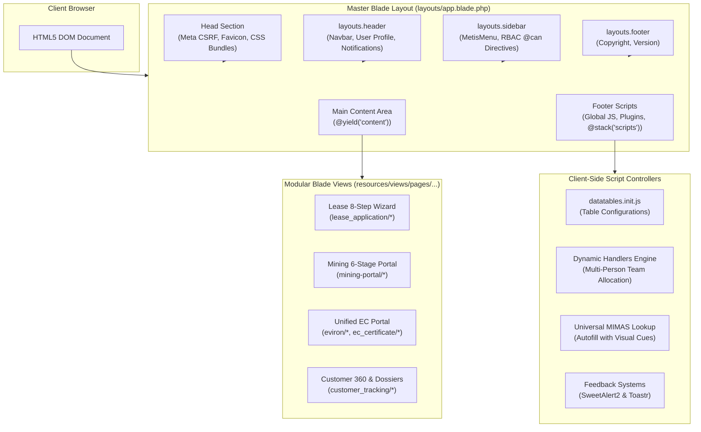

# 10 — Frontend Architecture & UI Component System

**Document Version:** 1.0.0  
**Target Codebase:** `c:\xampp\htdocs\GTMS\gtms`  
**Classification:** Client-Side Architecture, Template Hierarchy & Scripting Patterns  
**UI Foundation:** Dexignlabs Admin Dashboard / Bootstrap 5 / jQuery 3.6+ / DataTables  

---

## 1. Executive Summary & UI Framework Architecture

The **GTMS (Granite / Mining Tracking Management System)** user interface is engineered to streamline high-density statutory workflows, multi-step administrative wizards, spatial boundary reviews, and financial calculations. The frontend is built on a robust, responsive **Server-Side Rendered (SSR) Blade Architecture** enhanced by dynamic client-side interactions powered by jQuery, DataTables, SweetAlert2, and Toastr.

### 1.1 Dual Asset Pipeline
The GTMS repository features two coexisting asset compilation approaches:
1. **Legacy Production Bundle (`/public/...`):** The operational admin dashboard directly consumes pre-compiled, highly optimized vendor assets hosted in `public/vendor/`, `public/css/`, and `public/js/`. This ensures immediate zero-build rendering in standard PHP/XAMPP environments.
2. **Modern Vite Pipeline (`vite.config.js`):** A modern Node/Vite bundler configured with `@tailwindcss/vite` and Tailwind CSS v4, supporting newer modular components and utility-first styling extensions.



---

## 2. Blade Layout Hierarchy & Template Architecture

All internal operational pages extend the master layout envelope located at `resources/views/layouts/app.blade.php`.

### 2.1 Master Layout Specification (`resources/views/layouts/app.blade.php`)

```blade
<!DOCTYPE html>
<html lang="en">
<head>
    <title>@yield('title')</title>
    <meta charset="utf-8">
    <meta http-equiv="X-UA-Compatible" content="IE=edge">
    <meta name="csrf-token" content="{{ csrf_token() }}">
    <meta name="viewport" content="width=device-width, initial-scale=1">

    <!-- Favicon -->
    <link rel="shortcut icon" type="image/png" href="/images/gtmslogo.png">

    <!-- Core Vendor CSS -->
    <link href="/vendor/bootstrap-select/css/bootstrap-select.min.css" rel="stylesheet">
    <link href="/vendor/owl-carousel/owl.carousel.css" rel="stylesheet">
    <link rel="stylesheet" href="/vendor/nouislider/nouislider.min.css">

    <!-- DataTables & Responsive Extensions -->
    <link href="/vendor/datatables/css/jquery.dataTables.min.css" rel="stylesheet">
    <link href="/vendor/datatables/responsive/responsive.css" rel="stylesheet">

    <!-- Toastr & SweetAlert2 -->
    <link rel="stylesheet" href="/vendor/toastr/css/toastr.min.css">
    <link href="/vendor/sweetalert2/sweetalert2.min.css" rel="stylesheet">

    <!-- Bootstrap Icons & Theme CSS -->
    <link rel="stylesheet" href="https://cdn.jsdelivr.net/npm/bootstrap-icons@1.11.3/font/bootstrap-icons.min.css">
    <link href="/css/style.css?v=2" rel="stylesheet">
</head>
<body>
    <div id="main-wrapper">
        <!-- Navigation Header -->
        @include('layouts.header')

        <!-- Navigation Sidebar -->
        @include('layouts.sidebar')

        <!-- Dynamic Content Injection -->
        <div class="content-body">
            <div class="container-fluid">
                @yield('content')
            </div>
        </div>

        <!-- Footer -->
        @include('layouts.footer')
    </div>

    <!-- Core Vendor Scripts -->
    <script src="/vendor/global/global.min.js"></script>
    <script src="/vendor/toastr/js/toastr.min.js"></script>
    <script src="/vendor/sweetalert2/sweetalert2.min.js"></script>
    <script src="/vendor/bootstrap-select/js/bootstrap-select.min.js"></script>
    <script src="/vendor/datatables/js/jquery.dataTables.min.js"></script>
    <script src="/vendor/datatables/responsive/responsive.js"></script>
    <script src="/js/plugins-init/datatables.init.js"></script>

    <!-- Theme Initializers -->
    <script src="/js/custom.min.js"></script>
    <script src="/js/app.js?v=2"></script>
    <script src="/js/admin.js"></script>
    <script src="/js/dlabnav-init.js"></script>

    <!-- Page Specific Script Stacks -->
    @yield('scripts')
    @stack('scripts')
</body>
</html>
```

### 2.2 Template Partials Breakdown

1. **`resources/views/layouts/header.blade.php`:**
   - Houses the top navigation bar, system branding logo (`gtmslogo.png`), search input, live quick-stats counter, notification dropdown, and user profile drawer.
   - Displays authenticated user avatar, full name, role title (`$user->role->name ?? 'Staff'`), and direct trigger for `/logout`.
2. **`resources/views/layouts/sidebar.blade.php`:**
   - Implements the MetisMenu collapsible multi-level navigation tree.
   - Enforces authorization visibility using Spatie Blade directives (`@can`, `@canany`). Navigation nodes for modules the user is unauthorized to access are completely pruned from the DOM.
3. **`resources/views/layouts/footer.blade.php`:**
   - Displays copyright, build metadata, and regulatory compliance notices.

---

## 3. Client Asset Stack & Vendor Libraries

The application combines leading open-source frontend libraries to provide a responsive, enterprise-grade user experience:

| Category | Library / Package | Version / Source | Function in GTMS |
| :--- | :--- | :--- | :--- |
| **Grid & Base UI** | Bootstrap | 5.3+ (`/vendor/global/`) | Grid system, modals, buttons, alerts, responsive utilities |
| **Iconography** | Bootstrap Icons | 1.11.3 (CDN) | Modern functional icons across wizards and status indicators |
| **Iconography** | FontAwesome | 5.x / 6.x | Legacy sidebar navigation icons and pagination arrows |
| **Tables & Grids** | DataTables | 1.13+ (`/vendor/datatables/`) | High-density record searching, ordering, and responsive tables |
| **Notifications** | Toastr | 2.1+ (`/vendor/toastr/`) | Non-blocking, auto-dismissing AJAX feedback alerts |
| **Dialogues** | SweetAlert2 | 11.x (`/vendor/sweetalert2/`) | Two-stage confirmation modals for deletion and state transitions |
| **Form Controls** | Bootstrap-Select | 1.14+ (`/vendor/bootstrap-select/`) | Searchable multi-select dropdowns for minerals and districts |
| **Sliders / Ranges**| Nouislider | 15.x (`/vendor/nouislider/`) | Coordinate radius and mining buffer range filtering |
| **Data Viz** | ApexCharts / Peity | Latest (`/vendor/apexchart/`) | Dashboard charts for filings by district and mineral categories |

---

## 4. DataTables Integration Architecture

GTMS relies extensively on DataTables to present dense regulatory records across all 38 districts. Configuration is standardized in `public/js/plugins-init/datatables.init.js` and harmonized globally via custom CSS.

### 4.1 Standard Table Initializations (`datatables.init.js`)

The centralized initializer configures multiple table profiles:

```javascript
// public/js/plugins-init/datatables.init.js
(function($) {
    "use strict";

    // 1. Interactive Selection Table (#example)
    var table = $('#example').DataTable({
        createdRow: function (row, data, index) {
            $(row).addClass('selected');
        },
        language: {
            paginate: {
                next: '<i class="fa fa-angle-double-right"></i>',
                previous: '<i class="fa fa-angle-double-left"></i>'
            }
        }
    });

    // 2. High-Density Master Tables (#example10)
    // Used in: Users, Branches, Customer Directory, Roles, Drone Survey, Categories
    var table10 = $('#example10').DataTable({
        searching: false,
        paging: true,
        select: false,
        info: false,
        responsive: true,
        lengthChange: false,
        language: {
            paginate: {
                next: '<i class="fa fa-angle-double-right"></i>',
                previous: '<i class="fa fa-angle-double-left"></i>'
            }
        }
    });

    // 3. Compact Operational Tables (#example3, #example5)
    $('#example3, #example5').DataTable({
        searching: false,
        paging: true,
        select: false,
        info: true,
        lengthChange: false,
        language: {
            paginate: {
                next: '<i class="fa fa-angle-double-right"></i>',
                previous: '<i class="fa fa-angle-double-left"></i>'
            }
        }
    });
})(jQuery);
```

### 4.2 Custom Specialized Tables: `#b2ClearanceTable`
For complex workflows such as the Environmental Clearance B2 portfolio (`resources/views/pages/eviron/index.blade.php`), a dedicated custom DataTable configuration is applied:
- Dynamic column searching on Application No, Project Name, District, and Proponent.
- Status badge rendering (`Pending Review`, `SEAC Approved`, `EC Granted`).
- Custom DOM wrapper layout (`dom: '<"top"f>rt<"bottom"lip><"clear">'`).

### 4.3 DataTables Pagination Harmonization CSS
Laravel's native Tailwind/Bootstrap pagination SVGs often blow up to full width if unstyled. GTMS embeds a global defensive stylesheet in `layouts/app.blade.php:43-100` that normalizes pagination controls across both native Blade paginators and jQuery DataTables:

```css
/* Defend against unstyled SVG icons in pagination */
.pagination svg, nav[role="navigation"] svg {
    width: 1rem !important;
    height: 1rem !important;
    max-width: 16px !important;
    max-height: 16px !important;
    display: inline-block !important;
}

/* GTMS Brand Alignment (#0F1E4D Navy Blue) */
.pagination .page-item.active .page-link {
    background-color: #0F1E4D !important;
    border-color: #0F1E4D !important;
    color: #ffffff !important;
    box-shadow: 0 2px 6px rgba(15, 30, 77, 0.25);
}

.dataTables_wrapper .dataTables_paginate {
    display: inline-flex !important;
    align-items: center !important;
    gap: 4px !important;
    padding-top: 0.75rem !important;
    justify-content: flex-end !important;
}
```

---

## 5. Dynamic Polymorphic Handlers Table Pattern

A hallmark architectural feature of GTMS is the **Universal Dynamic Handlers Table Pattern**. Every statutory process (Lease Application, Mining Plan, Environment Clearance, PPT Presentation, DGPS Survey, Drone Survey, EC Compliance) requires allocating a multi-disciplinary team (e.g., *RQP Consultant*, *DGPS Surveyor*, *Mining Geologist*, *Revenue Liaison*).

The application implements this across 8 distinct wizard views using an identical dynamic DOM pattern:

```
================================================================================
DYNAMIC HANDLERS IMPLEMENTATION DIRECTORY:
================================================================================
Wizard Module                 Blade View Path                           Table DOM ID
--------------------------------------------------------------------------------
1. Lease Application (Step 6) lease_application/createstep6.blade.php   #handlers_table
2. Mining Plan (New App)      mining-portal/newapplication.blade.php    #mining_handlers_table
3. Environment Clearance      eviron/create.blade.php                   #env_handlers_table
4. PPT Department Wizard      ppt_department/wizard.blade.php           #ppt_handlers_table
5. DGPS Survey Wizard         dgps_survey/wizard.blade.php              #dgps_handlers_table
6. Drone Survey Wizard        drone_survey/wizard.blade.php             #drone_handlers_table
7. EC Compliance Wizard       ec_compliance/wizard.blade.php            #comp_handlers_table
8. EC Certificate Wizard      ec_certificate/wizard.blade.php           #ec_handlers_table
================================================================================
```

### 5.1 Step 6 Implementation Blueprint (`createstep6.blade.php`)

```blade
<!-- Table Structure -->
<table class="table table-bordered align-middle" id="handlers_table">
  <thead class="bg-light text-navy">
    <tr>
      <th style="width: 50px;" class="text-center">#</th>
      <th style="width: 28%;">Person Name <span class="text-danger">*</span></th>
      <th style="width: 28%;">Role / Designation <span class="text-danger">*</span></th>
      <th>Notes &amp; Responsibilities</th>
      <th style="width: 70px;" class="text-center">Action</th>
    </tr>
  </thead>
  <tbody id="handlers_table_body">
    <!-- Dynamically Injected Rows -->
  </tbody>
</table>
```

### 5.2 Dynamic Row Mutation Script

```javascript
document.addEventListener('DOMContentLoaded', function () {
    const tableBody = document.getElementById('handlers_table_body');
    const btnAdd = document.getElementById('btn_add_handler');
    const countBadge = document.getElementById('handler_count_badge');

    let handlerIndex = 0;

    function addRow(data = {}) {
        handlerIndex++;
        const tr = document.createElement('tr');
        tr.dataset.index = handlerIndex;

        tr.innerHTML = `
            <td class="text-center fw-semibold text-muted row-number"></td>
            <td>
                <input type="text" name="handlers[${handlerIndex}][name]" 
                       class="form-control form-control-sm" 
                       value="${data.name || ''}" placeholder="Full Name" required>
            </td>
            <td>
                <input type="text" name="handlers[${handlerIndex}][role]" 
                       class="form-control form-control-sm" 
                       value="${data.role || ''}" placeholder="e.g. RQP Consultant" required>
            </td>
            <td>
                <input type="text" name="handlers[${handlerIndex}][notes]" 
                       class="form-control form-control-sm" 
                       value="${data.notes || ''}" placeholder="Assigned responsibilities">
            </td>
            <td class="text-center">
                <button type="button" class="btn btn-outline-danger btn-xs btn-remove-handler">
                    <i class="bi bi-trash"></i>
                </button>
            </td>
        `;

        tableBody.appendChild(tr);
        reindexRows();
    }

    function reindexRows() {
        const rows = tableBody.querySelectorAll('tr');
        rows.forEach((row, i) => {
            row.querySelector('.row-number').textContent = i + 1;
        });
        countBadge.textContent = `${rows.length} member${rows.length === 1 ? '' : 's'}`;
    }

    tableBody.addEventListener('click', function (e) {
        const btn = e.target.closest('.btn-remove-handler');
        if (btn) {
            btn.closest('tr').remove();
            reindexRows();
        }
    });

    btnAdd.addEventListener('click', () => addRow());
});
```

---

## 6. User Feedback & Notification Architecture

GTMS enforces proactive visual confirmation and asynchronous status updates to prevent accidental data destruction or regulatory filing errors.

### 6.1 SweetAlert2 Confirmation Dialogues
Critical state transitions (e.g., advancing a mining plan stage, transitioning a lease to mining, or deleting records) employ two-stage SweetAlert2 modals:

```javascript
// Example: Universal Delete Confirmation
$('.btn-delete-confirm').on('click', function(e) {
    e.preventDefault();
    const form = $(this).closest('form');
    
    Swal.fire({
        title: 'Confirm Statutory Deletion?',
        text: 'This operation will soft-delete the record and archive associated attachments.',
        icon: 'warning',
        showCancelButton: true,
        confirmButtonColor: '#d33',
        cancelButtonColor: '#0F1E4D',
        confirmButtonText: 'Yes, Delete',
        cancelButtonText: 'Cancel'
    }).then((result) => {
        if (result.isConfirmed) {
            form.submit();
        }
    });
});
```

### 6.2 Toastr Real-Time Alerts
For rapid background actions—such as document validation toggling, boundary point saving, or quick draft updates—Toastr provides non-blocking feedback:

```javascript
// Example: Document Status Toggle AJAX Callback
$.ajax({
    url: `/application/document/${docId}/status`,
    method: 'POST',
    data: { status: newStatus },
    success: function(response) {
        toastr.success(response.message, 'Document Validated');
        updateStatusBadge(docId, newStatus);
    },
    error: function(xhr) {
        toastr.error(xhr.responseJSON?.message || 'Server error occurred', 'Validation Failed');
    }
});
```

### 6.3 Flash Session Alerts
Standard HTTP 302 redirects carry flash data rendered via dismissible Bootstrap alerts:
```blade
@if(session('success'))
<div class="alert alert-success alert-dismissible fade show border-0 py-2 px-3 mb-3">
    <i class="bi bi-check-circle-fill me-2"></i> {{ session('success') }}
    <button type="button" class="btn-close" data-bs-dismiss="alert"></button>
</div>
@endif
```

---

## 7. Multi-Step Form Wizard Architecture

The core of GTMS's business intake rests on multi-step wizard workflows designed to minimize operator fatigue when inputting 50+ statutory parameters.

### 7.1 Lease Application 8-Step Stepper Architecture
The Lease wizard spans 8 individual step routes (`/step1` through `/step8`), retaining draft state within session memory (`session('lease_draft')`):
- **Step 1: General Information:** Proponent identity, corporate profile, lease period, village, taluk, district.
- **Step 2: MIMAS & Communication:** Portal credentials, official email, mobile contact.
- **Step 3: Land & Boundary Details:** Survey numbers, extents in hectares, classification (Patta / Poramboke / Govt).
- **Step 4: Boundary Coordinates:** Northing/Easting GCP points, datum, UTM zones.
- **Step 5: Document Uploads:** 19-folder statutory checklist upload engine with AJAX file uploads.
- **Step 6: Team Allocation:** Dynamic `#handlers_table` multi-person team assignment.
- **Step 7: Commercial Ledger:** Estimated product value, initial fee calculation, payment schedules.
- **Step 8: Final Review & Submission:** Comprehensive read-only dossier summary with atomic submit trigger.

### 7.2 Visual Step Indicators & Navigation Hooks
Wizards render a standardized progress stepper header:
- **Active Step:** Highlighted with GTMS brand color `#0F1E4D` and pulse badge.
- **Completed Steps:** Green checkmark icon (`bi-check-lg`) with direct anchor links permitting backward navigation.
- **Upcoming Steps:** Muted grey (`#94a3b8`) locked against forward jumping until current step validation succeeds.
- **Draft & Exit Button (`btn_save_draft_exit`):** Persists partial inputs to session and returns user to `/application`.

---

## 8. Frontend Engineering Guidelines for Developers

1. **CSRF Inclusion:** All AJAX calls must include the CSRF token header:
   ```javascript
   $.ajaxSetup({
       headers: {
           'X-CSRF-TOKEN': $('meta[name="csrf-token"]').attr('content')
       }
   });
   ```
2. **Prevent SVG Size Inflation:** Always nest custom SVG icons inside standard wrappers or apply the `.pagination svg` sizing constraints.
3. **Table Re-Indexing:** When removing or re-ordering table rows in dynamic handlers tables, always invoke `reindexRows()` to prevent array key collisions when serialized to PHP's `Request` payload.
4. **SweetAlert Destruction:** Never trigger raw form submission on deletion buttons; always route through the centralized `.btn-delete-confirm` SweetAlert2 listener.
