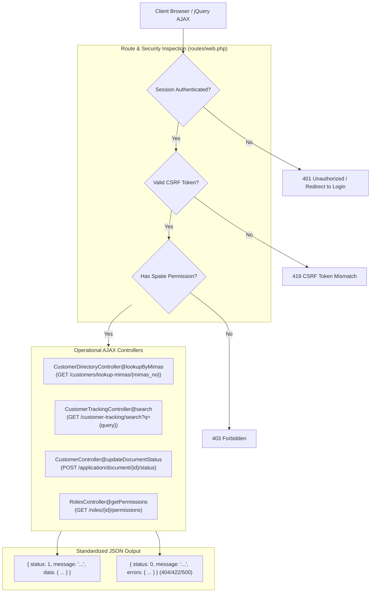

# 11 — Internal API & AJAX Endpoints Specification

**Document Version:** 1.0.0  
**Target Codebase:** `c:\xampp\htdocs\GTMS\gtms`  
**Classification:** Client-Server API Catalog & Asynchronous Interaction Contracts  
**Authentication Standard:** Stateful Session Cookie + CSRF (`web` guard)  

---

## 1. Executive Summary & AJAX Architecture

The **GTMS (Granite / Mining Tracking Management System)** incorporates a comprehensive suite of internal AJAX endpoints designed to power live client-side data operations without requiring full-page reloads. These endpoints support:
1. **Universal Cross-Module Autocomplete:** High-speed lookup of customer profiles across statutory intake forms using Tamil Nadu Mines Department Unique IDs (`mimas_no`), normalized Aadhaar numbers, and phone numbers.
2. **Global Tracking Dossier Search:** Multi-table relationship matching across 8 regulatory modules to resolve project dossiers in real time.
3. **Regulatory Document Status Toggles:** Immediate verification, rejection remarks, and workflow gate approvals for statutory attachments.
4. **Dynamic Entity CRUD Operations:** Modal-based administrative actions for Branches, Users, Roles, and Customer Directory.

### 1.1 Authentication & Request Contract
- **Session-Based Authentication:** GTMS does not expose public headless REST endpoints (e.g., via Laravel Sanctum or Passport tokens in `routes/api.php`). All AJAX endpoints reside in `routes/web.php` and require an authenticated session (`auth` middleware).
- **CSRF Token Header:** All mutating HTTP requests (`POST`, `PUT`, `DELETE`) must transmit the anti-CSRF token in the `X-CSRF-TOKEN` request header or `_token` body parameter.
- **Dual Response Negotiation:** Many controllers dynamically evaluate `$request->ajax()` or `$request->wantsJson()`: returning structured JSON payloads for asynchronous callers, while issuing standard 302 redirects with session flash data for traditional HTTP form submissions.



---

## 2. Universal MIMAS & Customer Unique ID Lookup

The Universal MIMAS lookup is the primary mechanism for eliminating duplicate data entry. When an operator initiates a Lease Application, Mining Plan, or EC filing, entering a Customer Unique ID instantly pre-fills the applicant's complete profile.

### 2.1 Endpoint Specification
- **HTTP Verb & URI:** `GET /customers/lookup-mimas/{mimas_no}`
- **Controller Method:** `App\Http\Controllers\CustomerDirectoryController@lookupByMimas`
- **Route Name:** `customers.lookup.mimas`
- **Middleware:** `auth`

### 2.2 Controller Implementation Details (`CustomerDirectoryController.php:293-349`)

```php
public function lookupByMimas(Request $request, $mimas_no)
{
    $mimas_no = trim(urldecode($mimas_no));
    $cleanDigits = preg_replace('/[^0-9]/', '', $mimas_no);

    $customer = Customer::withTrashed()->with(['district', 'mineral'])
        ->where(function ($query) use ($mimas_no, $cleanDigits) {
            $query->where('mimas_no', $mimas_no)
                ->orWhere('id', $mimas_no)
                ->orWhere('slug', $mimas_no)
                ->orWhere('mimas_number', $mimas_no)
                ->orWhere('company_name', 'like', "%{$mimas_no}%")
                ->orWhere('customer_name', 'like', "%{$mimas_no}%");

            if (!empty($cleanDigits) && strlen($cleanDigits) >= 10) {
                $query->orWhere('mobile_num', 'like', "%{$cleanDigits}%")
                    ->orWhere('secondary_mobile_num', 'like', "%{$cleanDigits}%")
                    ->orWhereRaw("REPLACE(REPLACE(COALESCE(aadhaar_no, ''), '-', ''), ' ', '') LIKE ?", ["%{$cleanDigits}%"]);
            }
        })
        ->first();

    if (!$customer) {
        return response()->json([
            'status' => 0,
            'message' => 'No customer found matching Customer Unique ID: "' . $mimas_no . '".',
        ], 404);
    }

    return response()->json([
        'status' => 1,
        'message' => 'Customer found successfully.',
        'data' => [
            'id'                       => $customer->id,
            'mimas_no'                 => $customer->mimas_no,
            'mimas_number'             => $customer->mimas_number,
            'mimas_status'             => $customer->mimas_status,
            'company_name'             => $customer->company_name,
            'customer_name'            => $customer->customer_name,
            'secondary_contact_person' => $customer->secondary_contact_person,
            'mobile_num'               => $customer->mobile_num,
            'secondary_mobile_num'     => $customer->secondary_mobile_num,
            'email'                    => $customer->email,
            'district_id'              => $customer->district_id,
            'district_name'            => $customer->district?->name,
            'mineral_id'               => $customer->mineral_id,
            'mineral_name'             => $customer->mineral?->name,
            'pan'                      => $customer->pan,
            'aadhaar_no'               => $customer->aadhaar_no,
            'gstin'                    => $customer->gstin,
            'area'                     => $customer->area,
            'address'                  => $customer->address,
            'status'                   => $customer->status,
            'slug'                     => $customer->slug,
        ],
    ]);
}
```

### 2.3 Key Search Mechanics
1. **URL Decoding & Sanitization:** Decodes incoming parameters (e.g., handling `%20` or `/` characters in registration codes).
2. **Soft-Delete Resilience (`withTrashed()`):** Enables retrieval of archived customer profiles to restore historical records or prevent duplicate registration attempts.
3. **Aadhaar & Phone Normalization:** Strips hyphens and spaces via SQL `REPLACE(REPLACE(COALESCE(aadhaar_no, ''), '-', ''), ' ', '')` to guarantee exact matches regardless of whether the user types `3232-6868-9898`, `3232 6868 9898`, or raw digits.

### 2.4 Client-Side Auto-Fill Integration
Upon receiving a successful JSON response, client-side wizard scripts populate form fields and append visual feedback:
```javascript
$.get(`/customers/lookup-mimas/${encodeURIComponent(query)}`, function(res) {
    if (res.status === 1) {
        $('#company_name').val(res.data.company_name).addClass('field-autofilled');
        $('#applicant_name').val(res.data.customer_name).addClass('field-autofilled');
        $('#district_id').val(res.data.district_id).trigger('change');
        $('#mobile_num').val(res.data.mobile_num).addClass('field-autofilled');
        toastr.success(`Loaded customer: ${res.data.customer_name}`);
    }
}).fail(function(xhr) {
    toastr.warning(xhr.responseJSON?.message || 'Customer not found.');
});
```

---

## 3. Live Customer Tracking Autocomplete Search

The global tracking dashboard provides an omni-search autocomplete endpoint querying all customer profiles and their cross-module children.

### 3.1 Endpoint Specification
- **HTTP Verb & URI:** `GET /customer-tracking/search?q={query}`
- **Controller Method:** `App\Http\Controllers\CustomerTrackingController@search`
- **Route Name:** `customer-tracking.search`
- **Middleware:** `auth`, `permission:customer.view`

### 3.2 Advanced Normalization & Multi-Relationship Query
The controller handles multi-format queries with strict performance boundaries:

```php
// app/Http/Controllers/CustomerTrackingController.php:356-450
public function search(Request $request)
{
    $q = trim($request->input('q', ''));
    if (strlen($q) < 2) {
        return response()->json(['results' => []]);
    }

    $cleanDigits = preg_replace('/[^0-9]/', '', $q);
    $cleanAlphanumeric = preg_replace('/[^a-zA-Z0-9]/', '', $q);

    $customers = Customer::with(['district', 'mineral'])
        ->where(function ($query) use ($q, $cleanDigits, $cleanAlphanumeric) {
            // 1. Direct Attributes
            $query->where('customer_name', 'like', "%{$q}%")
                ->orWhere('company_name', 'like', "%{$q}%")
                ->orWhere('mimas_no', 'like', "%{$q}%")
                ->orWhere('aadhaar_no', 'like', "%{$q}%")
                ->orWhere('mobile_num', 'like', "%{$q}%")
                ->orWhere('secondary_mobile_num', 'like', "%{$q}%")
                ->orWhere('pan', 'like', "%{$q}%");

            // 2. Normalized Aadhaar (Dashed, Spaced, Raw)
            if (!empty($cleanDigits) && strlen($cleanDigits) >= 4) {
                $query->orWhereRaw("REPLACE(REPLACE(COALESCE(aadhaar_no, ''), '-', ''), ' ', '') LIKE ?", ["%{$cleanDigits}%"]);
                if (strlen($cleanDigits) === 12) {
                    $dashed = substr($cleanDigits, 0, 4) . '-' . substr($cleanDigits, 4, 4) . '-' . substr($cleanDigits, 8, 4);
                    $spaced = substr($cleanDigits, 0, 4) . ' ' . substr($cleanDigits, 4, 4) . ' ' . substr($cleanDigits, 8, 4);
                    $query->orWhere('aadhaar_no', $dashed)->orWhere('aadhaar_no', $spaced)->orWhere('aadhaar_no', $cleanDigits);
                }
            }

            // 3. Normalized Phone (+91, Dashed, Spaced)
            if (!empty($cleanDigits) && strlen($cleanDigits) >= 5) {
                $query->orWhereRaw("REPLACE(REPLACE(REPLACE(COALESCE(mobile_num, ''), '-', ''), ' ', ''), '+91', '') LIKE ?", ["%{$cleanDigits}%"]);
                if (strlen($cleanDigits) >= 10) {
                    $last10 = substr($cleanDigits, -10);
                    $query->orWhere('mobile_num', 'like', "%{$last10}%")->orWhere('secondary_mobile_num', 'like', "%{$last10}%");
                }
            }

            // 4. Cross-Module Deep Search Across 8 Relations
            $query->orWhereHas('leaseApplications', fn($lq) => $lq->where('application_no', 'like', "%{$q}%")->orWhere('common_id', 'like', "%{$q}%"))
                  ->orWhereHas('miningApplications', fn($mq) => $mq->where('application_no', 'like', "%{$q}%")->orWhere('common_id', 'like', "%{$q}%"))
                  ->orWhereHas('environmentProjects', fn($eq) => $eq->where('project_code', 'like', "%{$q}%")->orWhere('project_name', 'like', "%{$q}%"))
                  ->orWhereHas('ecCertificates', fn($cq) => $cq->where('ec_ref_no', 'like', "%{$q}%")->orWhere('parivesh_app_no', 'like', "%{$q}%"))
                  ->orWhereHas('pptApplications', fn($pq) => $pq->where('application_no', 'like', "%{$q}%"))
                  ->orWhereHas('dgpsSurveys', fn($dq) => $dq->where('survey_no', 'like', "%{$q}%"))
                  ->orWhereHas('droneSurveys', fn($drq) => $drq->where('survey_no', 'like', "%{$q}%"))
                  ->orWhereHas('ecCompliances', fn($ecq) => $ecq->where('compliance_no', 'like', "%{$q}%"));
        })
        ->take(8)
        ->get();

    // Map results with Privacy Masking & Active Stage Resolution
    $results = $customers->map(function ($c) {
        $stage = 'Profile Registered';
        if ($c->ecCompliances()->exists())      $stage = 'EC Compliance Active';
        elseif ($c->ecCertificates()->exists()) $stage = 'EC Certificate Issued';
        elseif ($c->pptApplications()->exists()) $stage = 'PPT Department';
        elseif ($c->environmentProjects()->exists()) $stage = 'Environment Clearance';
        elseif ($c->miningApplications()->exists())  $stage = 'Mining Plan';
        elseif ($c->leaseApplications()->exists())   $stage = 'Lease Application';
        elseif ($c->dgpsSurveys()->exists())    $stage = 'DGPS Survey';
        elseif ($c->droneSurveys()->exists())   $stage = 'Drone Survey';

        $maskedAadhaar = null;
        if ($c->aadhaar_no) {
            $clean = preg_replace('/[^0-9]/', '', $c->aadhaar_no);
            $maskedAadhaar = strlen($clean) >= 8 ? (substr($clean, 0, 4) . ' **** ' . substr($clean, -4)) : $c->aadhaar_no;
        }

        return [
            'id'               => $c->id,
            'name'             => $c->customer_name,
            'company'          => $c->company_name ?: 'Individual Applicant',
            'unique_id'        => $c->mimas_no ?: ('CUST-' . str_pad($c->id, 4, '0', STR_PAD_LEFT)),
            'mimas_no'         => $c->mimas_no,
            'mobile'           => $c->mobile_num,
            'secondary_mobile' => $c->secondary_mobile_num,
            'aadhaar'          => $maskedAadhaar,
            'district'         => $c->district?->name ?: 'N/A',
            'active_stage'     => $stage,
            'url'              => route('customer-tracking.show', $c->slug ?? $c->id),
        ];
    });

    return response()->json(['results' => $results]);
}
```

### 3.3 Privacy & Security Safeguards
- **Aadhaar Masking:** Plaintext 12-digit Aadhaar numbers are never returned in search results. The controller applies dynamic masking (`XXXX **** XXXX`), revealing only the first 4 and last 4 digits.
- **Result Capping:** The query caps results at 8 items (`->take(8)`) to maintain lightning-fast response times under 50ms and eliminate DOM freezing.

---

## 4. Document Status & Regulatory Workflow Endpoints

GTMS features granular document review endpoints allowing reviewing officers to validate or reject uploaded statutory files.

### 4.1 Update Lease Document Status
- **HTTP Verb & URI:** `POST /application/document/{id}/status`
- **Controller Method:** `App\Http\Controllers\CustomerController@updateDocumentStatus`
- **Route Name:** `application.document.status`
- **Middleware:** `auth`, `permission:application.edit`

#### Request Payload:
```json
{
  "status": "validated",
  "notes": "Adangal certified by Village Administrative Officer (VAO)"
}
```
*Allowed Status Values:* `uploaded`, `pending`, `validated`, `approved`, `rejected`

#### Controller Execution:
```php
public function updateDocumentStatus(Request $request, $id)
{
    $validated = $request->validate([
        'status' => 'required|in:uploaded,pending,validated,approved,rejected',
        'notes'  => 'nullable|string|max:500',
    ]);

    $doc = LeaseDocument::findOrFail($id);
    $doc->status = $validated['status'];
    if (isset($validated['notes'])) {
        $doc->notes = $validated['notes'];
    }
    $doc->save();

    return response()->json([
        'status'  => 1,
        'message' => "Document '{$doc->document_name}' marked as {$doc->status}.",
    ]);
}
```

---

### 4.2 Mining Plan Document Validation
- **HTTP Verb & URI:** `POST /mining/document/{id}/validate`
- **Controller Method:** `App\Http\Controllers\MiningController@validateDocument`
- **Route Name:** `mining.document.validate`
- **Middleware:** `auth`, `permission:mining.edit`
- **Functionality:** Toggles document verification state in `mining_documents` table and updates stage completion percentage.

---

### 4.3 Environment Clearance Document Review
- **HTTP Verb & URI:** `POST /eviron/{id}/documents/{document}/review`
- **Controller Method:** `App\Http\Controllers\EnverionsoneController@reviewDocument`
- **Route Name:** `eviron.documents.review`
- **Middleware:** `auth`, `permission:environment.b2.review`

#### Request Payload:
```json
{
  "status": "approved",
  "review_remarks": "Form-1 and Pre-Feasibility Report verified."
}
```

---

## 5. Master Data & Entity Management AJAX Endpoints

### 5.1 Dynamic Role Permissions Fetch
- **HTTP Verb & URI:** `GET /roles/{id}/permissions`
- **Controller Method:** `App\Http\Controllers\RolesController@getPermissions`
- **Route Name:** `roles.permissions`
- **Middleware:** `auth`, `permission:roles.view`
- **Response Format:**
  ```json
  {
    "status": 1,
    "permissions": [1, 2, 5, 12, 17, 18, 21, 22]
  }
  ```
  *(Used by frontend JavaScript to check checkboxes in the Role Edit modal).*

---

### 5.2 Branch / Department CRUD Endpoints
- **Create Branch:** `POST /branchadd` (`BranchController@store`, perm: `branch.create`)
- **Update Branch:** `POST /branchedit` (`BranchController@update`, perm: `branch.edit`)
- **Delete Branch:** `POST /branchdelete` (`BranchController@destroy`, perm: `branch.delete`)

#### Response Contract:
```json
{
  "status": 1,
  "message": "Branch updated successfully."
}
```

---

### 5.3 Customer Directory CRUD Endpoints
- **Create Customer:** `POST /customeradd` (`CustomerDirectoryController@store`, perm: `customer.create`)
- **Update Customer:** `POST /customeredit` (`CustomerDirectoryController@update`, perm: `customer.edit`)
- **Delete Customer:** `POST /customerdelete` (`CustomerDirectoryController@destroy`, perm: `customer.delete`)
  - Evaluates active dependencies across all 8 child tables before allowing deletion. Returns HTTP 422 if active applications exist.

---

## 6. Complete API & AJAX Endpoint Matrix

```
========================================================================================================================
GTMS ASYNCHRONOUS & AJAX ENDPOINT DIRECTORY:
========================================================================================================================
HTTP Verb  URI Path                                   Controller Method                         Required Permission
------------------------------------------------------------------------------------------------------------------------
GET        /customers/lookup-mimas/{mimas_no}         CustomerDirectoryController@lookupByMimas  auth
GET        /customer-tracking/search                  CustomerTrackingController@search          customer.view
GET        /roles/{id}/permissions                    RolesController@getPermissions             roles.view
POST       /application/document/{id}/status          CustomerController@updateDocumentStatus    application.edit
POST       /application/{id}/validate                 CustomerController@validateApplication     application.edit
POST       /application/{id}/approve                  CustomerController@approveApplication      application.edit
POST       /application/{id}/reject                   CustomerController@rejectApplication       application.edit
POST       /application/{id}/move-to-mining           CustomerController@moveToMining            application.edit
POST       /mining/document/{id}/validate             MiningController@validateDocument          mining.edit
POST       /mining/application/{id}/stage             MiningController@advanceStage              mining.edit
POST       /mining/application/{id}/move-to-environ   MiningController@moveToEnvironment         mining.edit
POST       /eviron/{id}/documents/{document}/review   EnverionsoneController@reviewDocument      environment.b2.review
POST       /eviron/{id}/status                        EnverionsoneController@updateStatus        environment.b2.review
POST       /eviron/{id}/submit-sc1-ppt                EnverionsoneController@submitSc1ToPpt      environment.b2.review
POST       /eviron/{id}/submit-sc2-ppt                EnverionsoneController@submitSc2ToPpt      environment.b2.review
POST       /ppt-department/{id}/approve-stage         PptDepartmentController@approvePresentation ppt.view
POST       /branchadd                                 BranchController@store                     branch.create
POST       /branchedit                                BranchController@update                    branch.edit
POST       /branchdelete                              BranchController@destroy                   branch.delete
POST       /customeradd                               CustomerDirectoryController@store          customer.create
POST       /customeredit                              CustomerDirectoryController@update         customer.edit
POST       /customerdelete                            CustomerDirectoryController@destroy        customer.delete
POST       /roleadd                                   RolesController@store                      roles.create
POST       /roleupdate                                RolesController@update                     roles.edit
POST       /roledelete                                RolesController@destroy                    roles.delete
========================================================================================================================
```

---

## 7. Standardized Error Handling & Response Codes

All asynchronous endpoints adhere to standard HTTP status codes combined with application status envelopes:

| HTTP Status | Application Status | Meaning | Typical Scenario |
| :---: | :---: | :--- | :--- |
| **200 OK** | `status: 1` | Action succeeded | Customer located, document validated, stage advanced |
| **400 Bad Request** | `status: 0` | Input validation failed | Missing required status string or invalid status transition |
| **401 Unauthorized** | N/A | Session unauthenticated | Session cookie expired; intercepted by auth redirect |
| **403 Forbidden** | `status: 0` | Permission denied | Officer attempting to execute `branch.delete` |
| **404 Not Found** | `status: 0` | Entity not found | No customer found matching query; document ID invalid |
| **419 Session Expired**| N/A | CSRF token mismatch | User left tab open for >120 minutes without activity |
| **422 Unprocessable** | `status: 0` | Business logic violated | Cannot delete customer with active lease applications |
| **500 Server Error** | `status: 0` | Exception caught | Database lock timeout or file copy permission error |
