# 12 — Background Jobs, Queues & Console Commands

**Document Version:** 1.0.0  
**Target Codebase:** `c:\xampp\htdocs\GTMS\gtms`  
**Classification:** Asynchronous Processing, Background Scheduling & System Scalability  
**Queue Driver:** Database (`jobs`, `failed_jobs`, `job_batches`)  

---

## 1. Executive Summary & Queue Engine Architecture

The **GTMS (Granite / Mining Tracking Management System)** infrastructure is pre-configured to support enterprise-grade asynchronous processing via Laravel 12's native queue system. Statutory mining management involves heavy, compute-intensive operations—including differential GPS coordinate polygon calculations, multi-megabyte CAD/DWG and KML file parsing, high-resolution drone orthomosaic ingestion, cross-module statutory document cloning, and PDF invoice rendering.

### 1.1 Queue Configuration (`config/queue.php`)
The application defines `database` as its primary operational queue connection:

```php
// config/queue.php:16, 38-46
'default' => env('QUEUE_CONNECTION', 'database'),

'connections' => [
    'sync' => [
        'driver' => 'sync',
    ],

    'database' => [
        'driver' => 'database',
        'connection' => env('DB_QUEUE_CONNECTION'),
        'table' => env('DB_QUEUE_TABLE', 'jobs'),
        'queue' => env('DB_QUEUE', 'default'),
        'retry_after' => (int) env('DB_QUEUE_RETRY_AFTER', 90),
        'after_commit' => false,
    ],
    // ...
],

'failed' => [
    'driver' => env('QUEUE_FAILED_DRIVER', 'database-uuids'),
    'database' => env('DB_CONNECTION', 'sqlite'),
    'table' => 'failed_jobs',
],
```

---

## 2. Database Schema for Asynchronous Processing

The queue architecture is backed by three dedicated database tables created via migration `database/migrations/0001_01_01_000002_create_jobs_table.php`:

### 2.1 The `jobs` Table
Stores enqueued background tasks awaiting execution by worker processes.

| Column | Type | Index | Description |
| :--- | :--- | :---: | :--- |
| `id` | `BIGINT UNSIGNED` | Primary | Auto-incrementing unique job identifier |
| `queue` | `VARCHAR(255)` | Index | Target queue channel (e.g., `default`, `documents`, `notifications`) |
| `payload` | `LONGTEXT` | None | Serialized PHP job class, constructor arguments, and metadata |
| `attempts` | `TINYINT UNSIGNED` | None | Current count of execution attempts |
| `reserved_at` | `INT UNSIGNED` | None | UNIX timestamp when worker reserved the job (NULL if pending) |
| `available_at` | `INT UNSIGNED` | Index | UNIX timestamp when job becomes eligible for execution |
| `created_at` | `INT UNSIGNED` | None | UNIX timestamp when job was initially pushed |

### 2.2 The `job_batches` Table
Facilitates coordinated execution of parallel job clusters (e.g., bulk document imports or mass notifications).

| Column | Type | Description |
| :--- | :--- | :--- |
| `id` | `VARCHAR(255)` | Primary UUID string identifying the batch |
| `name` | `VARCHAR(255)` | Human-readable batch title (e.g., `batch-clone-lease-docs`) |
| `total_jobs` | `INT` | Total count of jobs assigned to this batch |
| `pending_jobs` | `INT` | Remaining jobs pending completion |
| `failed_jobs` | `INT` | Count of jobs that failed during execution |
| `failed_job_ids`| `LONGTEXT` | JSON array of failed job UUIDs |
| `options` | `MEDIUMTEXT` | Serialized batch callbacks (`then`, `catch`, `finally`) |
| `cancelled_at` | `INT` | UNIX timestamp if batch was manually cancelled |
| `created_at` | `INT` | UNIX timestamp when batch was initialized |
| `finished_at` | `INT` | UNIX timestamp when all jobs completed or failed |

### 2.3 The `failed_jobs` Table
Captures execution exceptions and stack traces when jobs exhaust their maximum retry attempts.

| Column | Type | Description |
| :--- | :--- | :--- |
| `id` | `BIGINT UNSIGNED` | Primary unique failure record ID |
| `uuid` | `VARCHAR(255)` | Unique UUID identifying the failed task |
| `connection` | `TEXT` | Queue connection driver (`database`) |
| `queue` | `TEXT` | Channel where job failed (`default`) |
| `payload` | `LONGTEXT` | Serialized payload of the failed job |
| `exception` | `LONGTEXT` | Verbatim PHP exception class, error message, and trace |
| `failed_at` | `TIMESTAMP` | Server timestamp of failure |

---

## 3. Codebase Reality vs. Architectural Target

### 3.1 Ground-Truth Audit of Active Codebase
A comprehensive audit of `app/Jobs`, `app/Events`, `app/Listeners`, and `app/Console/Commands` reveals:
- **Zero Active Custom Job Classes:** No classes currently exist in `app/Jobs/`.
- **Zero Active Custom Event / Listener Classes:** No custom domain events exist in `app/Events/` or `app/Listeners/`.
- **Single Console Route:** `routes/console.php` contains only the boilerplate Laravel `inspire` command:
  ```php
  // routes/console.php:6-8
  Artisan::command('inspire', function () {
      $this->comment(Inspiring::quote());
  })->purpose('Display an inspiring quote');
  ```
- **Synchronous Execution:** All document uploads (up to 25MB), physical file cloning (`CustomerController.php:1694-1732`), and status changes execute **synchronously** inside the HTTP web server process.

```mermaid
flowchart TD
    subgraph CurrentReality["Current Synchronous Execution (High Risk Under Load)"]
        HTTPReq["HTTP POST /application/{id}/move-to-mining"]
        TransDB["DB Transaction (Create Mining Record)"]
        SyncCopy["Synchronous File Loop\n(@copy 19+ files up to 25MB each)"]
        HTTPResp["HTTP 302 / JSON Response (Latency: 2-8 seconds)"]

        HTTPReq --> TransDB --> SyncCopy --> HTTPResp
    end

    subgraph TargetArchitecture["Target Enterprise Asynchronous Architecture"]
        AsyncReq["HTTP POST /application/{id}/move-to-mining"]
        QuickDB["DB Transaction (Record State Transition)"]
        DispatchJob["Queue::push(new CloneLeaseDocumentsJob)"]
        FastResp["HTTP 200 OK (Latency: < 150ms)"]

        Worker["Background Worker (queue:work)"]
        AsyncCopy["Background Physical File Copying & Checksums"]
        LogSuccess["ActivityLog & Webhook / Notification"]

        AsyncReq --> QuickDB --> DispatchJob --> FastResp
        DispatchJob -.-> Worker --> AsyncCopy --> LogSuccess
    end
```



### 3.2 Technical Risks of Synchronous Processing
1. **PHP Execution Timeouts:** Uploading 25MB CAD/DWG or orthomosaic files or cloning 19 statutory documents in a single request can exceed PHP's `max_execution_time` (typically 30s or 60s in default XAMPP/Apache configurations), causing abrupt 500 errors and half-cloned directories.
2. **Web Worker Saturation:** High concurrency during monthly filing deadlines can lock Apache child processes or PHP-FPM pools, denying access to other users browsing the dashboard.
3. **Partial Mutation on Failure:** While database records are protected by transactions, file system operations (`@copy`) are not atomic. An aborted request leaves orphaned physical files on disk.

---

## 4. Target Enterprise Asynchronous Job Specifications

To prepare GTMS for state-wide deployment across all 38 Tamil Nadu districts, the following 4 core background jobs should be introduced:

### 4.1 Job 1: `CloneLeaseDocumentsToMiningJob`
- **Queue Channel:** `documents`
- **Tries:** 3
- **Timeout:** 300 seconds
- **Trigger:** Fired when an approved Lease Application is moved to the Mining Plan department (`CustomerController@moveToMining`).
- **Signature:**
  ```php
  namespace App\Jobs;

  use App\Models\LeaseApplication;
  use App\Models\MiningApplication;
  use App\Models\MiningDocument;
  use Illuminate\Bus\Queueable;
  use Illuminate\Contracts\Queue\ShouldQueue;
  use Illuminate\Foundation\Bus\Dispatchable;
  use Illuminate\Queue\InteractsWithQueue;
  use Illuminate\Queue\SerializesModels;

  class CloneLeaseDocumentsToMiningJob implements ShouldQueue
  {
      use Dispatchable, InteractsWithQueue, Queueable, SerializesModels;

      public function __construct(
          public int $leaseApplicationId,
          public int $miningApplicationId,
          public int $userId
      ) {}

      public function handle(): void
      {
          $lease = LeaseApplication::with('documents')->findOrFail($this->leaseApplicationId);
          $miningApp = MiningApplication::findOrFail($this->miningApplicationId);

          $destDir = public_path('uploads/mining/' . $miningApp->application_no);
          if (!file_exists($destDir)) {
              mkdir($destDir, 0777, true);
          }

          foreach ($lease->documents as $doc) {
              if (!empty($doc->file_path) && file_exists(public_path($doc->file_path))) {
                  $source = public_path($doc->file_path);
                  $filename = basename($source);
                  $dest = $destDir . '/' . $filename;
                  copy($source, $dest);

                  $targetFolder = 2; // Default: Documents
                  $lower = strtolower($doc->document_name . ' ' . $filename);
                  if (str_contains($lower, 'kml') || str_contains($lower, 'plan') || $doc->folder_id == 9) {
                      $targetFolder = 5; // Folder 5: Plan
                  }

                  MiningDocument::create([
                      'mining_application_id' => $miningApp->id,
                      'folder_id'             => $targetFolder,
                      'document_name'         => $doc->document_name,
                      'file_name'             => $filename,
                      'file_path'             => 'uploads/mining/' . $miningApp->application_no . '/' . $filename,
                      'file_type'             => $doc->file_type ?? 'application/pdf',
                      'file_size'             => filesize($dest),
                      'status'                => 'validated',
                      'uploaded_by'           => $this->userId,
                      'uploaded_at'           => now(),
                  ]);
              }
          }
      }
  }
  ```

---

### 4.2 Job 2: `ProcessStatutoryDocumentUploadJob`
- **Queue Channel:** `documents`
- **Purpose:** Decouples file verification from HTTP upload. Validates real file magic bytes (preventing spoofed `.pdf` extensions on binary executables), extracts page counts, and generates thumbnail previews for image attachments.

---

### 4.3 Job 3: `GenerateInvoicePdfJob`
- **Queue Channel:** `default`
- **Purpose:** Compiles Proforma and Tax Invoices using Dompdf or Snappy, applies Indian number currency words (`amountToWords`), and stores PDF artifacts in `public/uploads/invoices/`.

---

### 4.4 Job 4: `SyncMimasPortalJob`
- **Queue Channel:** `integrations`
- **Purpose:** Asynchronously pushes applicant registration requests to the Tamil Nadu Mines Information & Management Automation System (MIMAS) and updates `mimas_ack_no` upon receipt.

---

## 5. Domain Events & Listeners Specification

Adopting an event-driven architecture will cleanly decouple statutory state transitions:

```
================================================================================
DOMAIN EVENTS & LISTENERS BLUEPRINT:
================================================================================
Event Class                         Fired From                      Target Listener(s)
--------------------------------------------------------------------------------
1. LeaseApplicationSubmitted        CustomerController@submit       SendSubmissionAlertToDistrictOfficer
                                                                    CreateActivityAuditRecord
2. LeaseMovedToMining               CustomerController@moveToMining DispatchCloneLeaseDocumentsJob
                                                                    NotifyMiningDepartmentHead
3. MiningStageApproved              MiningController@advanceStage   CheckStagePrerequisitesListener
                                                                    NotifyRqpConsultant
4. EcCertificateGranted             EcCertificateController@store   ScheduleHalfYearlyComplianceCheck
                                                                    NotifyQuarryProponent
================================================================================
```

---

## 6. Artisan Console Commands & Scheduled Tasks

### 6.1 Scheduled Maintenance Plan
Production environments require scheduled housekeeping tasks to ensure database and disk cleanliness:

```php
// routes/console.php (Target Implementation)
use Illuminate\Support\Facades\Schedule;

// 1. Daily cleanup of abandoned wizard drafts older than 7 days
Schedule::command('gtms:cleanup-draft-uploads --days=7')
    ->dailyAt('02:00')
    ->runInBackground();

// 2. Weekly pruning of failed jobs
Schedule::command('queue:prune-failed --hours=168')
    ->weeklyOn(1, '03:00');

// 3. Daily pruning of completed job batches
Schedule::command('queue:prune-batches --hours=48')
    ->dailyAt('03:30');

// 4. Half-yearly EC compliance alert scanner
Schedule::command('gtms:scan-compliance-deadlines')
    ->dailyAt('08:00');
```

### 6.2 Host Scheduler Configuration

#### Linux Production Crontab (`crontab -e -u www-data`):
```cron
* * * * * cd /var/www/gtms && php artisan schedule:run >> /dev/null 2>&1
```

#### Windows Development / XAMPP Task Scheduler:
- **Program/Script:** `C:\xampp\php\php.exe`
- **Arguments:** `artisan schedule:run`
- **Start in:** `C:\xampp\htdocs\GTMS\gtms`
- **Frequency:** Every 1 minute, indefinitely.

---

## 7. Production Queue Worker Management: Supervisor

For production deployments on Linux servers, worker processes must be continuously monitored and auto-restarted using **Supervisor**.

### 7.1 Supervisor Worker Configuration (`/etc/supervisor/conf.d/gtms-worker.conf`)

```ini
[program:gtms-worker]
process_name=%(program_name)s_%(process_num)02d
command=php /var/www/gtms/artisan queue:work database --sleep=3 --tries=3 --max-time=3600 --timeout=120
autostart=true
autorestart=true
user=www-data
numprocs=4
redirect_stderr=true
stdout_logfile=/var/www/gtms/storage/logs/worker.log
stopwaitsecs=3600
```

### 7.2 Supervisor Operational Commands
```bash
# Reload Supervisor configuration after edits
sudo supervisorctl reread
sudo supervisorctl update

# Inspect worker status
sudo supervisorctl status gtms-worker:*

# Restart workers following code deployment
php artisan queue:restart
```

### 7.3 Dead-Letter Queue Monitoring & Recovery
When jobs fail permanently (exhausting 3 attempts), they are persisted to `failed_jobs`. Operations personnel can inspect and replay failed tasks using native Artisan commands:

```bash
# List all failed jobs
php artisan queue:failed

# Retry a specific failed job by UUID
php artisan queue:retry <uuid>

# Retry all failed tasks
php artisan queue:retry all

# Purge obsolete failed jobs
php artisan queue:flush
```
