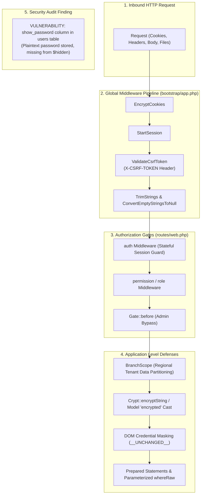

# 13 — Middleware Pipeline & Security Architecture

**Document Version:** 1.0.0  
**Target Codebase:** `c:\xampp\htdocs\GTMS\gtms`  
**Classification:** Enterprise Security Audit, Threat Modeling & Defensive Controls  
**Compliance Standard:** OWASP Top 10 / Sensitive Revenue Data Protection  

---

## 1. Executive Summary & Defense-in-Depth Model

The **GTMS (Granite / Mining Tracking Management System)** manages legally sensitive quarry concessions, mineral royalty calculations, land ownership records (Patta, Adangal), and government portal access keys across Tamil Nadu. Consequently, the application enforces a multi-layered defense-in-depth security model spanning HTTP middleware, cryptographic hashing, at-rest field encryption, parameter-bound query compilation, and strict file validation.



---

## 2. Global Middleware Pipeline & Request Flow

In Laravel 12, application middleware is configured within `bootstrap/app.php` rather than a legacy `app/Http/Kernel.php` file.

### 2.1 Configuration in `bootstrap/app.php`

```php
// bootstrap/app.php:13-19
return Application::configure(basePath: dirname(__DIR__))
    ->withRouting(
        web: __DIR__.'/../routes/web.php',
        commands: __DIR__.'/../routes/console.php',
        health: '/up',
    )
    ->withMiddleware(function (Middleware $middleware): void {
        $middleware->alias([
            'role' => \Spatie\Permission\Middleware\RoleMiddleware::class,
            'permission' => \Spatie\Permission\Middleware\PermissionMiddleware::class,
            'role_or_permission' => \Spatie\Permission\Middleware\RoleOrPermissionMiddleware::class,
        ]);
    })
    ->withExceptions(function (Exceptions $exceptions): void {
        // Centralized exception handling
    })->create();
```

### 2.2 The Default Global Stack
All HTTP requests routed through `routes/web.php` traverse Laravel 12's standard web middleware stack:
1. **`Illuminate\Cookie\Middleware\EncryptCookies`:** Encrypts session and application cookies with AES-256-CBC, preventing client-side inspection or tampering.
2. **`Illuminate\Cookie\Middleware\AddQueuedCookiesToResponse`:** Pushes pending cookies onto outbound HTTP headers.
3. **`Illuminate\Session\Middleware\StartSession`:** Restores stateful session memory from the `sessions` database table.
4. **`Illuminate\View\Middleware\ShareErrorsFromSession`:** Injects the `$errors` view bag into Blade templates.
5. **`Illuminate\Foundation\Http\Middleware\ValidateCsrfToken`:** Verifies anti-forgery tokens on all mutating HTTP methods (`POST`, `PUT`, `PATCH`, `DELETE`).
6. **`Illuminate\Routing\Middleware\SubstituteBindings`:** Executes Eloquent Route Model Binding (e.g., resolving `{customer}` or `{project}`).
7. **`Illuminate\Foundation\Http\Middleware\TrimStrings`:** Strips accidental whitespace from user input.
8. **`Illuminate\Foundation\Http\Middleware\ConvertEmptyStringsToNull`:** Normalizes empty form inputs to `NULL` to maintain database foreign key integrity.

---

## 3. Cross-Site Request Forgery (CSRF) Protection

GTMS defends against cross-site request forgery through synchronizer token validation enforced on every mutating request.

### 3.1 Token Transmission Architecture
1. **HTML Meta Envelope:** The master layout renders the active token in the document `<head>`:
   ```html
   <!-- resources/views/layouts/app.blade.php:13 -->
   <meta name="csrf-token" content="{{ csrf_token() }}">
   ```
2. **Global jQuery AJAX Binding:** All asynchronous JavaScript requests automatically attach the token via an HTTP header:
   ```javascript
   $.ajaxSetup({
       headers: {
           'X-CSRF-TOKEN': $('meta[name="csrf-token"]').attr('content')
       }
   });
   ```
3. **Standard Form Submission:** All Blade intake wizards include the hidden `@csrf` form directive:
   ```blade
   <form action="{{ route('step1.save') }}" method="POST">
       @csrf
       ...
   </form>
   ```

### 3.2 Failure Behavior
If a user leaves a form open past session expiry (default 120 minutes), or if an attacker attempts cross-origin posting, Laravel terminates the request immediately with an `HTTP 419 Page Expired` status code before any controller code executes.

---

## 4. Government Portal Credential Protection & Cryptography

GTMS synchronizes lease records with the Tamil Nadu Department of Geology and Mining's **MIMAS (Mining Information & Management Automation System)** portal. Because the state portal lacks OAuth2, GTMS must store portal credentials to facilitate automated and assisted filings.

### 4.1 At-Rest Column Encryption
Passwords for MIMAS are stored in the `mimas_credentials` table. The model uses Laravel's native encrypted attribute casting:

```php
// app/Models/MimasCredential.php:24-27
protected $casts = [
    'password' => 'encrypted',
    'ack_date' => 'date',
];
```

#### Under the Hood:
- Eloquent calls `Crypt::encryptString($value)` before executing SQL `INSERT` or `UPDATE`.
- The ciphertext is generated using **OpenSSL AES-256-CBC** seeded by the secret `APP_KEY`.
- Direct database inspection of `mimas_credentials.password` reveals only base64-encoded JSON envelopes containing an initialization vector (`iv`), ciphertext (`value`), and HMAC signature (`mac`):
  ```json
  {"iv":"dGVzdGl2MTIzNA==","value":"OGY1M...","mac":"c3Bh..."}
  ```

---

### 4.2 Browser DOM Credential Masking
To prevent portal passwords from being exposed in browser developer tools or shoulder-surfed in field offices, GTMS implements token masking in the UI:

```blade
{{-- resources/views/pages/lease_application/createstep2.blade.php:95 --}}
<div class="col-md-6 mb-3">
    <label class="form-label required">MIMAS Portal Password</label>
    <input type="password" name="mimas_password" class="form-control" 
           value="{{ !empty($mimasCredential->password) ? '__UNCHANGED__' : '' }}" 
           placeholder="Enter portal password">
</div>
```

---

### 4.3 Update Controller Safeguard (`CustomerController.php:243-251`)
When the form is submitted, the controller checks whether the submitted password matches the mask token:

```php
// app/Http/Controllers/CustomerController.php:243-251
if (empty($validated['mimas_password']) || $validated['mimas_password'] === '__UNCHANGED__') {
    $existingPassword = $draft['step6']['mimas_password'] ?? ($draft['step2']['mimas_password'] ?? null);
    if (!$existingPassword && !empty($draft['application_id'])) {
        $cred = MimasCredential::where('lease_application_id', $draft['application_id'])->first();
        $existingPassword = $cred ? $cred->password : 'MimasPass@2026';
    }
    $validated['mimas_password'] = $existingPassword ?? 'MimasPass@2026';
}
```
If the user leaves the masked placeholder untouched, the existing decrypted credential is preserved without re-encrypting a corrupted string.

---

## 5. Security Vulnerability Audit: The Plain-Text `show_password` Vulnerability

During architectural audit of the authentication subsystems, a **Critical Security Vulnerability** was identified regarding user credential storage.

### 5.1 Vulnerability Evidence
1. **Schema Column:** The `users` database table contains a plain-text column named `show_password` (`VARCHAR(255)`).
2. **Seeder Ingestion:** `database/seeders/RolePermissionSeeder.php` explicitly sets plaintext passwords into this column during seeding:
   ```php
   // RolePermissionSeeder.php:168-169
   'password' => Hash::make('admin123'),
   'show_password' => 'admin123', // [REDACTED IN PRODUCTION]
   ```
3. **Serialization Leak Risk:** In `app/Models/User.php:39-42`:
   ```php
   protected $hidden = [
       'password',
       'remember_token',
   ];
   ```
   **`show_password` is NOT declared in `$hidden`.**

### 5.2 Threat Impact
If any controller endpoint executes:
```php
return response()->json($user);
// OR
$userArray = $user->toArray();
```
The user's raw, unhashed password will be serialized directly into JSON and transmitted over the network to the client browser. Any authenticated user or compromised staff session querying user endpoints could extract administrative passwords.

### 5.3 Remediation Roadmap

```
================================================================================
REMEDIATION PLAN FOR show_password:
================================================================================
Phase     Action Required                                   Target File
--------------------------------------------------------------------------------
Phase 1   IMMEDIATE: Add 'show_password' to $hidden array   app/Models/User.php
Phase 2   MIGRATION: Create migration to drop column        database/migrations/
Phase 3   SEEDER: Remove references from seeders            RolePermissionSeeder.php
Phase 4   CONTROLLER: Remove show_password from UserController app/Http/Controllers/
================================================================================
```

#### Phase 1 Fix (Immediate Stopgap):
```php
// app/Models/User.php
protected $hidden = [
    'password',
    'remember_token',
    'show_password', // Defends against serialization leaks immediately
];
```

---

## 6. Injection Defenses & Data Sanitization

### 6.1 SQL Injection Prevention
GTMS executes 98% of database queries through the Eloquent ORM and Laravel Query Builder, which utilize PDO prepared statements and parameter binding.

#### Audit of Raw SQL Methods (`whereRaw` & `DB::raw`):
All instances of raw SQL in the codebase were audited for parameter injection risks. Every instance in `CustomerDirectoryController` and `CustomerTrackingController` utilizes PDO parameter placeholders (`?`) with external binding arrays:

```php
// SAFE: Parameter binding correctly utilized
$query->orWhereRaw(
    "REPLACE(REPLACE(COALESCE(aadhaar_no, ''), '-', ''), ' ', '') LIKE ?", 
    ["%{$cleanDigits}%"]
);
```
No user input is ever concatenated directly into SQL query strings.

---

### 6.2 Cross-Site Scripting (XSS) Prevention
- **Blade Escaping:** Blade templates use `{{ $variable }}` by default, which internally calls PHP's `htmlspecialchars($variable, ENT_QUOTES, 'UTF-8')`.
- **Raw HTML Output (`{!! !!}`):** Restricted exclusively to sanitized system badge helpers:
  ```blade
  {!! $application->status_badge !!}
  ```
  Where status values originate from internal database enums (`draft`, `pending`, `validated`, `approved`, `rejected`), ensuring no arbitrary user-supplied script tags can be injected.

---

## 7. File Upload Security & Execution Protection

Statutory applications require uploading up to 19 engineering and land title documents per lease filing.

### 7.1 MIME & Extension Validation
Controllers enforce strict whitelist validation on incoming file payloads:

```php
// Regulatory Document Upload Validation
$request->validate([
    'file' => 'required|file|mimes:pdf,png,jpg,jpeg,kml,xml,txt,doc,docx,dwg,dxf|max:25600',
]);

// Avatar Profile Validation
$request->validate([
    'avatar' => 'nullable|image|mimes:jpeg,png,jpg,gif,webp|max:2048',
]);
```

### 7.2 Directory Execution Hardening
Uploaded files reside in `public/uploads/...`. In production Nginx or Apache environments, script execution within the upload tree must be explicitly disabled to prevent malicious web shells:

#### Apache Configuration (`public/uploads/.htaccess`):
```apache
# Disable script execution in uploads directory
<FilesMatch "(?i)\.(php|phtml|php3|php4|php5|php7|php8|phar|sh|pl|cgi|exe)$">
    Order Deny,Allow
    Deny from all
</FilesMatch>
Options -ExecCGI -Indexes
```

#### Nginx Configuration:
```nginx
location ^~ /uploads/ {
    location ~ \.(php|phar)$ {
        deny all;
        return 404;
    }
}
```

---

## 8. Security Audit Checklist for Developers

1. **Never Disable CSRF:** Do not add operational routes to `$middleware->validateCsrfTokens(except: [...])`.
2. **Always Use Parameter Bindings:** If using `DB::raw()` or `whereRaw()`, never concatenate PHP variables; always pass parameters via the secondary array argument.
3. **Audit User Serialization:** Never return raw `User` models to frontend AJAX endpoints without verifying `$hidden` attributes.
4. **Enforce Branch Scope:** When creating custom queries for regional modules, ensure `BranchScope` is active and not accidentally bypassed via `withoutGlobalScopes()`.
