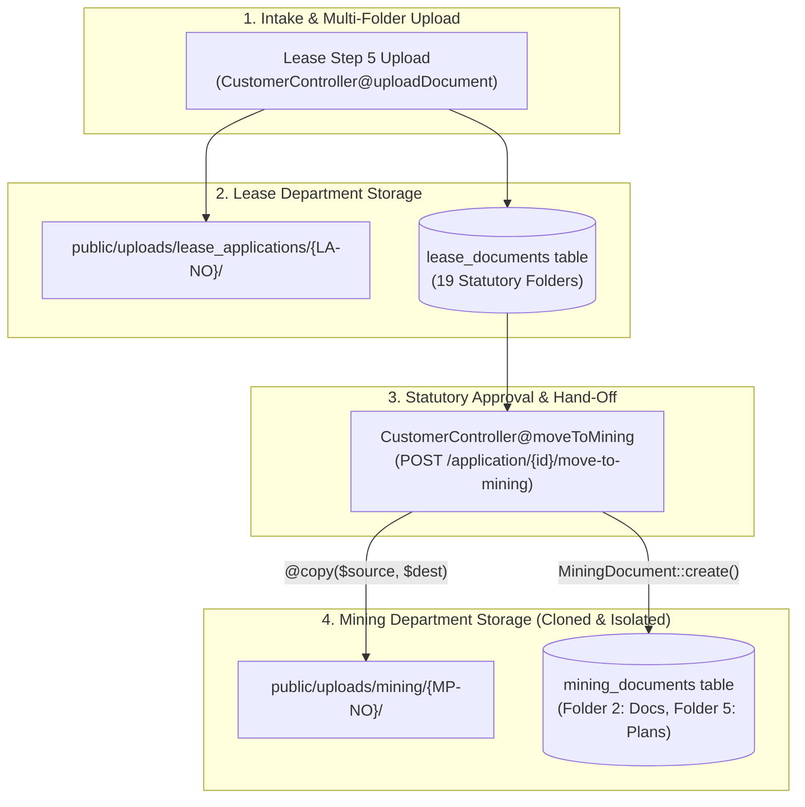

# 14 — File Storage, Uploads & Cross-Module Document Cloning

**Document Version:** 1.0.0  
**Target Codebase:** `c:\xampp\htdocs\GTMS\gtms`  
**Classification:** File System Architecture, Upload Directory Layout & Document Cloning  
**Storage Disk:** Local File System (`public/uploads/...` & `storage/app/public/...`)  

---

## 1. Executive Summary & File Architecture

The **GTMS (Granite / Mining Tracking Management System)** handles extensive statutory documentation required by Tamil Nadu's Department of Geology and Mining, the State Environmental Impact Assessment Authority (SEIAA), District Expert Appraisal Committees (DEAC), and revenue authorities. These documents include revenue land titles (Patta, Adangal, FMB sketches), high-precision AutoCAD boundary drawings (DWG, DXF), GIS spatial polygons (KML), environmental impact assessments (EIA), and drone photogrammetry orthomosaics.

### 1.1 Document Isolation Pattern vs. Polymorphic Storage
Rather than using a single shared polymorphic `documents` or `attachments` table—which creates database lock contention and couples departmental lifecycles—GTMS implements a **Partitioned Module Storage Pattern**:
- Every operational module maintains its own dedicated database table (`lease_documents`, `mining_documents`, `environment_documents`, `ppt_documents`, `dgps_documents`, `drone_documents`, `ec_compliance_documents`).
- Every module writes to a distinct physical directory on disk.
- When an application transitions between departments (e.g., Lease Approval $\rightarrow$ Mining Plan Preparation), documents are **physically cloned on disk** and registered in the receiving module's database, establishing legal and operational independence between departmental dossiers.



---

## 2. Storage Disk Configurations (`config/filesystems.php`)

The application's file system configuration is defined in `config/filesystems.php`:

```php
// config/filesystems.php:16, 31-48
'default' => env('FILESYSTEM_DISK', 'local'),

'disks' => [
    'local' => [
        'driver' => 'local',
        'root' => storage_path('app/private'),
        'serve' => true,
        'throw' => false,
        'report' => false,
    ],

    'public' => [
        'driver' => 'local',
        'root' => storage_path('app/public'),
        'url' => rtrim(env('APP_URL', 'http://localhost'), '/').'/storage',
        'visibility' => 'public',
        'throw' => false,
        'report' => false,
    ],

    's3' => [
        'driver' => 's3',
        // Cloud backup configuration
    ],
],
```

### 2.1 Storage Strategies in Practice
1. **Direct Public Path (`public/uploads/...`):** Used by `CustomerController`, `MiningController`, `PptDepartmentController`, `DgpsSurveyController`, and `EcComplianceController`. Placing files directly under `public_path('uploads/...')` guarantees high-performance static file serving under Apache/XAMPP without requiring symbolic link resolution (`php artisan storage:link`).
2. **Laravel Public Storage (`storage/app/public/...`):** Used by `EnverionsoneController` via `$file->storeAs("environment/{$project->project_code}", $filename, 'public')`. Files are accessible via `/storage/environment/...` when the symbolic link is created.

---

## 3. Upload Directory Taxonomy & Physical Layout

GTMS organizes files into isolated directory trees structured by operational domain and statutory application numbers:

```
========================================================================================================================
GTMS UPLOAD DIRECTORY TAXONOMY:
========================================================================================================================
Operational Module           File System Storage Path                          Controller & Line Reference
------------------------------------------------------------------------------------------------------------------------
1. Lease Applications        public/uploads/lease_applications/{application_no}/ CustomerController.php:436, 1209
2. Mining Plans              public/uploads/mining/{application_no}/             MiningController.php:403, 683
3. Environment Projects      public/uploads/environment/{project_code}/          EnverionsoneController.php:287
                             (or storage/app/public/environment/{project_code}/)
4. EC Certificates           public/uploads/ec_certificates/{project_code}/      EcCertificateController.php:244
5. PPT Department            public/uploads/ppt/                                 PptDepartmentController.php:274
6. DGPS Surveys              public/uploads/dgps/                                DgpsSurveyController.php:271
7. EC Compliances            public/uploads/compliance/                          EcComplianceController.php:345
8. User Profiles / Avatars   public/uploads/users/                               UserController.php:47
========================================================================================================================
```

### 3.1 Directory Creation Safety
Controllers employ defensive directory provisioning. If a sub-folder does not exist when a file arrives, it is created with full read/write permissions:

```php
// CustomerController.php:436-440
$uploadSubdir = 'uploads/lease_applications/' . $appNo;
$fullUploadPath = public_path($uploadSubdir);
if (!file_exists($fullUploadPath)) {
    mkdir($fullUploadPath, 0777, true);
}
```

---

## 4. MIME Type Validation & File Size Limits

Statutory filings require diverse document formats—ranging from signed revenue certificates to computer-aided drafting (CAD) files and satellite coordinate packages.

### 4.1 Statutory Document Validation Rule
```php
$request->validate([
    'file' => 'required|file|mimes:pdf,png,jpg,jpeg,kml,xml,txt,doc,docx,dwg,dxf|max:25600',
]);
```

### 4.2 Complete Format Specifications Matrix

| File Extension | MIME Type | Purpose / Statutory Role in GTMS | Max Size Limit |
| :--- | :--- | :--- | :---: |
| **`.pdf`** | `application/pdf` | Land titles (Patta, Adangal), official Gazette notifications, EIA reports, affidavits | 25 MB (25,600 KB) |
| **`.png`, `.jpg`, `.jpeg`** | `image/png`, `image/jpeg` | Scanned revenue sketches, field photos, applicant identity proofs | 25 MB (25,600 KB) |
| **`.dwg`** | `image/vnd.dwg`, `application/acad` | AutoCAD engineering quarry layout drawings and pit slope models | 25 MB (25,600 KB) |
| **`.dxf`** | `application/dxf` | Drawing Exchange Format for boundary geometry interoperability | 25 MB (25,600 KB) |
| **`.kml`** | `application/vnd.google-earth.kml+xml`| Spatial boundary vector polygons for GIS mapping and satellite verification | 25 MB (25,600 KB) |
| **`.xml`** | `application/xml`, `text/xml` | Digital geospatial coordinate packages and statutory survey points | 25 MB (25,600 KB) |
| **`.doc`, `.docx`** | `application/msword`, `...wordprocessingml` | Draft Mining Scheme text, ToR presentation scripts | 25 MB (25,600 KB) |
| **`.txt`** | `text/plain` | Raw DGPS rover ASCII coordinate logs | 25 MB (25,600 KB) |
| **Avatars (`.jpg`, `.png`)**| `image/jpeg`, `image/png`, `image/webp` | Staff and customer profile pictures (`public/uploads/users/`) | 2 MB (2,048 KB) |

---

## 5. Cross-Module Physical File Auto-Cloning (`moveToMining`)

When a district officer approves a Lease Application (`POST /application/{id}/approve`), the application becomes eligible for transition to the Mining Plan Department (`POST /application/{id}/move-to-mining`).

### 5.1 The Transition & Cloning Routine (`CustomerController.php:1694-1732`)
Rather than creating soft references or symlinks that could break if a lease file is later amended or purged, GTMS executes **physical disk duplication**:

```php
// app/Http/Controllers/CustomerController.php:1694-1732
// 5. Physical Document Auto-Cloning to Mining Storage
$miningUploadSubdir = 'uploads/mining/' . $miningAppNo;
$miningUploadPath = public_path($miningUploadSubdir);
if (!file_exists($miningUploadPath)) {
    mkdir($miningUploadPath, 0777, true);
}

// Folders in Mining Module: 2 = Documents, 5 = Plan
$clonedCount = 0;
foreach ($lease->documents as $lDoc) {
    if (!empty($lDoc->file_path) && file_exists(public_path($lDoc->file_path))) {
        $sourcePath = public_path($lDoc->file_path);
        $destFileName = basename($sourcePath);
        $destPath = $miningUploadPath . '/' . $destFileName;
        @copy($sourcePath, $destPath);

        // Map target folder: KML/Plan -> Folder 5 (Plan), others -> Folder 2 (Documents)
        $targetFolderId = 2;
        $docLower = strtolower($lDoc->document_name . ' ' . $destFileName);
        if (str_contains($docLower, 'kml') || str_contains($docLower, 'plan') || str_contains($docLower, 'drawing') || $lDoc->folder_id == 9) {
            $targetFolderId = 5;
        }

        MiningDocument::create([
            'mining_application_id' => $miningApp->id,
            'folder_id'             => $targetFolderId,
            'document_field_id'     => null, // Custom/carried document
            'document_name'         => $lDoc->document_name,
            'file_name'             => $destFileName,
            'file_path'             => $miningUploadSubdir . '/' . $destFileName,
            'file_type'             => $lDoc->file_type ?? 'application/pdf',
            'file_size'             => file_exists($destPath) ? filesize($destPath) : ($lDoc->file_size ?? 0),
            'status'                => in_array($lDoc->status, ['validated', 'approved']) ? 'validated' : 'uploaded',
            'uploaded_by'           => Auth::id() ?? 1,
            'uploaded_at'           => now(),
        ]);
        $clonedCount++;
    }
}
```

### 5.2 Key Engineering Behaviors:
1. **Autonomous Directory:** Creates dedicated directory `public/uploads/mining/{miningAppNo}/`.
2. **Physical Duplication via `@copy`:** Copies the exact binary bytes from `uploads/lease_applications/...` to `uploads/mining/...`. If the lease document is later modified, the mining department's archival copy remains legally intact.
3. **Smart Categorization Routing:**
   - Any document containing keywords `kml`, `plan`, `drawing` or originating from Folder 9 is automatically routed to **Folder 5 (Plan)**.
   - All standard revenue, title, and identity documents are routed to **Folder 2 (Documents)**.
4. **Validation Status Inheritance:** If a document was marked `validated` or `approved` during the lease stage, its status is preserved as `validated` in the mining dossier, eliminating redundant verification.

---

## 6. Statutory Folder Taxonomies

### 6.1 Lease Application 19-Folder Statutory Checklist
During Step 5 of the Lease Wizard, operators upload documents into 19 predefined statutory slots:

```
Folder 1:  Land Document (Sale Deed / Lease Agreement)
Folder 2:  Consent Letter (from land owners if applicable)
Folder 3:  Adangal & A-Register (Revenue land extract)
Folder 4:  Patta & Encumbrance Certificate (EC for 30 years)
Folder 5:  Work Order / Administrative Approval
Folder 6:  Government Gazette Notification
Folder 7:  Recommendation Letter (Assistant Director of Mines)
Folder 8:  Mineral Management System (MIMAS) Application Copy
Folder 9:  VAO Certificate (Village Administrative Officer clearance)
Folder 10: Combined Sketch (Survey boundaries)
Folder 11: FMB Sketch (Field Measurement Book diagram)
Folder 12: Topographic Sketch (500m & 5km radius buffer)
Folder 13: A-Register Extract
Folder 14: Chitta Extract
Folder 15: Quarry Site Plan (Demarcated area)
Folder 16: Processing Fee Challan (Treasury remittance)
Folder 17: Sworn Affidavit (Compliance declaration)
Folder 18: Applicant Identity Proofs (Aadhaar, PAN, GSTIN)
Folder 19: Miscellaneous Supporting Documents
```

### 6.2 Mining Plan 6-Folder Structure
- **Folder 1:** Baseline Details & Quarry Lease Deed
- **Folder 2:** Cloned Revenue & Legal Documents
- **Folder 3:** Geology, Reserve Estimation & Year-wise Production
- **Folder 4:** Progressive Mine Closure Plan (PMCP)
- **Folder 5:** AutoCAD Mine Plans, Sections & KML Polygons
- **Folder 6:** Statutory RQP Certifications & Bank Guarantees

### 6.3 Environmental Clearance Folders
- **Category B1 (Stage 1 - SC1 ToR):** 5 Preparation Folders (Form-1, PFR, Proposed ToR, Baseline Survey, VAO Certificate).
- **Category B1 (Stage 2 - SC2 EIA):** 6 EIA Folders (Draft EIA, Public Hearing Minutes, Final EIA, EMP, Risk Assessment, Compliance Undertaking).
- **Category B2 Workflow:** 6 Dedicated Clearance Folders (Form-1M, PFR, 500m Cluster Certificate, Approved Mining Plan, EMP, Public Consultation Exemption).

---

## 7. Document Lifecycle & Verification States

All document records implement a state machine tracking statutory verification:

```
[ uploaded ] ──(Officer Inspection)──> [ validated ] ──(Final Approval)──> [ approved ]
     │
     └──(Defect Detected)────────────> [ rejected ] ──(Re-upload)────────> [ uploaded ]
```

- **`uploaded`:** File is on disk, pending departmental scrutiny.
- **`validated`:** Verified against physical revenue originals by case officer.
- **`approved`:** Formally accepted into the legal application archive.
- **`rejected`:** Discrepancy discovered (e.g., blurry sketch, outdated Patta). Carries rejection remarks in `notes` column; permits proponent re-upload.

---

## 8. Storage Maintenance & Cleanup Protocols

### 8.1 Temporary Draft Cleanup
When users start a lease draft without submitting, temporary files are created under `uploads/lease_applications/DRAFT-{Ymd}-{hash}/`.
- **Maintenance Policy:** Temporary draft folders older than 14 days with no associated row in `lease_applications` should be purged via an automated maintenance command (`php artisan gtms:cleanup-drafts`).

### 8.2 Safe Deletion Architecture
When applications are soft-deleted:
- Database records have `deleted_at` set.
- Physical files are **not** immediately deleted from disk to preserve legal audit trails in compliance with state mining archives. Hard file deletion requires explicit administrative purge via Super Admin tools.
