# 15 — External Integrations & Master Data Synchronization

**Document Version:** 1.0.0  
**Target Codebase:** `c:\xampp\htdocs\GTMS\gtms`  
**Classification:** Third-Party Portal Touchpoints, Master Datasets & Hardware Interfaces  
**Primary Integration:** Tamil Nadu Mines (MIMAS) / SEIAA / 38 Revenue Districts  

---

## 1. Executive Summary & External Touchpoints

The **GTMS (Granite / Mining Tracking Management System)** acts as an enterprise bridge between private quarry proponents, registered mining consultants (RQP), surveying agencies, and statutory government regulatory bodies across Tamil Nadu and the Government of India.

The application interfaces across four distinct integration layers:
1. **State Mining Portal (MIMAS):** Department of Geology and Mining, Government of Tamil Nadu.
2. **Central & State Environmental Portals:** MoEFCC Parivesh Portal and SEIAA Tamil Nadu.
3. **Territorial Revenue Administration:** Complete master data mapping across all 38 Tamil Nadu Revenue Districts and sub-district Taluks.
4. **Hardware & Spatial Surveying Engines:** Differential GPS (DGPS) rovers, AutoCAD boundary plans (DWG/DXF), GIS vector layers (KML), and Drone photogrammetry flight logs.

```mermaid
flowchart TD
    subgraph GTMSCore["GTMS Core System (Laravel 12)"]
        CustomerHub["Universal Customer 360 Hub"]
        LeaseEngine["Lease Wizard (Steps 1-8)"]
        MiningEngine["Mining Plan Portal (6.1-6.6)"]
        ECEngine["Environment Portal (B1/B2/Certificates)"]
        InvoiceEngine["GST & Indian Number Invoicing"]
    end

    subgraph StateMines["State Regulatory Touchpoint"]
        MIMAS["Tamil Nadu MIMAS Portal\n(Dept of Geology & Mining)"]
        DistrictOffices["38 District Collectorates\n(AD Mines Offices)"]
    end

    subgraph EnvAuthorities["Environmental Regulatory Bodies"]
        SEIAA["SEIAA Tamil Nadu\n(State EIA Authority)"]
        DEAC["DEAC / PPT Department\n(District Expert Committees)"]
        Parivesh["MoEFCC Parivesh Portal\n(Central Clearance)"]
    end

    subgraph SpatialHardware["Field Survey & Spatial Hardware"]
        DGPS["Differential GPS Rovers\n(UTM Zone 44N / WGS-84)"]
        Drone["Drone Photogrammetry\n(DGCA Flight Logs / Orthomosaics)"]
        CADGIS["AutoCAD (DWG/DXF) & Google Earth (KML)"]
    end

    CustomerHub <--> MIMAS
    LeaseEngine --> DistrictOffices
    MiningEngine --> CADGIS
    ECEngine --> SEIAA
    ECEngine --> DEAC
    ECEngine --> Parivesh
    LeaseEngine <--> SpatialHardware
    CustomerHub --> InvoiceEngine
```



---

## 2. Tamil Nadu MIMAS Portal Integration

The **Mining Information & Management Automation System (MIMAS)** is the centralized state portal maintained by the Department of Geology and Mining, Tamil Nadu, for managing quarrying leases, dispatch permits, and royalty remittances.

### 2.1 Synchronization Architecture & Data Attributes
GTMS maintains synchronization with the state portal across the lifecycle of each concession:

| Attribute | Database Column | Purpose & Format in GTMS |
| :--- | :--- | :--- |
| **Applicant Registration Code** | `customers.mimas_no` | State registration identifier (e.g., `TN-MMS-SLM-001`, `TN-MMS-DPI-042`) |
| **Legacy MIMAS Number** | `customers.mimas_number`| Retained for backward compatibility with pre-2024 legacy paper records |
| **MIMAS Acknowledgment No** | `mimas_credentials.mimas_ack_no` | Official state filing acknowledgment receipt number |
| **Acknowledgment Date** | `mimas_credentials.ack_date` | Statutory date of submission stamped by government portal |
| **Portal Status** | `mimas_credentials.portal_status` | Status flags: `registered`, `submitted`, `verified`, `granted` |
| **Portal Credentials** | `mimas_credentials.password` | AES-256 encrypted access password for assisted filing |

---

### 2.2 Secure Credential Storage & UI Masking
To prevent government portal credentials from being leaked or mishandled:
1. **At-Rest Encryption:** Handled via Eloquent's encrypted casting (`app/Models/MimasCredential.php:25`):
   ```php
   protected $casts = [
       'password' => 'encrypted',
       'ack_date' => 'date',
   ];
   ```
2. **DOM Placeholder Masking:** Form inputs in `createstep2.blade.php` mask existing credentials with the string `'__UNCHANGED__'`.
3. **Controller Ingestion:** `CustomerController@saveStep2` checks:
   ```php
   if (empty($validated['mimas_password']) || $validated['mimas_password'] === '__UNCHANGED__') {
       $validated['mimas_password'] = $existingPassword;
   }
   ```

---

### 2.3 Universal Autocomplete by MIMAS Number
As detailed in Doc 11, entering a MIMAS number in any application wizard queries `GET /customers/lookup-mimas/{mimas_no}`, resolving applicant names, PAN, Aadhaar, GSTIN, district, and mobile contact instantly.

---

## 3. 38 Tamil Nadu Revenue Districts Master Data

Quarrying administration in Tamil Nadu is strictly decentralized across its 38 administrative districts. The Assistant Director of Geology and Mining (AD Mines) operates under the District Collector of each respective district.

### 3.1 Exhaustive Master Registry
All 38 districts are seeded via `database/seeders/GtmsMasterDataSeeder.php:15-68` with state-recognized 3-letter abbreviations:

| # | District Name | Code | Administrative HQ | Key Mining Operations in GTMS |
| :-: | :--- | :---: | :--- | :--- |
| 1 | **Ariyalur** | `ARL` | Ariyalur | Limestone, Marl, Major Mineral Concessions |
| 2 | **Chengalpattu** | `CGL` | Chengalpattu | Blue Metal, Gravel, Rough Stone Quarries |
| 3 | **Chennai** | `CHN` | Chennai | Administrative Headquarters, Head Office Operations |
| 4 | **Coimbatore** | `CBE` | Coimbatore | Rough Stone, Gravel, Manufacturing Sand (M-Sand) |
| 5 | **Cuddalore** | `CUD` | Cuddalore | Lignite, River Sand, Rough Stone |
| 6 | **Dharmapuri** | `DPI` | Dharmapuri | Monumental Black Granite, Rough Stone |
| 7 | **Dindigul** | `DGL` | Dindigul | Rough Stone, Multi-colored Granite, Gravel |
| 8 | **Erode** | `ERD` | Erode | Rough Stone, Quartz, Feldspar, Gravel |
| 9 | **Kallakurichi** | `KLK` | Kallakurichi | Rough Stone, Earth, Brick Earth |
| 10| **Kancheepuram** | `KCP` | Kancheepuram | Gravel, Blue Metal, Sand Replenishment |
| 11| **Karur** | `KRR` | Karur | Rough Stone, Quartz, Soapstone, Feldspar |
| 12| **Krishnagiri** | `KGI` | Krishnagiri | World-Famous Monumental Black & Grey Granite |
| 13| **Madurai** | `MDU` | Madurai | Multi-colored Granite, Rough Stone, Gravel |
| 14| **Mayiladuthurai**| `MYD` | Mayiladuthurai | Riverine Concessions, Silica Sand |
| 15| **Nagapattinam** | `NGP` | Nagapattinam | Coastal Minerals, Sand, Brick Clay |
| 16| **Kanniyakumari**| `KKI` | Nagercoil | Rough Stone, Heavy Mineral Beach Sands |
| 17| **Namakkal** | `NKL` | Namakkal | Rough Stone, Quartz, Feldspar, White Granite |
| 18| **Perambalur** | `PBL` | Perambalur | Limestone, Calcareous Stone, Rough Stone |
| 19| **Pudukkottai** | `PDK` | Pudukkottai | Multi-colored Granite, Rough Stone, Laterite |
| 20| **Ramanathapuram**|`RMD` | Ramanathapuram | Limestone, Gypsum, Silica, Coastal Sediments |
| 21| **Ranipet** | `RPT` | Ranipet | Rough Stone, Granite, Building Materials |
| 22| **Salem** | `SLM` | Salem | Magnesite, Bauxite, Granite, Rough Stone |
| 23| **Sivagangai** | `SVG` | Sivagangai | Graphite, Multi-colored Granite, Rough Stone |
| 24| **Tenkasi** | `TKS` | Tenkasi | Rough Stone, Gravel, River Sand |
| 25| **Thanjavur** | `TNJ` | Thanjavur | River Sand, Brick Clay, Gravel |
| 26| **Theni** | `THI` | Theni | Rough Stone, Limestone, Building Stone |
| 27| **Thiruvallur** | `TLR` | Thiruvallur | Blue Metal, Gravel, Brick Clay |
| 28| **Thiruvarur** | `TVR` | Thiruvarur | Clay, Silt, Agricultural Riverine Materials |
| 29| **Thoothukudi** | `TKD` | Thoothukudi | Limestone, Heavy Minerals (Garnet, Ilmenite) |
| 30| **Tiruchirappalli**|`TRY`| Tiruchirappalli | Rough Stone, Sand, Minor Minerals |
| 31| **Tirunelveli** | `TNV` | Tirunelveli | Rough Stone, Limestone, Multi-colored Granite |
| 32| **Tirupathur** | `TPR` | Tirupathur | Rough Stone, Building Granite |
| 33| **Tiruppur** | `TUP` | Tiruppur | Rough Stone, Gravel, M-Sand aggregates |
| 34| **Tiruvannamalai**| `TVM`| Tiruvannamalai | Black Granite, Rough Stone, Quartz |
| 35| **Nilgiris** | `NLG` | Udhagamandalam | Strictly Controlled Hill Area Minor Minerals |
| 36| **Vellore** | `VLR` | Vellore | Rough Stone, Granite, Building Materials |
| 37| **Viluppuram** | `VPM` | Viluppuram | Blue Metal, Gravel, Rough Stone |
| 38| **Virudhunagar** | `VNR` | Virudhunagar | Limestone, Rough Stone, Gravel |

### 3.2 Relational Integrity & Identifier Synthesis
The 3-letter district code serves as a building block for system-wide identifier generation:
- **Application Number Synthesis:**
  $$\text{Common ID} = \text{"GTMS-"}\ ||\ \text{YEAR}\ ||\ \text{"-"}\ ||\ \text{SEQUENCE}$$
  $$\text{MIMAS Code} = \text{"TN-MMS-"}\ ||\ \text{DISTRICT\_CODE}\ ||\ \text{"-"}\ ||\ \text{SEQUENCE}$$
  *(e.g., `TN-MMS-SLM-001` uniquely indicates Salem district).*

---

## 4. Commercial Invoicing & GST Financial Integration

While GTMS tracks statutory compliance, it also manages commercial client ledgers. The invoicing module supports **Dual-Tier GST calculation** and renders invoices following standard Indian financial conventions.

### 4.1 Invoicing Endpoints (`CustomerTrackingController.php`)
- **Proforma Invoice:** `GET /customer-tracking/{customer}/proforma-invoice`
- **Tax Invoice:** `GET /customer-tracking/{customer}/tax-invoice`

### 4.2 Dual-Tier GST Engine
The system inspects the proponent's state registration:
- **Intra-State Supply (Tamil Nadu Proponent $\rightarrow$ Tamil Nadu Quarry):**
  $$\text{CGST} = \text{Taxable Value} \times 9\%$$
  $$\text{SGST} = \text{Taxable Value} \times 9\%$$
  $$\text{Total Tax} = 18\%$$
- **Inter-State Supply (Proponent from Karnataka / Andhra Pradesh / Kerala):**
  $$\text{IGST} = \text{Taxable Value} \times 18\%$$

---

### 4.3 Indian Numbering Currency Words Algorithm
Financial invoices and treasury challans in India must state figures in words using the Indian numbering system (Lakhs and Crores rather than Millions and Billions).

```php
// app/Http/Controllers/CustomerTrackingController.php:1070-1110
private function amountToWords(float $number): string
{
    $decimal = round($number - ($no = floor($number)), 2) * 100;
    $words = [
        0 => '', 1 => 'One', 2 => 'Two', 3 => 'Three', 4 => 'Four',
        5 => 'Five', 6 => 'Six', 7 => 'Seven', 8 => 'Eight', 9 => 'Nine',
        10 => 'Ten', 11 => 'Eleven', 12 => 'Twelve', 13 => 'Thirteen',
        14 => 'Fourteen', 15 => 'Fifteen', 16 => 'Sixteen', 17 => 'Seventeen',
        18 => 'Eighteen', 19 => 'Nineteen', 20 => 'Twenty', 30 => 'Thirty',
        40 => 'Forty', 50 => 'Fifty', 60 => 'Sixty', 70 => 'Seventy',
        80 => 'Eighty', 90 => 'Ninety'
    ];
    $digits = ['', 'Hundred', 'Thousand', 'Lakh', 'Crore'];

    // Partitions numbers by standard Indian denominations:
    // Crores (10,000,000), Lakhs (100,000), Thousands (1,000), Hundreds (100)
    ...
    return $result . 'Rupees Only';
}
```
*Example Conversion:* `250000.00` $\rightarrow$ **"Two Lakh Fifty Thousand Rupees Only"**.

---

## 5. Geospatial & Hardware Surveying Integrations

Statutory mine boundary approval requires precise spatial demarcation to ensure quarry pits do not encroach upon public roads, reserve forests, water bodies, or neighboring patta lands.

### 5.1 Differential GPS (DGPS) Boundary Integration
- **Coordinate Standard:** WGS-84 Datum / Universal Transverse Mercator (UTM Zone 44N).
- **Pillar Data Points:** Demarcates boundary boundary pillars ($A, B, C, D \dots$) with sub-centimeter accuracy.
- **Rover ASCII Ingestion:** Ingests Northing, Easting, and Elevation coordinates recorded in the field by dual-frequency DGPS rovers.

### 5.2 GIS Vector Layers: Google Earth KML
- **Format:** Keyhole Markup Language (`application/vnd.google-earth.kml+xml`).
- **Functionality:** Uploaded during Step 5 of Lease Application and Step 5 of Mining Plan.
- **Verification:** Overlaid on satellite imagery by regulatory officers to verify that mandatory statutory safety buffers (50m from roads, 10m from boundaries) are observed.

### 5.3 Drone Photogrammetry & DGCA Compliance
- **Module:** `DroneSurveyController` & `DroneSurvey` entity.
- **Flight Logs:** Records drone pilot license, DGCA UIN (Unique Identification Number), flight date, and weather conditions.
- **Orthomosaic GeoTIFFs:** High-resolution aerial composite maps utilized for mine volumetrics and pit extraction audits.

---

## 6. Environmental Authorities Integration

### 6.1 State Environmental Impact Assessment Authority (SEIAA)
- Tracks state-level environmental clearances for Category B1 and larger B2 projects.
- Manages SEIAA Reference Numbers (`ec_ref_no`) and validity periods (typically 5 to 30 years).

### 6.2 District Expert Appraisal Committee (DEAC / PPT Department)
- Facilitates the **Project Presentation (PPT)** gate required by Tamil Nadu DEAC.
- Records committee queries, presentation minutes, and formal ToR (Terms of Reference) approvals before EIA studies can proceed.

### 6.3 Central Parivesh Portal
- Captures national MoEFCC Parivesh Application Numbers (`parivesh_app_no`) for inter-state tracking and central environmental clearances.

---

## 7. Integration Resilience & Failure Handling

1. **Graceful Fallback:** If the external MIMAS portal is unreachable during applicant lookup, the UI displays a dismissible warning toast and allows the operator to manually complete the form without blocking the intake pipeline.
2. **Audit Logging:** All credential lookups and external portal status updates are recorded in `activity_logs` with timestamps, operator IDs, and IP addresses to maintain an immutable compliance trail.
