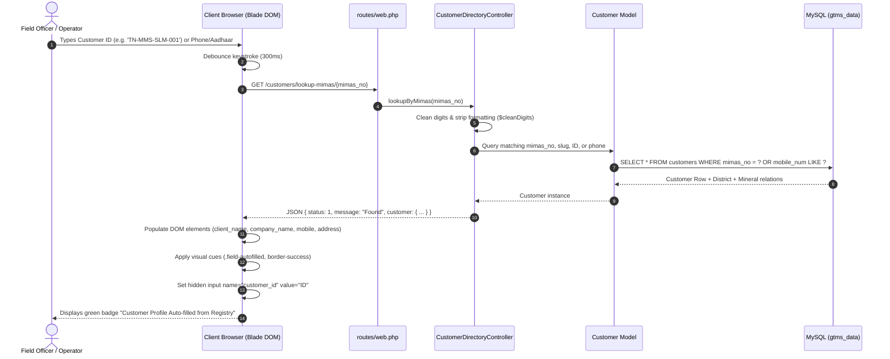
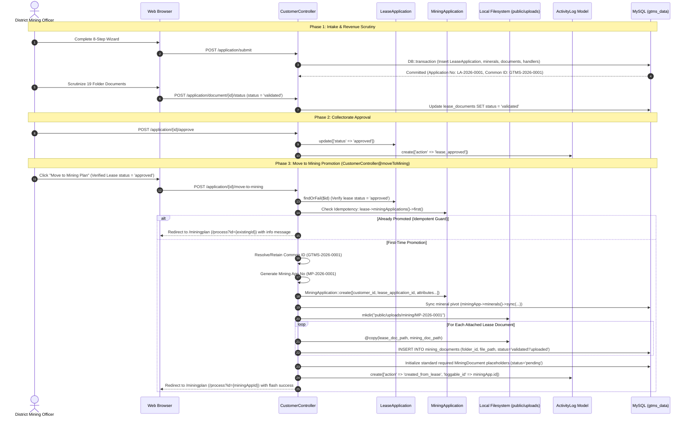
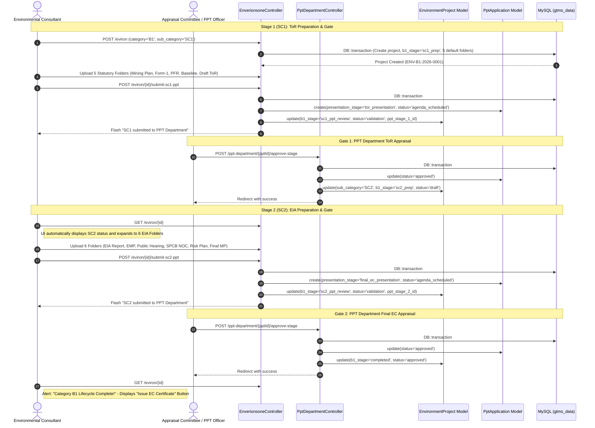
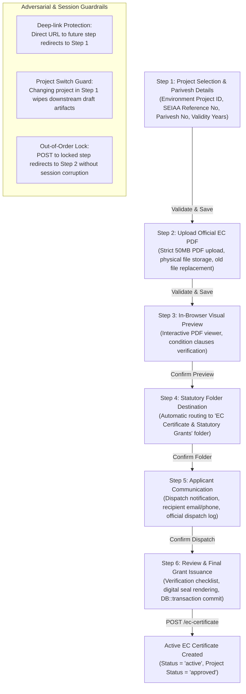
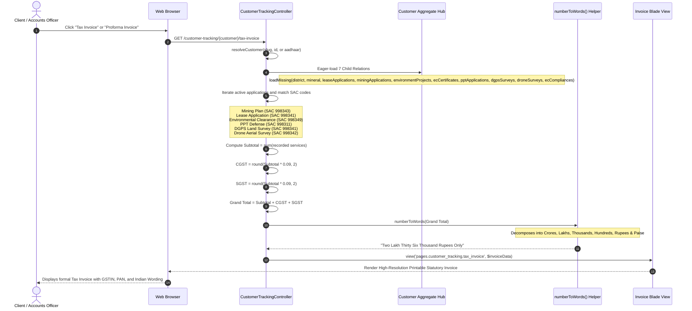

# GTMS — Statutory Data Flows & Sequence Diagrams

**Project Name:** Granite / Mining Tracking Management System (GTMS)  
**Domain:** District Mining Office Management & Statutory Regulatory ERP  
**State / Region:** Tamil Nadu, India  
**Target Architecture:** Monolithic Laravel 12 Enterprise Application  
**Authoritative Source:** Codebase Inspection & Empirical Routing/Controller Audit  
**Document Number:** `19` of `23`

---

## 1. Executive Summary

The **Granite / Mining Tracking Management System (GTMS)** orchestrates complex, multi-year statutory compliance workflows across diverse state and central regulatory departments in Tamil Nadu:
* Department of Geology and Mining (DoGM) / District Collectorate
* State Environmental Impact Assessment Authority (SEIAA) / MoEFCC Parivesh
* District Expert Appraisal Committee (DEAC) / PPT Department
* Geodetic Cadastral & Drone Aerial Photogrammetry Survey Authorities

This document details the exact **sequence diagrams and execution data flows** governing the system's six critical statutory pipelines.

---

## 2. Universal Customer Intake & AJAX Auto-Fill Sequence

Every statutory wizard in GTMS (Lease Application, Mining Portal, Environment Clearance, PPT, DGPS, Drone, EC Compliance) begins by establishing a binding connection to a master applicant profile via the **Customer Unique ID** (`mimas_no`).



### Technical Implementation Details
* **Endpoint:** `GET /customers/lookup-mimas/{mimas_no}`
* **Source:** `app/Http/Controllers/CustomerDirectoryController.php:293-349`
* **Multi-Factor Normalization:** If the input string contains 10 or more digits, the query automatically searches `mobile_num`, `secondary_mobile_num`, and Aadhaar without spaces or hyphens:
  ```sql
  REPLACE(REPLACE(COALESCE(aadhaar_no, ''), '-', ''), ' ', '') LIKE '%cleanDigits%'
  ```
* **Client Behavior:** Fields are marked with `.field-autofilled` and locked to read-only where appropriate, preventing accidental corruption of master customer records during application creation.

---

## 3. Lease Application -> Scrutiny -> Approval -> Mining Promotion

The statutory progression from an initial quarry lease application to an approved mining plan involves formal revenue document scrutiny, collectorate approval, and an atomic cross-module data and file transfer.



### Key Architectural Constraints
* **Immutability of Common ID:** The identifier `GTMS-{YEAR}-{SEQUENCE}` is generated at Step 8 of the lease intake and is guaranteed never to mutate as the project transitions into Mining, Environment, PPT, and Survey departments.
* **Physical Document Isolation:** GTMS rejects shared file references. Files are physically cloned on disk (`@copy()`) to ensure that future document edits or revocations in the Mining module do not alter the historical audit trail of the original Lease grant.
* **Non-Transactional Cross-Module Execution:** In `CustomerController@moveToMining`, writes (`MiningApplication`, `MiningDocument`, `@copy()` file cloning, and `ActivityLog`) occur directly without an enclosing `DB::beginTransaction()` / `DB::commit()` transaction block, and handlers/payment ledgers are not duplicated from lease to mining (see `docs/22-unknowns-risks.md § RISKS-02`).

---

## 4. Mining Plan 6-Stage Process Flow (Process 6.1 – 6.6)

The formulation and approval of a Mining Plan under Rule 41 of the Tamil Nadu Minor Mineral Concession Rules, 1959 proceeds through six sequential stages:

```mermaid
stateDiagram-v2
    [*] --> Stage_6_1: New Application Intake
    
    state "Stage 6.1: Draft Mine Plan Preparation" as Stage_6_1 {
        [*] --> Draft_Preparation
        Draft_Preparation --> Baseline_Studies: Surface & Geological Plates
        Baseline_Studies --> PMCP_Design: Progressive Mine Closure Plan
        PMCP_Design --> [*]
    }

    Stage_6_1 --> Stage_6_2: Advance Stage (advanceStage)
    
    state "Stage 6.2: Departmental Scrutiny" as Stage_6_2 {
        [*] --> DoGM_Filing
        DoGM_Filing --> Scrutiny_Letter: Scrutiny Remarks Issued
        Scrutiny_Letter --> Rectification_Done: Queries Answered
        Rectification_Done --> [*]
    }

    Stage_6_2 --> Stage_6_3: Advance Stage
    
    state "Stage 6.3: Technical Committee Defense" as Stage_6_3 {
        [*] --> PPT_Formulation
        PPT_Formulation --> Committee_Defense: Presentation to Technical Committee
        Committee_Defense --> Recommendation_Secured: Minutes of Meeting
        Recommendation_Secured --> [*]
    }

    Stage_6_3 --> Stage_6_4: Advance Stage
    
    state "Stage 6.4: Joint Site Inspection" as Stage_6_4 {
        [*] --> Field_Visit
        Field_Visit --> Geo_Inspection: AD Mines & Surveyor Inspection
        Geo_Inspection --> Inspection_Report: Ground Truth Verified
        Inspection_Report --> [*]
    }

    Stage_6_4 --> Stage_6_5: Advance Stage
    
    state "Stage 6.5: Financial Assurance" as Stage_6_5 {
        [*] --> Bank_Guarantee
        Bank_Guarantee --> Final_Plates: Final Fair Copies Prepared
        Final_Plates --> [*]
    }

    Stage_6_5 --> Stage_6_6: Advance Stage
    
    state "Stage 6.6: Formal Approval Order" as Stage_6_6 {
        [*] --> Order_Issued: Approved by Department
        Order_Issued --> Move_To_Env: Click "Move to Environment Clearance"
    }

    Stage_6_6 --> [*]: Promoted to Category B1 / B2 Project
```



---

## 5. Category B1 2-Stage Lifecycle & PPT Presentation Gates

Category B1 projects require a mandatory two-stage statutory progression before the State Environmental Impact Assessment Authority (SEIAA) and District Expert Appraisal Committee (DEAC):
1. **Stage 1 (SC1):** Terms of Reference (ToR) presentation and approval.
2. **Stage 2 (SC2):** Environmental Impact Assessment (EIA) formulation, public hearing, and Final EC presentation.



---

## 6. EC Certificate Issuance 6-Step Stepper Wizard

Following statutory approval, official clearance orders are codified into verified certificates through the guided 6-step wizard:



---

## 7. Customer 360 Dossier & Commercial Invoicing Data Flow

While GTMS tracks statutory engineering compliance, each statutory entity also functions as a billable service item. The Customer 360 Dossier dynamically aggregates these cross-departmental records into unified commercial invoices.



### Financial Calculation Formulas
* **Subtotal ($\text{ST}$):** $\sum_{i=1}^{n} \text{Amount}_i$
* **Central GST ($\text{CGST}$):** $\text{round}(\text{ST} \times 0.09, 2)$
* **State GST ($\text{SGST}$):** $\text{round}(\text{ST} \times 0.09, 2)$
* **Grand Total ($\text{GT}$):** $\text{ST} + \text{CGST} + \text{SGST}$
* **Number to Words Conversion:** Follows the traditional Indian currency denomination tiers (`Crore` $\rightarrow$ `Lakh` $\rightarrow$ `Thousand` $\rightarrow$ `Hundred` $\rightarrow$ `Rupees and Paise`).
