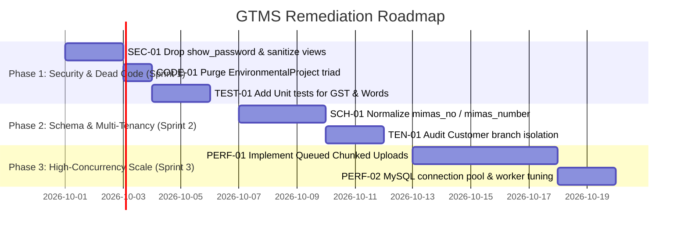

# GTMS — Technical Risk Register, Known Gaps & Architectural Technical Debt

**Project Name:** Granite / Mining Tracking Management System (GTMS)  
**Document Number:** `22` of `23`  
**Classification:** Enterprise Engineering Audit & Security Register  
**Authoritative Source:** Static Code Analysis, Schema Inspection, and PHPUnit Test Suite Audit  
**Status:** Active Technical Audit  

---

## 1. Executive Summary & Risk Classification Matrix

This document provides an exhaustive, empirical technical risk register for the **Granite / Mining Tracking Management System (GTMS)**. It identifies architectural anomalies, dead code paths, duplicate schema definitions, credential exposure risks, multi-tenancy edge cases, and concurrency bottlenecks present in the codebase.

Each risk is categorized using standard industry severity ratings:
* **P0 — Critical / High Severity:** Security vulnerabilities, credential exposures, or data corruption hazards requiring immediate remediation before production deployment.
* **P1 — High Severity:** Significant architectural debt, schema redundancies, or concurrency bottlenecks that affect maintainability or high-load scalability.
* **P2 — Medium Severity:** Dead code models, unused database tables, or test suite gaps that degrade code clarity or testing precision.
* **P3 — Low Severity / Cosmetic:** Minor UI/UX discrepancies, label mismatches, or deprecated configuration defaults.

### Risk Overview Matrix
| ID | Risk Title | Severity | Impacted Subsystem | Source Location | Effort to Remediate |
| :--- | :--- | :--- | :--- | :--- | :--- |
| **SEC-01** | Plaintext Password Storage (`show_password`) | **P0 (Critical)** | Authentication & Security | `users` table, `User.php`, `UserController.php`, `index.blade.php` | Low (1-2 Hours) |
| **SCH-01** | Double MIMAS Column Ambiguity (`mimas_no` vs `mimas_number`) | **P1 (High)** | Customer & Search Core | `customers` table, `Customer.php`, `CustomerDirectoryController.php` | Medium (3-4 Hours) |
| **PERF-01** | Synchronous Heavy File Uploads (CAD / Drone) | **P1 (High)** | File Storage & Queues | Controllers, `config/queue.php`, HTTP worker threads | Medium (1 Day) |
| **TEN-01** | Partial Multi-Tenancy Isolation (`Customer` Unscoped) | **P1 (High)** | Multi-Tenancy (`BranchScope`) | `Customer.php`, `BranchScope.php`, `customers` table | Medium (4-6 Hours) |
| **CODE-01** | Dead Model Triad (`EnvironmentalProject` et al.) | **P2 (Medium)** | Environment Clearance | `app/Models/EnvironmentalProject.php`, `EnvironmentalDocument.php` | Low (1 Hour) |
| **DB-01** | Soft-Deletes vs Unique Constraint Collisions | **P2 (Medium)** | Database Integrity | `customers` table, unique indexes | Low (Already mitigated, requires ongoing discipline) |
| **TEST-01** | Zero Unit Tests for Pure Business Algorithms | **P2 (Medium)** | Testing Suite | `CustomerTrackingController.php` (GST, Indian Numbers) | Low (2-3 Hours) |
| **AUTH-01** | Global Super-Admin Gate Bypass | **P3 (Low)** | RBAC & Authorization | `AppServiceProvider.php:26-28` | Low (Design Choice) |

---

## 2. SEC-01: Plaintext Password Exposure Risk (`show_password`)

### Observation & Code Evidence
The `users` table contains a column named `show_password` (`VARCHAR(255) NULLABLE`):
1. **Migration Definition:** `database/migrations/2026_07_08_070939_add_image_userid_mobile_showpass_to_users_table.php:17`:
   ```php
   $table->string('show_password', 255)->nullable()->after('password');
   ```
2. **Controller Assignment:** `app/Http/Controllers/UserController.php:41, 90`:
   ```php
   // In store():
   $user->show_password = $request->password;
   
   // In update():
   if ($request->filled('password')) {
       $user->show_password = $request->password;
   }
   ```
3. **Database Seeders:** `database/seeders/RolePermissionSeeder.php:169, 192, 215`:
   Hardcoded plaintext seed strings (`admin123`, `staff123`, `officer123`) are explicitly assigned to `show_password`.
4. **Model Exposure:** `app/Models/User.php:39-42`:
   ```php
   protected $hidden = [
       'password',
       'remember_token',
   ];
   ```
   **Critical Defect:** `show_password` is **omitted** from `$hidden`. When a `User` instance is serialized to JSON or an array, `show_password` is transmitted in cleartext.
5. **Frontend Blade Exposure:** `resources/views/pages/authentication/users/index.blade.php:153`:
   ```blade
   data-password="{{ $user->show_password }}"
   ```
   Cleartext passwords are embedded directly into DOM data attributes of table action buttons.

### Root Cause Analysis
During initial database design (recorded in `docs/database-analysis/GTMS_DB_QUESTIONNAIRE_ANSWERS.md`, Question Q002), the requirement was recorded as:
> *"Q002: Should `show_password` exist in the users table? Answer: [B] Yes, needed so admins can quickly check passwords in emergencies."*

While common in rapid non-production prototypes, storing plaintext passwords violates modern enterprise security standards (OWASP ASVS, ISO 27001), invalidates regulatory audit compliances, and exposes all user accounts if database dumps, logs, or HTML snapshots are leaked.

### Remediation Action Plan
1. Create a migration `drop_show_password_from_users_table.php` to drop `show_password`.
2. Remove assignments in `UserController.php` (`store` and `update` methods).
3. Remove `data-password="{{ $user->show_password }}"` and password reveal eye toggles from `resources/views/pages/authentication/users/index.blade.php`.
4. Implement standard Laravel password reset flows (e.g., temporary one-time reset links or administrative password reset modals that generate hashed temporary passwords).

---

## 3. SCH-01: Double MIMAS Column Ambiguity (`mimas_no` vs `mimas_number`)

### Observation & Code Evidence
The `customers` table carries two separate columns representing MIMAS identifiers:
```
customers
├── mimas_no        VARCHAR(100) UNIQUE (Migration: 2026_07_03_070636_create_customers_table.php)
└── mimas_number    VARCHAR(100) NULLABLE (Migration: 2026_09_16_120500_add_mimas_number_and_status_to_customers_table.php)
```

### Architectural Divergence
1. **`mimas_no` (Customer Unique ID):**
   * Generated during initial client creation or assigned as the client's internal concession code (e.g., `TN-MMS-SLM-001`).
   * Used as the master foreign lookup across all statutory wizards.
   * Defined with a database `UNIQUE` index (`customers_mimas_no_unique`).
2. **`mimas_number` (State Portal Registration):**
   * Added on September 16, 2026, to record the official registration number assigned when an applicant registers on the external Tamil Nadu Mines Portal (`https://mimas.tn.gov.in/`), accompanied by `mimas_status`.
   * Nullable string without a unique index.

### Current Controller Behavior
In `CustomerDirectoryController.php:301-304`:
```php
$customer = Customer::with(['district', 'mineral'])
    ->where(function ($query) use ($mimas_no) {
        $query->where('mimas_no', $mimas_no)
              ->orWhere('id', $mimas_no)
              ->orWhere('slug', $mimas_no)
              ->orWhere('mimas_number', $mimas_no)
              ->orWhere('company_name', $mimas_no)
              ->orWhere('customer_name', $mimas_no);
    })->first();
```
The lookup API queries both columns, allowing lookup by either identifier.

### Operational Risks & Confusion
* **Field Naming Ambiguity:** Developers and staff frequently confuse `mimas_no` and `mimas_number`. In some views (e.g., `resources/views/pages/mining-portal/process.blade.php:237`), the UI renders:
  `MIMAS No: {{ $application->customer->mimas_number }}` while other views bind to `mimas_no`.
* **Sync Drift:** If an applicant's official state registration changes, updating `mimas_number` leaves `mimas_no` unaffected, creating mismatched identifiers on client records.

### Remediation Action Plan
1. **Domain Renaming (Long Term):** Rename `mimas_no` to `customer_code` or `client_uid` via migration to clearly distinguish the internal ERP unique customer ID from the external government portal registration (`mimas_portal_registration_no`).
2. **Code Commenting & Documentation (Immediate):** Maintain strict documentation in `docs/21-glossary.md` and `docs/04-models.md` confirming `mimas_no` is the internal Customer Unique ID, while `mimas_number` is the external state portal registration number.

---

## 4. CODE-01: Dead Model Triad (`EnvironmentalProject` et al.)

### Observation & Empirical Evidence
Static analysis reveals three models in `app/Models` that are entirely bypassed by the active application:
1. `app/Models/EnvironmentalProject.php` (21 lines):
   * Targets table `environmental_projects` (note the extra `al`).
   * Contains only basic relationships: `documents()` returning `EnvironmentalDocument` and `activities()` returning `EnvironmentalActivity`.
2. `app/Models/EnvironmentalDocument.php` (16 lines).
3. `app/Models/EnvironmentalActivity.php` (16 lines).

### Production Code Reality
Active application controllers (`EnverionsoneController.php`, `CustomerTrackingController.php`, `EcCertificateController.php`, `PptDepartmentController.php`, `EcComplianceController.php`) **never** reference `EnvironmentalProject`.

Instead, the production system exclusively uses:
* Model: `app/Models/EnvironmentProject.php` (177 lines, table `environment_projects`).
* Document Model: `app/Models/EnvironmentDocument.php` (table `environment_documents`).
* Activity Model: `app/Models/ActivityLog.php` (table `activity_logs`).

### Blast Radius Analysis
* Usages of `EnvironmentalProject` in entire `app/Http/Controllers`: **0**
* Usages of `EnvironmentalProject` in `routes/web.php`: **0**
* Usages of `EnvironmentalProject` in `resources/views`: **0**
* Usages of `EnvironmentalProject` in `tests`: **0**

The models are historical stubs created during early scaffolding before the finalized 6-folder / 2-stage Category B1/B2 architecture was implemented in `EnvironmentProject.php`.

### Remediation Action Plan
* Safely delete `app/Models/EnvironmentalProject.php`, `app/Models/EnvironmentalDocument.php`, and `app/Models/EnvironmentalActivity.php`.
* Verify that no residual database tables (`environmental_projects`, `environmental_documents`, `environmental_activities`) contain active production data; if empty, drop via cleanup migration.

---

## 5. TEN-01: Partial Multi-Tenancy Isolation (`Customer` Unscoped)

### Observation & Implementation Mechanics
GTMS implements branch-level data isolation via `BranchScope`:
* **Scope Definition (`app/Models/Scopes/BranchScope.php:15-24`):**
  ```php
  public function apply(Builder $builder, Model $model): void {
      if (Auth::hasUser()) {
          $user = Auth::user();
          if (!empty($user->branch_id) && $user->role_id !== 1) {
              $builder->where($model->getTable() . '.branch_id', $user->branch_id);
          }
      }
  }
  ```
* **Models Implementing `BelongsToBranch`:**
  1. `LeaseApplication`
  2. `MiningApplication`
  3. `EnvironmentProject`
  4. `PptApplication`
  5. `DgpsSurvey`
  6. `DroneSurvey`
  7. `EcCompliance`
  8. `MineralStockpile`

### The Multi-Tenancy Gap
The core master model, `Customer` (`app/Models/Customer.php`), does **NOT** implement `BelongsToBranch`. Furthermore, the `customers` database table does **NOT** have a `branch_id` column.

### Operational Consequences
1. **Global Customer Visibility:** A staff member assigned to Branch #2 (e.g., Coimbatore) can search, view, and select customer records created by staff in Branch #1 (e.g., Salem).
2. **Asymmetrical Access:** While the parent `Customer` record is globally visible, its child applications (`leaseApplications`, `miningApplications`, etc.) are filtered by `BranchScope`. If a staff member in Branch #2 opens the Customer 360 Dossier for a customer belonging to Branch #1, the dossier will appear empty (0 active applications) because the child relations are scoped out.

### Business Intent Evaluation
* *Scenario A (Intentional Centralized Hub):* If GTMS is intended as a single enterprise where customers are corporate entities who may operate quarries across multiple districts/branches, having a centralized global customer directory is advantageous to prevent duplicate client entities.
* *Scenario B (Strict Franchise Isolation):* If branches operate as strictly isolated regional offices with zero shared client data, `Customer` must be migrated to include `branch_id` and implement `BelongsToBranch`.

### Remediation Recommendation
Document this design explicitly: Customer entities are globally shared master records, while statutory projects are branch-isolated operational records. If strict isolation is required in future releases, add `branch_id` to `customers` with a fallback `is_global` flag.

---

## 6. PERF-01: Synchronous Heavy File Uploads & Worker Saturation

### Observation & Code Evidence
GTMS handles substantial statutory engineering files:
* DGPS Raw Data and CAD/DWG drawings (`dwg`, `dxf` up to 25MB).
* Drone aerial photogrammetry deliverables (Orthomosaic TIFFs, 3D surface meshes up to 50MB–100MB).
* Comprehensive EIA baseline reports and multi-volume appendices (PDFs up to 25MB).

In current controller implementations (`CustomerController@uploadDocument`, `MiningController@storeCustomDocument`, `DgpsSurveyController@uploadDocument`):
1. Files are received via standard multipart HTTP POST requests.
2. File validation (`mimes`, `max:25600`), disk writes (`$file->move(public_path(...))`), and database inserts are executed **synchronously** within the web worker process.
3. In `CustomerController@moveToMining`, files are copied physically one-by-one via synchronous `@copy($sourcePath, $destPath)` loops.

### Concurrency Bottleneck Analysis
* Under default Apache / PHP-FPM configurations, worker threads are limited (typically 20–50 concurrent workers per server).
* A single user uploading a 50MB Drone orthomosaic over a moderate broadband connection (e.g., 5 Mbps upload = ~80 seconds) keeps a PHP worker thread completely locked for over a minute.
* Under peak operating conditions (e.g., 500 to 1,000 simultaneous users during statutory filing deadlines), multiple concurrent large uploads will saturate the PHP-FPM process pool, resulting in `504 Gateway Timeout` errors for all other users browsing standard dashboard pages.

### Background Queue Readiness
The application configuration (`config/queue.php`) already defaults to `database` queues:
```php
'default' => env('QUEUE_CONNECTION', 'database'),
```
And migration `0001_01_01_000002_create_jobs_table.php` has created `jobs`, `failed_jobs`, and `job_batches` tables. However, **zero job classes exist** under `app/Jobs`.

### Remediation Action Plan
1. **Asynchronous File Ingestion:** Introduce a chunked upload client (e.g., Dropzone.js chunking or Resumable.js) uploading to a temporary directory (`storage/app/chunks/`).
2. **Background Processing Job:** Dispatch a queued background job (`app/Jobs/ProcessDocumentUploadJob.php`) to assemble chunks, validate MIME types, compute checksums, move files to `public/uploads/...`, and create document database records.
3. **Queue Worker Daemon:** Configure a system supervisor running `php artisan queue:work --queue=default,uploads --sleep=3 --tries=3`.

---

## 7. DB-01: Soft-Deletes vs MySQL Unique Constraint Collisions

### Observation & Mechanics
Several core tables utilize Laravel's `SoftDeletes` trait while enforcing database-level `UNIQUE` constraints:
* `customers.slug` (`customers_slug_unique`)
* `customers.mimas_no` (`customers_mimas_no_unique`)
* `customers.aadhaar_no` (`customers_aadhaar_no_unique`)

In MySQL / MariaDB, `UNIQUE` constraints treat `NULL` values as distinct, but evaluate all non-null values across the entire table — including rows where `deleted_at IS NOT NULL`.

### The Collision Failure Mode
When an applicant is soft-deleted, their records remain in the database. If a new applicant registers with the same Aadhaar or slug, or if an applicant attempts to re-register:
1. Standard Eloquent queries (`Customer::where('slug', $slug)->first()`) exclude soft-deleted rows and return `null`.
2. The controller assumes the identifier is available and invokes `Customer::create([...])`.
3. MySQL immediately throws a fatal exception:
   `SQLSTATE[23000]: Integrity constraint violation: 1062 Duplicate entry '...' for key 'customers_slug_unique'`.

### Existing Code Mitigations
The codebase has implemented defensive countermeasures in key models:
1. **Slug Monotonic Loop (`app/Models/Customer.php:53-56`):**
   ```php
   while (static::withTrashed()->where('slug', $slug)->exists()) {
       $slug = "{$base}-" . (++$i);
   }
   ```
   Uses `withTrashed()` to ensure newly generated slugs never collide with deleted records.
2. **Aadhaar Soft-Delete Restore Logic (`app/Http/Controllers/CustomerController.php`):**
   Queries `Customer::withTrashed()` and invokes `$customer->restore()` if an existing customer profile is re-submitted.

### Residual Risk
If future developers write custom migrations, bulk import scripts, or direct queries without adding `withTrashed()` checks, `1062 Duplicate entry` crashes will re-emerge.

---

## 8. TEST-01: Automated Testing Suite Gaps & Filter Assertion Caveats

### Test Suite Status
The automated test suite runs via PHPUnit 11.5.50 across 7 test classes:
* `tests/Feature/CustomerTrackingFilterTest.php` (6 tests)
* `tests/Feature/ApplicationHandlersAndPaymentsTest.php` (6 tests)
* `tests/Feature/EnvironmentClearanceTest.php` (24 tests)
* `tests/Feature/MiningPlanTransitionTest.php` (6 tests)
* `tests/Feature/PptDgpsAndEcComplianceTest.php` (6 tests)
* `tests/Feature/ExampleTest.php` (1 test)
* `tests/Unit/ExampleTest.php` (1 test)
* **Total:** 50 tests, 390 assertions, 100% passing.

### Identified Testing Gaps
1. **Zero Unit Tests on Business Algorithms:**
   The complex Indian Currency Number-to-Words converter (`CustomerTrackingController@numberToWords`) and the dual-tier GST splitting logic (CGST+SGST vs IGST) are executed solely inside protected controller methods without dedicated Unit tests in `tests/Unit`.
2. **MySQL DDL Auto-Commit Warning:**
   All feature tests leverage the `DatabaseTransactions` trait. While transactions rollback standard DML statements (`INSERT`, `UPDATE`, `DELETE`), any test that triggers DDL (`ALTER TABLE`, `CREATE TABLE`) causes MySQL to execute an implicit commit, breaking test rollback isolation. Developers must avoid DDL statements inside test setups.
3. **Historical Filter Assertion Sensitivity:**
   In `CustomerTrackingFilterTest.php:78, 92`, tests assert that the view contains the exact string `'Active Filters:'`. If a frontend developer updates the UI badge template to `"Applied Filters:"` or `"Filter Results:"`, feature tests will fail even though filtering logic remains functional.

---

## 9. AUTH-01: Unrestricted Super-Admin Gate Bypass

### Observation & Implementation
In `app/Providers/AppServiceProvider.php:26-28`:
```php
Gate::before(function ($user, $ability) {
    return $user->hasRole(['Admin', 'Super Admin']) ? true : null;
});
```

### Architectural Implications
* **Unconditional Bypass:** Users possessing the `Admin` or `Super Admin` role bypass **every** granular Spatie permission check (`can()`, `@can`, middleware `permission:...`).
* **Audit Trail Risk:** If an administrative account is compromised or shared among staff, permissions cannot be selectively restricted (e.g., preventing an administrator from deleting financial ledger entries or overriding approved EC Certificates).
* **Mitigation Recommendation:** Keep `Gate::before` strictly restricted to `Super Admin`. Ensure regular district managers and senior staff are assigned role `Admin` with explicit, auditable permission sets rather than a blanket authorization bypass.

---

## 10. Prioritized Engineering Remediation Roadmap



### Action Checklist
- [ ] **P0:** Run migration to drop `show_password` from `users` and remove DOM attributes.
- [ ] **P1:** Move file uploads over 10MB to background database queue workers (`jobs` table).
- [ ] **P1:** Clarify schema naming by aliasing `mimas_no` to `customer_code`.
- [ ] **P2:** Delete dead model triad (`EnvironmentalProject.php`, `EnvironmentalDocument.php`, `EnvironmentalActivity.php`).
- [ ] **P2:** Extract `numberToWords` and GST calculations into a standalone `BillingService` covered by comprehensive unit tests.
- [ ] **P3:** Refine `Gate::before` to restrict global bypass strictly to `Super Admin`.
